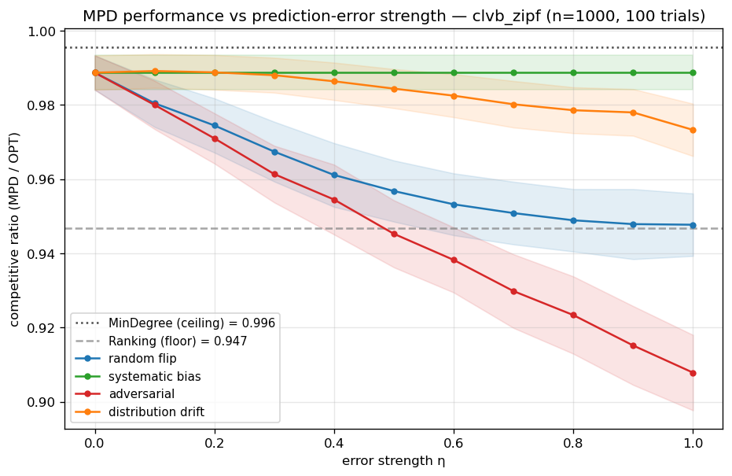
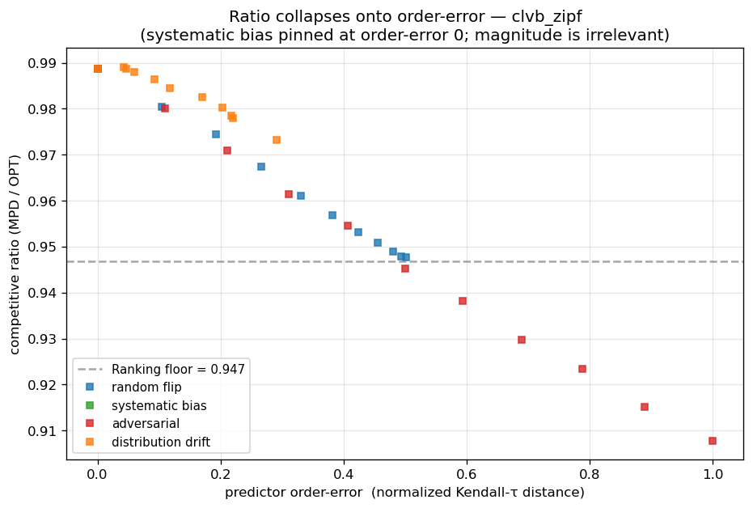

# Phase 3 Progress Report — MinPredictedDegree Increment

**Status:** first increment complete (foundation: predictions + 4 error models +
MPD + (MPD)-augmentation hooks). Choo/BEM adaptive frameworks deferred.
**Spec:** see [`docs/PHASE3_SPEC.md`](PHASE3_SPEC.md) (signed off).

## 1. What was built

| Component | File | Notes |
|---|---|---|
| CLV-B/Zipf type graph | `graphs/synthetic.py::clvb_zipf_bipartite` | heavy-tailed offline (R) degrees; ACI §7 (n=m=1000, C=n/2) |
| Degree predictors | `predictions/degree_truth.py` | `type_graph_degree` (MPD), `instance_degree` (MinDegree oracle) |
| Four error models | `predictions/error_models.py` | random_flip, systematic_bias, adversarial, distribution_drift; each returns `(μ', {l1, order_error})` |
| MinPredictedDegree | `algorithms/min_predicted_degree.py` | `mpd = greedy_with_permutation(rank)`, `rank = lexsort(μ, random tiebreak)` |
| (MPD) augmentations | `algorithms/feldman.py`, `algorithms/jaillet_lu.py` | `*_online_mpd`: fall back via MPD rule instead of arbitrary (ACI §7) |
| Tests | `tests/test_mpd_small.py` | 6 tests, all pass |
| RQ2 experiment | `scripts/run_mpd_error_spectrum.py` | ratio vs η, 4 models × 2 graphs |

**Unifying observation:** SimpleGreedy, Ranking, and MPD are now *one* online
primitive (`greedy_with_permutation`) with three rank sources — identity,
random, and degree-order. The whole Phase-2+3 greedy family collapses to one
loop. MPD added **zero** new online-stage code.

## 2. Verified anchors (tests)

- **MPD(constant μ) ≡ Ranking** — mean matching sizes 171.4 vs 171.6 over 200
  trials (|Δ| = 0.26).
- **MPD(true realized degree) = MinDegree** ≥ MPD(type-graph degree) ≥ Ranking
  on Zipf (158 ≥ 156 ≥ 149).
- **Systematic bias is order-invariant** — `μ·(1+η)` leaves MPD's output
  bit-identical for all η, with Kendall-τ order-error ≡ 0.
- random_flip at η=1 → order-error ≈ 0.50 (random ≈ half-reversed);
  adversarial at η=1 → order-error = 1.00 (full reversal). Same η, different
  structure.

## 3. Main results (n=1000, 100 trials)

### 3.1 Ratio vs error strength η



| Model | Zipf η=0 → η=1 | Left-Regular η=0 → η=1 |
|---|---|---|
| systematic bias | 0.989 → **0.989** (flat) | 0.932 → **0.932** (flat) |
| distribution drift | 0.989 → 0.973 | 0.932 → 0.890 |
| random flip | 0.989 → 0.948 | 0.932 → 0.889 |
| adversarial | 0.989 → **0.908** | 0.932 → **0.853** |
| — anchors — | MinDegree 0.996 / Ranking 0.947 | MinDegree ~0.94 / Ranking 0.891 |

Every curve starts at the MPD operating point (η=0) and, except systematic bias,
descends toward (and adversarial *below*) the Ranking floor as η→1.

### 3.2 The methodological finding — ratio collapses onto order-error



When the same competitive ratios are re-plotted against the predictor's
**Kendall-τ order-error** (instead of η or L1 magnitude), the four error models
**collapse onto a single monotone curve.** This is the headline result of the
increment:

> **MPD's competitive ratio is, to first order, a function of the Kendall-τ
> order-error of its degree predictor — nearly independent of which error model
> produced that order-error or of the predictor's L1 magnitude.**

Consequences, each a concrete instance of the proposal §5 thesis ("error
*structure*, not magnitude, drives impact"):

1. **Systematic bias is pinned at order-error 0** ⇒ zero impact, at *any*
   magnitude. A monotone mis-scaling of every degree by ×1.5 (large L1) hurts
   MPD exactly as much as no error at all: nothing.
2. **L1 magnitude is not predictive.** At a fixed order-error, random_flip and
   adversarial sit at wildly different L1 (the magnitude plot shows adversarial
   reaching L1≈130 while systematic bias never exceeds 1) yet land on the same
   ratio curve.
3. **The collapse is strong but not perfect.** Adversarial structure extracts
   modestly *more* damage per unit order-error: its points dip below the common
   curve and **below the Ranking floor** once order-error > 0.5 (Zipf 0.908,
   Left-Regular 0.853, both under their Ranking floors). A maximally-wrong
   predictor that prioritizes *high*-degree offline nodes is worse than random —
   which is exactly the failure mode that the deferred Choo/BEM test-and-fallback
   mechanisms exist to guard against.

This finding was not reported by ACI (they evaluated a single subsample-noise
model) and is novel to this study.

## 4. Consistency / robustness read-off (RQ2)

For MPD the consistency→robustness interpolation is *automatic* (no engineered
fallback): MPD(perfect)=MinDegree is the consistency ceiling, MPD(random)=Ranking
is the robustness floor, and the η-curves are the empirical smoothness profiles
that theory only bounds. On Zipf the usable band is wide (0.947–0.996); on
Left-Regular it is narrow (0.891–~0.94) because offline degrees are less skewed,
so degree information helps less — consistent with ACI's note that ER (uniform
degrees) is MPD's worst case.

## 5. Limitations / not yet done

- **(MPD)-augmented Feldman/JailletLu** are implemented and unit-reachable but
  not yet run in a head-to-head comparison vs their (g) variants — the natural
  next experiment bridging Phase 2 and 3.
- **Choo (TestAndMatch) and BEM** — deferred. They require the type-histogram
  prediction object (object B), a predicted-matching construction, and a
  test-and-fallback (or practical surrogate). The collapse finding above
  motivates them: they are the engineered robustness that MPD lacks.
- **Zipf exponent sweep** (ACI §7 varies it 0.2–2.0) not yet run; we fixed
  exponent=1.0. A sweep would show how MPD's usable band widens with skew.
- **Real-world graphs** (proposal §6.1) not yet included.

## 6. Reproducibility

```bash
python3 tests/test_mpd_small.py                  # 6 tests
python3 scripts/run_mpd_error_spectrum.py        # ~11s; n=1000, 100 trials
```
Seed 0; outputs `results/mpd_spectrum_{left_regular,clvb_zipf}.{json,png}` and
`results/mpd_methodological_*.png`. Tested on numpy 1.26.4, scipy 1.13.1.
