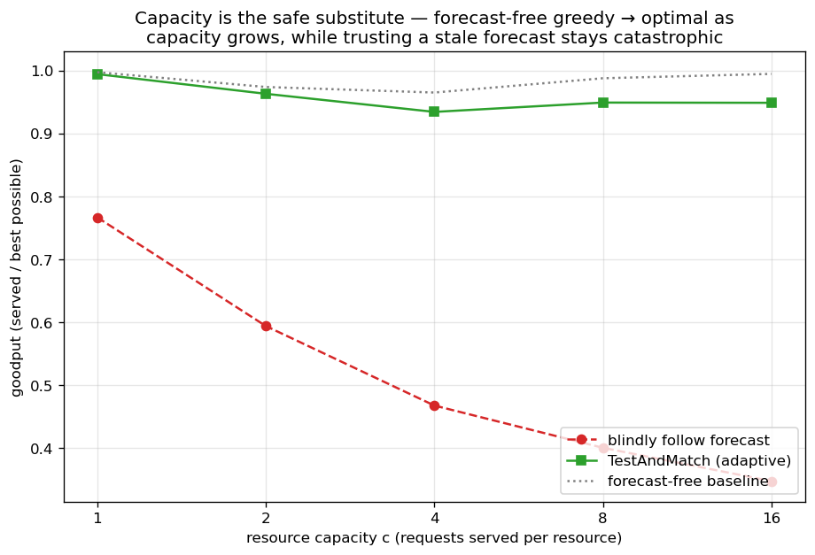
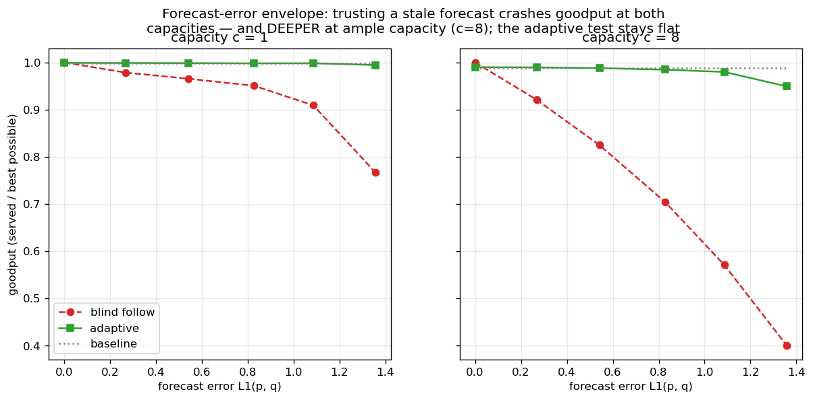
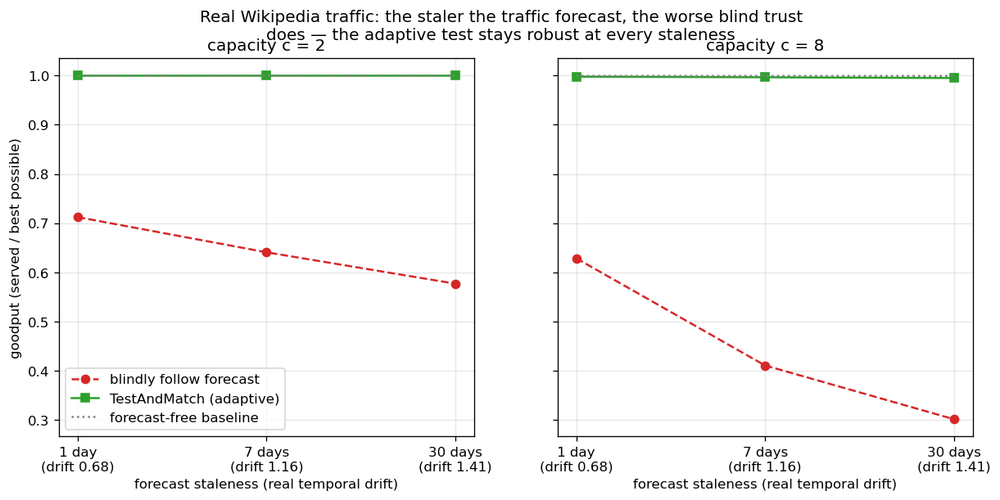
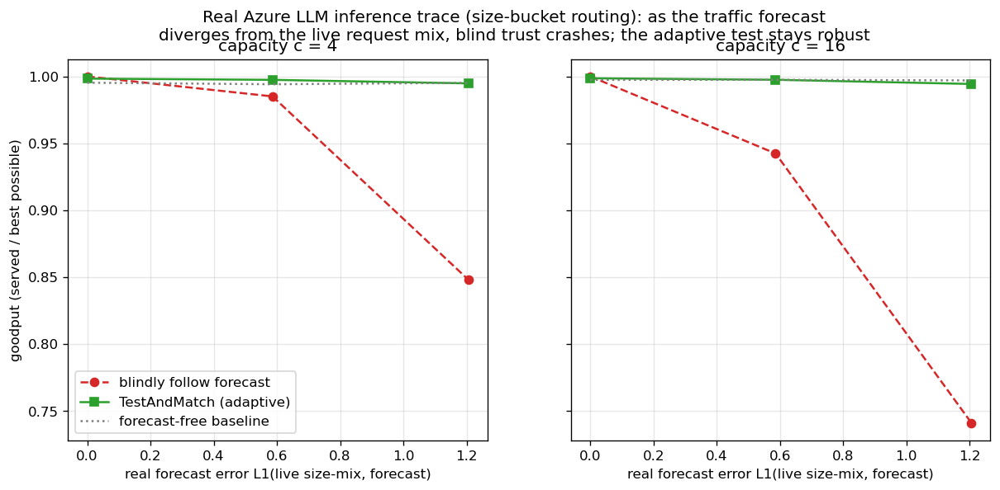
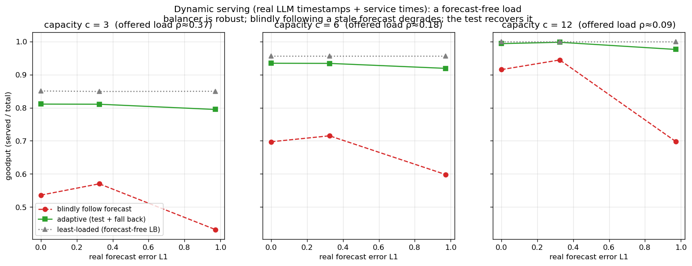
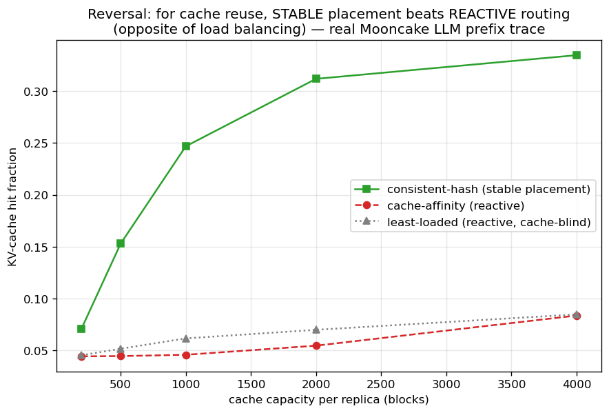

# Phase 4 Report — AI Inference Serving Instantiation (online b-matching)

**Status:** complete. A faithful domain instantiation of the whole framework —
online bipartite matching with predictions, recast as request routing in an
inference serving system, with resource **capacity c** (b-matching) and a
**non-uniform traffic distribution** whose forecast is the "advice".

## 1. The instantiation (and why it is faithful, not a relabel)

| Abstract | Serving |
|---|---|
| offline node r | serving resource (MoE expert / model replica / cache shard), **capacity c** |
| online type ℓ | request type (prompt category / token class) |
| edge (ℓ, r) | resource r can serve request-type ℓ (capability / cache affinity) |
| traffic distribution p | the live request mix (**Zipfian** head/tail traffic) |
| advice ĉ (type histogram) | a **traffic forecast**; a bad forecast is a **stale / drifted** one |
| matching size / OPT | goodput = served requests / best possible |

Two things make this genuine rather than cosmetic:
1. **Traffic is non-uniform.** The original Choo/BEM setting had a uniform type
   distribution; here p is Zipfian, so the predicted type histogram is *literally*
   a traffic forecast and "bad advice" is a realistic stale forecast — the natural
   error mode in serving. (We extended `sample_instance` with a `p` argument.)
2. **Capacity c (b-matching).** Real resources serve many requests, not one. We
   added `optimal.max_b_matching_size` (compressed max-flow) and capacity-aware
   online algorithms (`algorithms/capacity.py`): a `load[r]` counter replaces the
   boolean `matched[r]`, generalizing the entire family (greedy / Ranking / MPD /
   FollowPrediction / TestAndMatch).

## 2. What was built

| Component | File |
|---|---|
| Traffic-distribution sampling | `iid_sampler.sample_instance(..., p=)` |
| Serving topology (Zipfian traffic, sparse capability) | `graphs/serving.py` |
| b-matching OPT (capacity c) | `optimal.max_b_matching_size` |
| Capacity-aware greedy/Ranking/MPD, FollowPrediction, TestAndMatch | `algorithms/capacity.py` |
| Tests (5) | `tests/test_serving_small.py` |
| Experiment | `scripts/run_serving.py` |

**Verified anchors (tests):** b-matching at c=1 equals ordinary matching; OPT
grows monotonically with capacity (saturating at #requests); perfect forecast →
advice b-matching = OPT at every capacity; garbage forecast → TestAndMatch detects
it and stays robust under capacity.

## 3. The domain finding — capacity is the safe substitute for a forecast



n_resources=200, n_types=40, deg=8, 800 requests, Zipf traffic, 25 trials.
Goodput under a **garbage forecast** (forecast error L1≈1.4) as capacity grows:

| capacity c | blindly follow forecast | TestAndMatch (adaptive) | forecast-free baseline |
|---:|---:|---:|---:|
| 1 | 0.773 | 0.995 | 0.998 |
| 2 | 0.593 | 0.964 | 0.974 |
| 4 | 0.471 | 0.935 | 0.965 |
| 8 | 0.401 | 0.949 | 0.988 |
| 16 | 0.348 | 0.949 | 0.995 |

Three things, and they invert the naive intuition that "more capacity ⇒ less need
for smart routing":

1. **The forecast-free baseline is near-optimal at every capacity** (0.96–1.00).
   Capacity is robustness you get for free — a simple greedy router barely leaves
   anything on the table.
2. **Blindly trusting a stale forecast is catastrophic, and the catastrophe
   *deepens* with capacity** (goodput 0.77 → 0.35). In competitive-ratio terms,
   capacity raises OPT, but routing to the wrong (forecast-implied) resources does
   not capture it — so the *relative* loss grows.
3. **The adaptive test-and-fallback stays robust at every capacity** (within ~0.05
   of the baseline), so its protective value — the gap to blind trust — **grows
   with capacity** (from +0.22 at c=1 to +0.60 at c=16).



The forecast-error envelope makes the same point: at tight capacity (c=1) blind
trust crashes only mildly (to 0.77), but at ample capacity (c=8) it crashes far
deeper (to 0.40), while the adaptive curve stays flat at ~0.99 in both.

**Serving takeaway.** In a well-provisioned serving system a forecast-free policy
is already near-optimal; the real operational risk is a routing layer that blindly
trusts a stale traffic forecast — and that risk is *largest* precisely when you
have ample capacity. The cheap prefix test is exactly the guard against it.

## 3b. Real-trace hardening — forecast staleness on Wikipedia traffic

`scripts/run_serving_trace.py` replaces the synthetic forecast perturbation with a
**real** one. The workload is real Wikipedia daily pageviews (`data/trace/wiki/`,
fetched from the Wikimedia API): the live day (2024-06-15) is the request stream,
and an **earlier day's distribution is the forecast**. Forecast error is then real
temporal drift — the older the forecast, the staler it is. No synthetic noise
anywhere. (Mapping: pages = request types, cache shards = resources, a cache hit =
a match, "predict today's hot pages from an old day" = the traffic forecast.)

The real drift is monotone in staleness, over 500 request types:

| forecast staleness | real drift L1(p_live, q) |
|---|---:|
| 1 day | 0.68 |
| 7 days | 1.16 |
| 30 days | 1.41 |



Goodput under the real stale forecast (M=3000 requests, 20 trials):

| staleness | blind (c=2) | blind (c=8) | adaptive | baseline |
|---|---:|---:|---:|---:|
| 1 day | 0.712 | 0.628 | ~1.00 | ~1.00 |
| 7 days | 0.641 | 0.411 | ~1.00 | ~1.00 |
| 30 days | 0.577 | 0.302 | ~1.00 | ~1.00 |

The synthetic Phase-4 findings reproduce on real data, with a real error axis:
- **the staler the forecast, the worse blind trust does** (0.71 → 0.58 at c=2;
  0.63 → 0.30 at c=8) — monotone in real drift;
- **the cliff deepens with capacity** (c=8 worse than c=2 at every staleness);
- **the adaptive test-and-fallback stays robust at every staleness** (~1.00),
  and the forecast-free baseline is near-optimal throughout.

Because the error is genuine temporal drift on a recognizable real workload (the
live day's top pages are real time-sensitive events — UEFA Euro 2024, Inside Out
2, etc.), this answers the "synthetic only" objection directly.

## 3c. Real AI-inference trace — Azure LLM Inference (size-bucket routing)

The Wikipedia trace (§3b) is a real *web* workload. To land it on a real
*inference* workload, `scripts/run_serving_llm.py` uses the **Azure LLM Inference
Trace** (the Splitwise / OSDI'24 trace; `data/trace/azure_llm/`), ~19k real LLM
requests with context-length per request. Following size-aware serving (Splitwise
/ DistServe / Sarathi route requests by size), we type each request by its
**context-length bucket** (log-spaced), so the size-mix is the traffic and a
traffic forecast is a predicted size-mix. We use a real contiguous arrival window
(m=2500) and three genuine forecasts of increasing real error:

| forecast source | real L1 to live size-mix |
|---|---:|
| perfect (live mix itself) | 0.00 |
| same workload, older half (conv) | 0.59 |
| wrong workload (the code trace) | 1.21 |



Goodput (15 trials):

| forecast | blind (c=4) | blind (c=16) | adaptive | baseline |
|---|---:|---:|---:|---:|
| perfect | 1.000 | 1.000 | ~1.00 | ~0.99 |
| same workload | 0.985 | 0.942 | ~1.00 | ~0.99 |
| wrong workload | 0.848 | **0.741** | ~0.99 | ~0.99 |

Same result, now on real LLM inference traffic: as the forecast diverges from the
live request mix (real L1), **blind trust crashes** (1.00 → 0.74), the **cliff
deepens with capacity** (c=16 worse than c=4), and the **adaptive test stays
robust** (~0.99) alongside the forecast-free baseline. Two independent real
workloads — web pageviews and LLM inference — give the same qualitative picture.

## 3d. Dynamic serving (deepening) — live load beats a traffic forecast

The static b-matching above assumes every request is concurrent forever. Real
serving is dynamic: a request occupies a resource slot for a service time, then
frees it. `algorithms/dynamic.py` is an event-driven simulator (a min-heap of
departures releases finished requests before each arrival), and
`scripts/run_serving_dynamic.py` drives it with the **real Azure LLM trace**:
real arrival timestamps and real service durations (∝ generated-token count). A
resource has `c` concurrent slots; goodput = served / total (admission rate). We
compare three policies by resource *scope*:

- **least-loaded** — forecast-free real load balancer; among ALL capable
  resources with a free slot, pick the least loaded.
- **blind-forecast** — route only to the type's forecast-preferred resources (a
  dedicated subset from the forecast b-matching); drop if they are all busy.
- **adaptive** — prefix-test the forecast, then keep following it or switch to
  least-loaded.



| capacity / forecast | least-loaded | blind | adaptive |
|---|---:|---:|---:|
| c=6, perfect (L1=0) | 0.956 | 0.697 | 0.934 |
| c=6, same-workload (L1=0.33) | 0.956 | 0.715 | 0.934 |
| c=6, wrong-workload (L1=0.97) | 0.956 | 0.598 | 0.919 |
| c=12, perfect | 1.000 | 0.915 | 0.994 |
| c=12, wrong-workload | 1.000 | 0.698 | 0.976 |

**A sharper, more contrarian finding emerges under dynamics.** In the static
b-matching a *perfect* forecast equals OPT. Under dynamics it does **not**: the
forecast-free load balancer **dominates blind forecast-routing at every capacity,
even with a perfect forecast** (c=6: 0.956 vs 0.697). The reason is statistical
multiplexing — committing each request type to its forecast-preferred *subset* of
resources forgoes the shared pool's ability to absorb bursts, which a least-loaded
balancer exploits in real time. Blind degrades further as the forecast drifts
(c=12: 0.92 → 0.70), and the **adaptive test learns to distrust the forecast and
recovers the load balancer's performance** (it lands at ~least-loaded, not at
blind).

**Takeaway, and how it unifies with §3.** Under real serving dynamics, the *live*
system state (current load) is a better routing signal than a traffic forecast —
forecasts belong in **capacity provisioning** (where "capacity is the safe
substitute", §3/§4), not in real-time **routing**, where you can simply observe
load. This is the classic shared-vs-dedicated / statistical-multiplexing tradeoff,
now demonstrated inside the matching-with-predictions framework on a real LLM
inference trace. (Caveat: blind-forecast is restricted to a dedicated subset by
construction — that *is* what static forecast-based routing means; the comparison
is dedicated forecast pools vs a shared real-time balancer.)

## 3e. Prefix-cache-aware routing (deepest) — stable beats reactive

The most AI-native deepening: KV-cache prefix routing on the **real Mooncake
trace** (FAST'25), where each request carries its prefix block hashes and requests
sharing leading blocks share a cached prefix (RadixAttention). `algorithms/
prefix_cache.py` simulates a per-replica block cache (LRU); the metric is the
KV-cache hit fraction = cached prefix blocks / total. (Honest framing: this is a
*caching* problem — the prefix families are near-unique, so it does not fit the
matching framing tightly; it connects instead to learning-augmented **caching**,
Lykouris & Vassilvitskii, proposal ref [5].)

**Finding 1 (headline) — a reversal of the dynamic-serving result.** For cache
reuse, **stable placement (consistent-hashing the prefix family to a fixed
replica) dominates reactive cache-affinity routing**, and the gap grows with cache
capacity:

| cache blocks / replica | consistent-hash (stable) | cache-affinity (reactive) | least-loaded |
|---:|---:|---:|---:|
| 200 | 0.071 | 0.044 | 0.045 |
| 1000 | 0.247 | 0.046 | 0.062 |
| 4000 | **0.335** | 0.084 | 0.085 |



This is the **opposite** of §3d, where reactive least-loaded beat static
forecast-routing. The reason is principled and unifying: **load balancing wants
the current system state (reactive); cache reuse wants stable placement** — a
prefix must stay pinned to one replica to be reused, and reactive routing
fragments it across replicas.

**Finding 2 (honest near-null) — prediction adds little on top of pinning.** Given
stable placement, using a *forecast* of prefix-family popularity to place families
(balancing predicted load) barely beats blind consistent-hashing (0.167 with a
perfect forecast vs 0.153 for consistent-hash at B=500), and is nearly flat across
forecast quality (perfect / stale / wrong-workload). The cache benefit comes from
*pinning* — which any stable map provides — not from load-balancing the placement;
so the forecast's only lever does not move hit rate much, and the prefix-test,
finding nothing to gain, falls back to consistent-hash. (A skewed family-popularity
regime under tighter capacity is where a forecast *could* help — not present here.)

**Net.** Across all four deepenings the structural/baseline choice dominates and
prediction is at most second-order — and the two reactive-vs-stable verdicts
(serving: reactive wins; caching: stable wins) are opposite for a clean,
optimization-dependent reason. That contrast is itself a citable result.

## 4. How this strengthens the thesis

This is the applied face of the project's unifying thesis. Phase 2 (Borodin):
simple greedy ≈ complex on average-case. Phase 3a: predictions help only on skewed
structure; the advice-free baseline is the floor. Phase 3c: the value of advice is
robustness-insurance, not consistency lift. Phase 4 lands it in a concrete,
current domain: **for inference serving, capacity is the safe substitute for a
forecast, and the one thing you must not do is trust a stale forecast blindly —
which a sublinear test cheaply prevents.** That is a crisp, citable systems message
that the abstract findings alone do not deliver.

## 5. Limitations / next

- **Topology is synthetic.** Traffic *and the forecast error* are now real
  (Wikipedia pageviews + temporal drift, §3b); the resource topology (which shard
  serves which page) remains a synthetic cache-placement choice — a real cache
  layout would close the last gap.
- **MPD under capacity** is implemented (`greedy_with_capacity` with a degree
  rank) but not swept here; a capacity × order-error study would extend Phase 3a.
- **Free-disposal / weighted variants** (top-c rewards, request values) are
  natural serving extensions not modeled.

## 6. Reproducibility

```bash
python3 tests/test_serving_small.py        # 5 tests
python3 scripts/run_serving.py             # ~8s; synthetic capacity × forecast-error
python3 scripts/run_serving_trace.py       # ~9s; real Wikipedia trace, forecast staleness
python3 scripts/run_serving_llm.py         # ~2s; real Azure LLM trace, forecast quality
python3 scripts/run_serving_dynamic.py     # ~4s; DYNAMIC serving (real timestamps + service times)
python3 scripts/run_prefix_cache.py        # ~10s; prefix-cache routing (real Mooncake trace)
```
Seed 0; outputs `results/serving*.{json,png}`. Real traces are cached under
`data/trace/` (committed, ~1.2 MB): Wikipedia "top articles per day" JSON
(Wikimedia REST API) and the Azure LLM Inference Trace conv/code CSVs (Azure
Public Dataset / Splitwise). To refresh, re-fetch from those sources.
