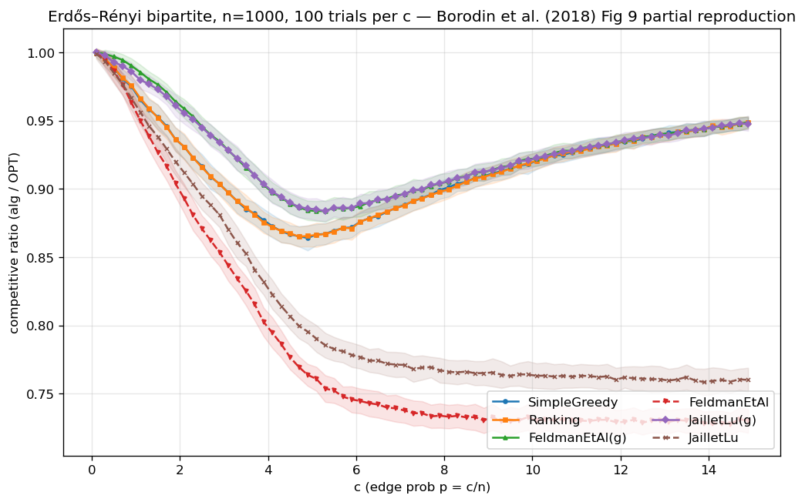
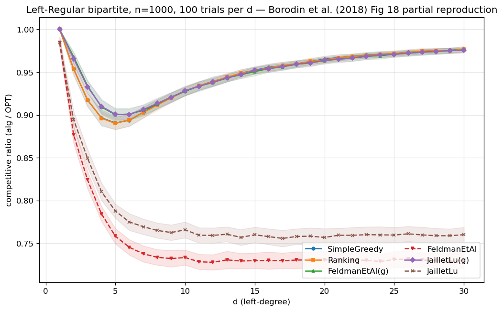

<!--
Thesis Ch 3 — Model, Algorithms & Methodology + Phase-2 reproduction (fidelity check).
Reuses paper/01_setup.md (precise setup) + PHASE2_REPORT.md (the reproduction, the NEW
part of this chapter). Ch2 gave the field context; Ch3 is OUR exact model, implementation,
and the validation of the harness before the contributions (Chs 4–9). Numbers verbatim
from PHASE2_REPORT. Full reproduction tables → Appendix.
-->

# Chapter 3. Model, Algorithms, and Methodology

Chapter 2 placed the problem in its field. This chapter fixes the precise model and
notation used throughout (§3.1), details the algorithms as we implement them (§3.2), the
prediction objects and structured error models (§3.3), the consistency/robustness measures
(§3.4), and the experimental harness (§3.5). It closes by validating the harness against
the published Borodin et al. figures before any contribution is built on it (§3.6).

## 3.1 The known-i.i.d. model, precisely

There is a set $R$ of $n$ offline **resources** and a **type graph** on $r$ online
**types**; type $\ell$ has neighborhood $N(\ell)\subseteq R$. An instance is generated by
drawing $m$ arrivals i.i.d. from a distribution $p$ over the $r$ types; the $i$-th arrival
reveals its type (hence $N(\cdot)$) and must be matched to a currently unmatched resource in
its neighborhood, immediately and irrevocably, or left unmatched. The type graph and $p$ are
known to the algorithm; the realized arrival sequence is not. Following the standard
*integral-types* convention, the default is $m=n$ with uniform $p$, so each type's expected
count is an integer; the classical setting has $r=n$ (each offline vertex a distinct type),
and the *few-types* setting used for the histogram-advice experiments has $r\ll n$.

The performance measure is the **competitive ratio**, computed per instance and then
averaged: $\rho(\mathrm{ALG}) = \mathbb E\bigl[|\mathrm{ALG}|/|\mathrm{OPT}|\bigr]$, where
$\mathrm{OPT}$ is a maximum matching of the *realized* instance, computed exactly by
Hopcroft–Karp [@hopcroftkarp1973]. Averaging per-instance ratios is the natural convention
under paired trials (§3.5), since on a given instance every algorithm is divided by the same
exactly-computed optimum. It differs in principle from the ratio of expectations
$\mathbb E[|\mathrm{ALG}|]/\mathbb E[|\mathrm{OPT}|]$ that an experimental study might report
instead, so we measured the gap: across nine algorithm-by-quality cells spanning both
prediction families, the two conventions agree to within $6\times10^{-5}$ — two orders of
magnitude below the confidence intervals we report — so no number in this thesis depends on
the choice (`scripts/run_metric_check.py`, §A.2). The advice-free baseline throughout is KVV
Ranking, whose ratio we write $\rho_{\mathrm{base}}$ (the **baseline strength**).

The notation recurs throughout the thesis and is collected here for reference:

| symbol | meaning | typical value |
|---|---|---|
| $n$ | offline resources | 1000–2000 |
| $r$ | online request types | $r=n$ (classical), $r=8$ (few-types) |
| $m$ | arrivals in one instance | $m=n$ |
| $p$ | known distribution over types | uniform unless stated |
| $\mu$ | predicted resource degrees (degree prediction) | — |
| $\hat c$ | predicted type counts (histogram prediction) | — |
| $k$ | length of the prefix a test may inspect | $k=200$ |
| $\eta$ | strength of the injected prediction error | $\eta\in[0,1]$ |
| $\rho_{\mathrm{base}}$ | Ranking's ratio on that instance family (the floor) | 0.89–0.99 |

<!--REV
id: 3-01
role: R1 二审考官
level: 必改
kind: 符号密度
mark: An instance is generated by drawing
quote: There is a set R of n offline resources and a type graph on r online types
note: 3.1 一节内连续引入 R、n、r、N(l)、m、p、OPT、rho_base 八个符号，之后全篇都在用。读者读到第 6 章要回翻两次才能确认 r 和 k 谁是谁。
fix: 在 3.1 末尾加一张三行的符号表（符号、含义、典型取值），或至少在附录 A 前加一页符号表并在此处指向它。这是全篇性价比最高的一处补充。
-->

<!--REV
id: 3-02
role: R2 领域审稿人
level: 必改
kind: 指标定义需要辩护
mark: The performance measure is the
quote: the competitive ratio is the ratio of the expectation of ALG to the expectation of OPT
note: 报告的是期望之比，不是比值的期望，两者一般不相等。这是有意的选择（沿用 Borodin 的惯例，也便于配对试验），但正文没有说明，审稿人会直接问为什么不是 E[ALG/OPT]。
fix: 补一句理由：we report the ratio of expectations, following Borodin et al., so that a single exactly-computed OPT per instance can be shared across algorithms in paired trials; the two agree to within the reported CIs on our instances（若确实如此，给一个数）。
-->

## 3.2 Algorithms

All greedy-type algorithms are instances of one primitive: given a total order (**rank**)
on the resources, **GreedyWithPermutation** matches each arrival to its available neighbor
of minimum rank. This makes the algorithm family a single code path parameterized by the
rank, which is important both for a fair comparison and for the theory.

- **Advice-free baselines.** SimpleGreedy (identity rank), **Ranking** (uniformly random
  rank; the baseline), and the stochastic-matching algorithms Feldman and Jaillet–Lu, which
  precompute a suggested matching by max-flow: Feldman from a cap-$\{2,1,2\}$ network, whose
  unit-flow subgraph splits into a *blue* and a *red* matching; Jaillet–Lu from a
  cap-$\{3,2,3\}$ network, whose fractional solution gives a per-type list of resources to
  try in order. Each of the two has a *non-greedy* variant (follow the suggestion only) and
  a *greedy* variant (fall back to any available neighbor).

<!--REV
id: 3-03
role: R1 二审考官
level: 建议
kind: 记号未解释
mark: precompute a suggested matching by max-flow
quote: Feldman via a cap-{2,1,2} flow network and a blue/red decomposition ... Jaillet-Lu via a cap-{3,2,3} network
note: cap-{2,1,2} 和 blue/red decomposition 是原论文的内部术语，这里直接搬来当作已知。不做这两个算法的读者会卡住，而这两个算法在第 4 章 F4 里是主角。
fix: 各补半句功能性说明：什么容量加在哪一层、蓝红分解产出的是什么。或者干脆只说它们各自预计算一个建议匹配，把构造细节推到脚注。
-->

<!--REV
id: 3-04
role: R3 英语文字编辑
level: 建议
kind: 条目过长
mark: -
quote: (3.2 的三个 bullet)
note: 三个 bullet 分别是 7、5、8 行，每条内部又用破折号和分号套了两到三层。这里是全篇最需要被快速查阅的一节（读者会反复回来确认某个算法是什么），却是最难扫视的排版。
fix: 每条压成两句：一句说它是什么，一句说它在本文里的角色。构造细节移到脚注或附录。
-->

- **Degree predictions.** MinPredictedDegree (MPD) is GreedyWithPermutation ranked by
  ascending predicted degree $\mu\in\mathbb R^R$. Constant $\mu$ gives Ranking; the true
  realized degrees give the consistency ceiling (MinDegree). The **augmentations**
  Feldman(MPD) and JailletLu(MPD) use the MPD rank only as the tie-break of the greedy
  fallback.

<!--REV
id: 3-05
role: R1 二审考官
level: 建议
kind: 关键机制一句带过
quote: use the MPD rank only as the tie-break of the greedy fallback, so the worst-case-optimal base matching carries the load
note: 这句话解释了第 4 章 F2 的全部机制（结构性鲁棒为什么平坦），但只有一句、藏在 bullet 里。F2 是本文两大机制之一。
fix: 把它提成一个独立小段，并说清楚后果：因为建议只影响并列时的选择，预测再差也动不了主体匹配 - 这既是它不会崩的原因，也是它吃不到上升空间的原因。
-->

- **Type-histogram advice and test-and-fallback.** From a count vector $\hat c$ over types we
  build an advice matching $\hat M$ and record its per-type partners. **FollowPrediction**
  routes every arrival to its type's predicted partner; **TestAndMatch** (Choo and BEM) does
  the same over a length-$k$ prefix, tests the empirical $\ell_1$ distance between the prefix
  frequencies and $q=\hat c/\lVert\hat c\rVert_1$ against a threshold $\tau$, then continues
  or falls back to Ranking. The Chłędowski-style dynamic **combiner** is ported as a
  benchmarked baseline, not a contribution.

This last point is the whole mechanism behind the structural robustness of Chapter 4, so it
is worth stating plainly: because the prediction only decides between otherwise equivalent
choices, the worst-case-optimal base matching carries the load and an arbitrarily bad
prediction cannot move it. That is why the augmentations never crash — and equally why they
cannot capture the upside when the prediction is good.

<!--REV
id: 3-06
role: R4 体例校对
level: 建议
kind: 术语
quote: FollowPrediction mimics M-hat - routes every arrival to its type's advice partner
note: mimic 是实现里的策略名，正文在这里和 6.4 各出现一次，中间隔了三章。读者第二次遇到时已经忘了。
fix: 要么正文一律用 advice-following，把 mimic 放进括号说明一次；要么在 3.2 就把它定为正式术语并在 6.4 保持一致。全文只留一个名字。
-->

## 3.3 Prediction objects and structured error models

The families consume different prediction objects — degree vectors $\mu$ and type
histograms $\hat c$ — so each is corrupted by its own knob and reported in a parallel panel.
For $\mu$ we use four structured error models, each driven by a strength $\eta\in[0,1]$ and
each returning both an $\ell_1$ *magnitude* error and a normalized **Kendall-$\tau$ order
error**:

| model | construction at strength $\eta$ | effect on the induced order |
|---|---|---|
| random-flip | independently, with probability $\eta$, replace an entry of $\mu$ by a uniform draw from $[\min\mu,\max\mu]$ | grows with $\eta$; $\eta=1$ is a constant-quality predictor, i.e. Ranking |
| systematic-bias | monotone rescale $\mu\leftarrow\mu\cdot(1+\eta)$ | none — Kendall-$\tau\equiv0$ by construction, while the $\ell_1$ magnitude grows linearly |
| adversarial | reflect an $\eta$-fraction of entries, $\mu(R)\leftarrow(\min\mu+\max\mu)-\mu(R)$ | the most order-damaging perturbation at a given fraction; $\eta=1$ reverses the order |
| distribution-drift | blend toward the degrees of an independently drawn graph of the same family, $\mu\leftarrow(1-\eta)\mu+\eta\mu_{\mathrm{alt}}$ | grows with $\eta$, but in a correlated way rather than entry-by-entry |

For $\hat c$ we blend the realized counts toward a
concentrated random target by a fraction $\eta\in[0,1]$, reporting the induced
$\ell_1(p,q)$. Because MPD depends on $\mu$ only through the induced order, the
order/magnitude distinction is the axis of Chapter 5.

<!--REV
id: 3-07
role: R1 二审考官
level: 必改
kind: 误差模型不可复现
quote: four structured error models ... random-flip, systematic-bias, adversarial (reflection of a fraction of entries), and distribution-drift
note: 四个误差模型只有名字和半句括注，没有构造式。读者无法判断 adversarial 有多 adversarial、random-flip 的强度参数是什么，也就无法评估第 4、5 章误差扫描的强度是否公平。这是实验类论文最常被要求补充的一处。
fix: 补一张四行小表：模型名、构造（一句公式即可）、强度参数的取值范围。放这里或附录 A 都行，但正文要有指向。
-->

<!--REV
id: 3-08
role: R2 领域审稿人
level: 建议
kind: 误差模型的选择理由
quote: each is corrupted by its own knob and reported in a parallel panel
note: 两族预测对象用不同的误差旋钮，这是必要的，但也意味着跨面板的数字不可直接比较。第 4 章的表却把三个面板并排放在一起。
fix: 在这里就写明这一点（the panels are not commensurable across families; only the within-panel comparisons are meaningful），第 4 章表注再重复一次。
-->

## 3.4 Consistency and robustness

For a prediction-consuming algorithm, **consistency** is its ratio under perfect advice and
**robustness** is its worst-case ratio under adversarial advice. Operationally we cannot
sweep every adversarial prediction, so in the experiments robustness is reported as the
minimum over our corruption levels — an upper bound on the true worst case, and therefore a
generous reading of an algorithm's safety. A useful algorithm is
consistent *and* never (much) below $\rho_{\mathrm{base}}$; the tension between the two is
the subject of Chapter 6 and of the outlook in §10.2.

<!--REV
id: 3-09
role: R2 领域审稿人
level: 建议
kind: 定义与测量不对应
quote: robustness is its worst-case ratio under adversarial advice
note: 定义说的是最坏情况，实验测的是两个具体档（adversarial 与 garbage）中较低的那个。定义与测量之间的差距没有交代，而 robustness 是全文的核心量之一。
fix: 写明操作化定义：in the experiments we report the minimum over our corruption levels as a proxy for the worst case, which is a lower bound on the true robustness。
-->

## 3.5 The experimental harness

The harness is a small, dependency-light Python codebase (NumPy, SciPy, NetworkX). Every
source of randomness draws from its own independent, reproducible stream, so that within a
comparison the *only* thing that varies is the prediction and adding an algorithm never
disturbs existing results (Appendix A.1 lists the streams). We use **paired trials**: within a comparison, every algorithm and error
level reuses the same graph, arrival sequence, $\mathrm{OPT}$, and tie-break seed, so
differences are attributable to the prediction alone. Reported ratios are means over trials
with 95% normal-approximation confidence intervals, computed per algorithm and error level.
Those per-algorithm intervals are the conservative choice: they under-use the pairing, since
a comparison between two algorithms is really a *paired difference*, whose interval is
narrower whenever the two respond to the same instances in the same direction. Every
comparison the thesis draws survives under the wider convention — the narrowest margin being
Feldman(MPD)'s $+0.0044$ against a $\pm0.0023$ per-algorithm interval — so nothing in the
thesis turns on which is used; §A.2 reports the measured correlations and paired intervals. Every figure and table in the thesis is
regenerated from a fixed seed by a single script (Appendix A).

<!--REV
id: 3-10
role: R2 领域审稿人
level: 必改
kind: 统计方法
quote: Reported ratios are means over trials with 95% normal-approximation confidence intervals
note: 两个问题：其一，比值型指标在 40 到 100 次重复下用正态近似，需要说明为何可接受；其二，既然用了配对试验，算法之间的比较应报配对差的置信区间，而不是各自比值的置信区间 - 后者会系统性高估差异的不确定性。第 4 章的结论正是靠这些区间支撑的。
fix: 至少补一句说明；更好的做法是对关键对比（例如 MPD 与 floor）额外报一次配对差的 CI。这是审稿人最可能要求的补充实验，成本很低。
-->

<!--REV
id: 3-11
role: R3 英语文字编辑
level: 可选
kind: 实现细节过多
quote: independent, reproducible streams obtained by NumPy's spawn mechanism - by default four streams (graph, instance, Ranking, Jaillet-Lu)
note: 正文写到了具体库的具体机制和默认流数，而附录 A.1 又完整写了一遍。学位论文正文可以更抽象一点。
fix: 正文只留结论（每个比较里唯一变化的是预测，其余随机性完全对齐），把 spawn 与流的清单交给附录。
-->

## 3.6 Fidelity check: reproducing Borodin et al.

Before building prediction-based algorithms on the harness, we validated it against the
published experimental study of Borodin, Karavasilis and Pankratov [@borodin2018experimental]. This is a
**fidelity check, not a contribution**: its purpose is to confirm that the generators, the
i.i.d. sampler, the Hopcroft–Karp optimum, and the algorithm implementations reproduce the
paper's qualitative findings, so that later differences can be attributed to the algorithms
rather than to infrastructure. Our stack (Python/NetworkX) differs from the paper's
(C++/Edmonds–Karp), so we target *qualitative* agreement, accepting small absolute
differences ($\le 0.02$).

<!--REV
id: 3-12
role: R5 答辩提问者
level: 建议
kind: 判据的时序
quote: we target qualitative agreement, accepting small absolute differences (<= 0.02)
note: 0.02 这个容忍度是事前定的还是看到结果后定的，正文没说。答辩老师问这一句的概率不低，因为它决定了复现是否算成功。
fix: 写明它的来源：例如 the tolerance was fixed in advance from the paper's own reported spread / from the size of our CIs。若确实是事后定的，就诚实写成 we report the observed differences and note that all fall below 0.02。
-->

We reproduced the core four algorithms (six greedy/non-greedy variants) on two random graph
families at $n=1000$, $m=n$, 100 trials per parameter value (matching the paper's setup),
under a single master seed.

**Erdős–Rényi (edge probability $c/n$; the paper's Fig. 9, partial).** All five of the
paper's qualitative claims that we checked reproduce, with absolute differences below
$0.02$. In detail: sweeping $c$ reproduces the characteristic U-shape and its hard case, SimpleGreedy attains its minimum
$0.864$ at $c\approx4.9$, and the greedy variants of the complex algorithms their minima
$\approx0.884$ at $c\approx5.3$. Ranking is indistinguishable from SimpleGreedy (maximum
difference $0.0017$ across all 75 values — the paper omits Ranking's curve for exactly this
reason), and the non-greedy variants degrade monotonically as $c$ grows ($0.986\to0.730$ for
Feldman, $0.985\to0.760$ for Jaillet–Lu). Every one of the paper's five prose claims we
checked holds.

<!--REV
id: 3-13
role: R1 二审考官
level: 建议
kind: 结论前置
quote: SimpleGreedy attains its minimum 0.864 at c approximately 4.9, and the greedy variants of the complex algorithms their minima approximately 0.884 at c approximately 5.3
note: 这一段把六个数字和三条结论混排在一句里，而复现章真正要传达的只有一件事：我们的实现与已发表结果一致。数字是证据，不是主角。
fix: 先给一句结论（all five qualitative claims reproduce, with absolute differences below 0.02），再列证据。这样跳读的人一眼就拿到了本节的作用。
-->

{width=65%}

**Random left-regular (left-degree $d$; the paper's Fig. 18, partial).** The pattern
repeats with the hard case at $d=5$ (SimpleGreedy minimum $0.890$), Ranking $\approx$
SimpleGreedy (max difference $0.0013$), non-greedy degradation as $d$ grows, and greedy
complex variants $\approx$ SimpleGreedy asymptotically.

{width=65%}

**A cross-family observation.** Combining the two sweeps surfaces a non-obvious fact: the
non-greedy Feldman and Jaillet–Lu algorithms converge to the *same* asymptotic ratio in
*both* families — $0.730$ and $0.760$ respectively, within $0.001$ across families — and
both sit *above* their worst-case theoretical bounds ($0.670$ and $0.729$) by $+0.06$ and
$+0.03$. The two families happen to converge to the same value here; we do not investigate whether
that is universal. It is, in any case, an early and concrete instance of the thesis's
recurring theme that the average case is far more benign than the worst case, which the prediction-error sweeps of
later chapters probe in earnest.

<!--REV
id: 3-14
role: R4 体例校对
level: 必改
kind: 跨章重复
mark: A cross-family observation
quote: A cross-family observation ... both sit above their worst-case theoretical bounds (0.670 and 0.729) by +0.06 and +0.03
note: 这一段与附录 A.4 末尾那段几乎逐字相同（同样的 0.729 / 0.764 / +0.06 / +0.03 和同样的解读）。同一发现在正文和附录各写一遍，读者会以为附录有新内容。
fix: 定正本：解读留正文，附录只留数字并写 see 3.6 for the reading。或者反过来。两处保持一处即可。
-->

<!--REV
id: 3-15
role: R2 领域审稿人
level: 建议
kind: 顺带发现的地位
quote: This hints at a universal average-case asymptotic constant distinct from the worst-case guarantee
note: 这是一个有意思的顺带发现，但用 universal 和 constant 这样的词写在一个只跑了两个图族的复现小节里，强度偏高。审稿人会问：你测了几个族、有没有理论依据。
fix: 降一档：the two families happen to converge to the same value here; we do not investigate whether this is universal。保留观察，去掉断言。
-->

**Verdict.** The harness reproduces the published qualitative findings on both families,
including the locations of the hard cases and the near-identity of Greedy and Ranking. The
foundation is trusted; the contributions of Chapters 4–9 are built on it. (Full
reproduction tables and the paper-claim checklist are in Appendix A.)
