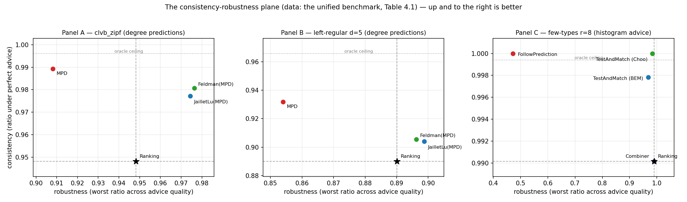

<!--
Thesis Ch 4 — The Unified Benchmark. Adapted from paper/02 §3 (numbers identical:
scripts/run_unified_benchmark.py). Chapter framing + section renumber + cross-refs fixed
(paper §7→Ch 9). Table 4.1 = the three panels; Figure 4.1 = grouped bars.
-->

# Chapter 4. The Unified Benchmark

Having validated the harness (Chapter 3), we now place all three algorithm families on it
and establish the thesis's organizing finding. This chapter reports competitive ratios
(mean $\pm$ 95% CI) as a function of prediction quality, in three panels chosen to span the
regimes each family was designed for; the four findings it draws out (§4.2) recur through
the rest of the thesis.

## 4.1 Design

The families consume different prediction objects, so each is driven by its own corruption
knob and reported in a parallel panel (Chapter 3); the shared harness — graphs,
$\mathrm{OPT}$, CI methodology, and the advice-free floor — is what makes the panels
comparable.

**Instance format and notation.** Every panel uses the instance format of Chapter 3: $n$
offline resources, $r$ online request types, and $m$ arrivals drawn i.i.d. from the type
distribution; throughout this chapter $m=n$, so requests and resources are balanced. The
panels differ *only* in the type graph connecting requests to resources — that single
change is what moves the input between the regimes the two prediction families were
designed for:

- **Panel A — clvb_zipf** ($n=1000$, 60 trials): resource degrees follow a Zipf power law
  with exponent $1.0$ — a few resources are heavily contended while most are rarely
  eligible. This heavy-tailed profile gives a *degree* predictor genuine signal to carry.
- **Panel B — left-regular $d{=}5$** ($n=1000$, 60 trials): each arriving request connects
  to exactly $d=5$ uniformly random resources, so resource degrees are nearly homogeneous
  — the hard case of Chapter 3, where a degree predictor has almost no signal left to
  carry.
- **Panel C — few-types $r{=}8$** ($n=2000$, 50 trials): only $r=8$ distinct request
  types, each arriving $\approx n/r=250$ times on average — the near-perfect-matchable,
  few-types regime the *histogram*-advice algorithms are calibrated for; their
  test-and-fallback test inspects a prefix of $k=200$ arrivals.

Panels A and B thus exercise the degree-prediction family (MPD and its augmentations);
Panel C exercises the histogram-advice family (FollowPrediction, TestAndMatch, and the
combiner).

<!--REV
id: 4-01
role: R1 二审考官
level: 建议
kind: 代码名进正文
mark: resource degrees follow a Zipf power law
quote: Panel A - clvb_zipf
note: clvb_zipf 是代码里的生成器标识符，带下划线出现在正文和图表里。读者不知道 clvb 是什么（CLV-B 模型的缩写），也无法从名字看出这个面板测的是什么。
fix: 正文用可读名（Panel A - heavy-tailed degrees (Zipf)），把 clvb_zipf 作为脚本名放进附录 A 的映射表。第 5 章的 systematic_bias 同理。
-->

<!--REV
id: 4-02
role: R6 初次读者
level: 建议
kind: 面板设计的动机
quote: The panels differ only in the type graph connecting requests to resources
note: 三个面板的设计逻辑（一个给度数预测足够信号、一个几乎没有信号、一个是直方图建议的主场）是本章最巧的地方，但被写成了三个并列的 bullet，读者容易当成三组普通实验。
fix: 在 bullet 前加一句把设计意图说穿：the three panels are chosen so that the degree predictor has strong, weak, and irrelevant signal respectively。
-->

**Shared methodology.** Paired trials, independent random streams and confidence intervals
are exactly as in §3.5; the panel-specific parameters are the ones listed above, and the
intervals are tight throughout ($\pm0.001$–$0.003$). The quality columns instantiate the
error models of
§3.3 — degree panels: *perfect* (true realized degrees), *noisy* (random-flip at strength
$\tfrac12$), *adversarial* (order-reversing reflection), *garbage* (independent random
$\mu$, $\equiv$ Ranking); advice panel: the true histogram blended toward a concentrated
random target by $\eta\in\{0,0.3,0.6,1.0\}$ (*perfect / mild / bad / garbage*). The two sets
of columns are *not* commensurable — they corrupt different prediction objects with
different knobs — so only within-panel comparisons carry meaning.
**Table 4.1** presents each panel's ratios beside its bar chart; the findings follow in
§4.2.

<!--REV
id: 4-03
role: R4 体例校对
level: 必改
kind: 方法描述重复
mark: Every panel runs with paired trials
quote: Every panel runs with paired trials: within a panel, every algorithm and quality level reuses the same graphs, arrival sequences, realized optima ...
note: 这一整段与 3.5 的描述几乎逐字相同（配对试验、四条随机流、正态近似 CI）。第二次出现没有新增信息。
fix: 本段压成一句并指向 3.5：methodology as in 3.5; panel-specific parameters are listed above。省下的篇幅用来解释面板之间为什么不可横向比较（见 3-08）。
-->

<!--REV
id: 4-04
role: R2 领域审稿人
level: 必改
kind: 跨面板不可比
quote: The quality columns instantiate the error models of 3.3 - degree panels: perfect, noisy, adversarial, garbage; advice panel: ... (perfect / mild / bad / garbage)
note: 两族的四个质量档语义完全不同（一个是度数向量的结构化扰动，一个是直方图向 eta 混合），却排成同一张表的同名四列。读者的第一反应一定是横向比较 Panel A 的 noisy 与 Panel C 的 mild。
fix: 在表注里用一句话封死这个误读：columns are comparable within a panel only; the corruption knobs differ across prediction families (3.3)。必要时把 Panel C 的列名改成 eta=0 / 0.3 / 0.6 / 1.0，让它一眼看出是另一套刻度。
-->

```{=latex}
\begin{table}[H]
\footnotesize
\setlength{\tabcolsep}{4pt}
\noindent
\begin{minipage}[c]{0.60\linewidth}
\begin{tabular}{@{}lrrrr@{}}
\toprule
\emph{Panel A --- clvb\_zipf} & perfect & noisy & advers. & garbage \\
\midrule
Ranking (floor) & 0.948 & --- & --- & --- \\
MinDegree (oracle) & 0.996 & --- & --- & --- \\
MPD & 0.989 & 0.956 & \textbf{0.908} & 0.946 \\
Feldman(MPD) & 0.981 & 0.979 & 0.976 & 0.978 \\
JailletLu(MPD) & 0.977 & 0.976 & 0.974 & 0.975 \\
Feldman (base) & 0.887 & --- & --- & --- \\
JailletLu (base) & 0.900 & --- & --- & --- \\
\bottomrule
\end{tabular}
\end{minipage}\hfill
\begin{minipage}[c]{0.38\linewidth}
\includegraphics[width=\linewidth]{../../results/unified_benchmark_panelA.png}
\end{minipage}

\medskip
\noindent
\begin{minipage}[c]{0.60\linewidth}
\begin{tabular}{@{}lrrrr@{}}
\toprule
\emph{Panel B --- left-regular $d{=}5$} & perfect & noisy & advers. & garbage \\
\midrule
Greedy $=$ Ranking (floor) & 0.890 & --- & --- & --- \\
MinDegree (oracle) & 0.966 & --- & --- & --- \\
MPD & 0.932 & 0.906 & \textbf{0.854} & 0.888 \\
Feldman(MPD) & 0.906 & 0.902 & 0.896 & 0.900 \\
JailletLu(MPD) & 0.904 & 0.903 & 0.899 & 0.901 \\
Feldman (base) & 0.760 & --- & --- & --- \\
JailletLu (base) & 0.788 & --- & --- & --- \\
\bottomrule
\end{tabular}
\end{minipage}\hfill
\begin{minipage}[c]{0.38\linewidth}
\includegraphics[width=\linewidth]{../../results/unified_benchmark_panelB.png}
\end{minipage}

\medskip
\noindent
\begin{minipage}[c]{0.60\linewidth}
\begin{tabular}{@{}lrrrr@{}}
\toprule
\emph{Panel C --- few-types $r{=}8$} & perfect & mild & bad & garbage \\
\midrule
Ranking (floor) & 0.990 & --- & --- & --- \\
MinDegree (oracle) & 0.999 & --- & --- & --- \\
FollowPrediction & 1.000 & 0.832 & 0.679 & \textbf{0.472} \\
TestAndMatch (Choo) & 1.000 & 0.984 & 0.989 & 0.990 \\
TestAndMatch (BEM) & 0.998 & 0.988 & 0.988 & 0.968 \\
Combiner \emph{(benchmark)} & 0.990 & 0.990 & 0.990 & 0.990 \\
\bottomrule
\end{tabular}
\end{minipage}\hfill
\begin{minipage}[c]{0.38\linewidth}
\includegraphics[width=\linewidth]{../../results/unified_benchmark_panelC.png}
\end{minipage}
\caption{The unified benchmark. Each panel's competitive ratios (means over paired
trials; every 95\% CI $\le 0.003$) sit beside their bar chart (error bars: 95\% CIs;
dashed line: advice-free floor; dotted: oracle ceiling). Bold marks the worst column of
each unguarded prediction-follower; all three fall below their own panel's floor. That
floor is instance-dependent --- it is Ranking's ratio on that panel's graph family, not a
constant --- so the three floors ($0.948$, $0.890$, $0.990$) are not comparable with one
another, and neither are the quality columns across the two prediction families (\S3.3).}
\end{table}
```

<!--REV
id: 4-05
role: R4 体例校对
level: 必改
kind: 加粗规则与表注不符
mark: Bold marks dips below the floor
mark: -
quote: Bold marks dips below the floor
note: 表注说加粗表示跌破 floor，但 Panel C 的 floor 是 0.990，而 FollowPrediction 的 mild=0.832 和 bad=0.679 同样低于 floor，却只有 garbage=0.472 被加粗。规则和标记不一致，是考官翻表时最容易一眼看到的问题。
fix: 两个选择：把 Panel C 该加粗的三个数都加粗，或者把表注改成 bold marks each algorithm's worst column。无论选哪个，三个面板要用同一条规则。
-->

<!--REV
id: 4-06
role: R1 二审考官
level: 必改
kind: 三个 floor 数值差异
mark: -
quote: Ranking (floor) 0.948 / Greedy = Ranking (floor) 0.890 / Ranking (floor) 0.990
note: 同一张表里 floor 有三个值（0.948、0.890、0.990），第 6 章又出现 0.99 和 0.958。它们来自不同的图族，但表里没有任何提示，读者只会觉得数字对不上。这是全文一致性风险最高的一处（见 CROSS_CHAPTER X-2）。
fix: 在表注加一句：the floor is instance-dependent; it is Ranking's ratio on that panel's own graph family。并回头统一第 6 章各处 floor 的写法与出处。
-->

## 4.2 Four findings

**(F1) Robustness is engineered, not free: naive followers crash below the floor.** Both
unguarded prediction-followers dive under the advice-free Ranking floor once the prediction
is adversarial or garbage: MPD falls to $0.908<0.948$ (Panel A) and $0.854<0.890$ (Panel
B), and FollowPrediction collapses to $0.472\ll0.990$ (Panel C). Under adversarial or
garbage advice, then, using either *unguarded* is worse than using no prediction at all. Every robust algorithm — the
augmentations, TestAndMatch, the combiner — avoids this by construction.

**(F2) Two distinct robustness mechanisms, with different shapes.** *Structural* robustness
(Feldman(MPD), JailletLu(MPD)): the worst-case-optimal base matching carries the load and
the prediction only breaks ties, so performance is nearly *flat* — Feldman(MPD) moves only
$0.981\!\to\!0.976$ from perfect to adversarial (Panel A). It cannot crash but caps the
upside (never reaching the $0.996$ oracle). *Adaptive* robustness (TestAndMatch): test a
sublinear prefix, then commit — capturing the upside when advice is good (Choo $1.000$) and
holding the floor when it is bad ($0.990$). On Panel C it is the only algorithm on the upper
envelope at both ends. The two mechanisms trade consistency for robustness in opposite ways;
**Figure 4.1** plots every algorithm on the consistency–robustness plane, where the opposite
trades — and the empty region beyond TestAndMatch toward the ideal top-right corner — are
visible at a glance.

{width=100%}

<!--REV
id: 4-07
role: R2 领域审稿人
level: 必改
kind: 断言范围
quote: Using either unguarded is strictly worse than using no prediction at all.
note: strictly worse 是无条件断言，但同一张表里 MPD 在 perfect 和 noisy 两列都高于 floor（0.989 和 0.956 对 0.948）。这句话只在坏建议下成立。
fix: 补上条件：under adversarial or garbage advice, using either unguarded is worse than using no prediction at all。一个从句就把一句可被表格直接反驳的话救回来。
-->

<!--REV
id: 4-08
role: R1 二审考官
level: 建议
kind: 图注不自足
quote: The consistency-robustness plane (the data of Table 4.1)
note: 这是本章的总结图，图注却没说两个坐标轴各自怎么定义（consistency 用哪一列、robustness 用哪一列）。而这两个量的操作化定义正是 3.4 留下的问题。
fix: 图注写明：horizontal axis = ratio under perfect advice; vertical axis = ratio under the worst corruption level。读者才能自己核对点位。
-->

**(F3) The consistency upside is small on average-case inputs; the spread lives on the
bad-advice side.** On few-types the advice-free Ranking is already $0.990$ and
MPD-with-true-degrees is $0.999$ — under $0.01$ for any advice to add on the good side.
Every wide gap in Panel C is a *downside* gap. This is the thesis in one panel; Chapter 6
shows why no affordable test escapes it, and the concluding outlook (§10.2) why it is
forced.

<!--REV
id: 4-09
role: R6 初次读者
level: 可选
kind: 保持
quote: This is the thesis in one panel
note: 这句话是全章最好的一处指路，读者读到这里会立刻明白 Panel C 的地位。
fix: 保持。同类做法可以复制到第 6 章（哪一张图是那一章的题眼）和第 7 章。
-->

<!--REV
id: 4-10
role: R2 领域审稿人
level: 建议
kind: 数值呈现
quote: the advice-free Ranking is already 0.990 and MPD-with-true-degrees is 0.999 - under 0.01 for any advice to add on the good side
note: 0.01 这个上升空间是全文的核心量（10.2 的 stakes 就是它），但这里只作为一句顺带的减法出现，也没有给不确定度。既然每个数都有 CI，这个差值也应该有。
fix: 把它写成一个带不确定度的量：the entire consistency headroom is 0.009 +/- 0.00x - smaller than most of the effects we will measure。这一句会成为第 6 章和 10.2 反复引用的锚点。
-->

**(F4) The augmentation rescues structurally weak base algorithms.** Feldman and Jaillet–Lu
are tuned for the worst-case ratio and are the *weakest* advice-free entries on these
average-case inputs (Panel B: $0.760$ / $0.788$, below Greedy's $0.890$); the MPD
augmentation lifts them to $\approx0.90$. The prediction does *more* for the
worst-case-designed algorithms than for greedy — a pairing visible only under a unified
table.

<!--REV
id: 4-11
role: R5 答辩提问者
level: 建议
kind: 自我表扬式断言
quote: The prediction does more for the worst-case-designed algorithms than for greedy - a pairing visible only under a unified table.
note: visible only under a unified table 是对自己方法论的表扬，而且容易被反驳（分别做两组实验也能看到）。答辩现场这类句子是免费的靶子。
fix: 去掉 only：a pairing that a unified table makes immediate。观察本身很好，不需要这半句加分。
-->

## 4.3 Chapter summary

On average-case matching the advice-free baseline is already near-optimal, unguarded
prediction-following is unsafe, and the value of the sophisticated algorithms is downside
protection delivered by one of two mechanisms. Chapters 5–7 sharpen each part — what governs
the (small) loss, what the adaptive test costs, and whether the picture survives on real
data — and the concluding outlook (§10.2) explains why the wall is forced, not accidental.

<!--REV
id: 4-12
role: R3 英语文字编辑
level: 建议
kind: 小结与要点重复
quote: On average-case matching the advice-free baseline is already near-optimal, unguarded prediction-following is unsafe, and the value of the sophisticated algorithms is downside protection
note: 章末小结把 F1、F2、F3 又复述了一遍，而它们刚在两页前以加粗标题出现过。
fix: 小结只留一句本章结论加一句下章出口（第 5 章要问的是：这个小小的损失由什么决定）。
-->
