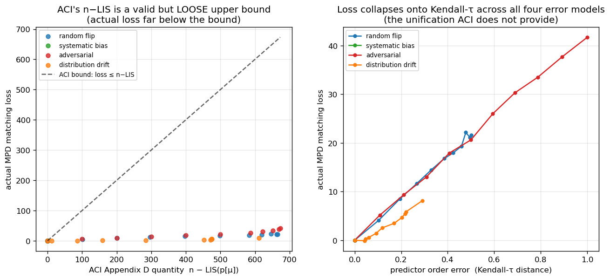

<!--
Thesis Ch 5 — What Governs the Loss: Order Error. Adapted from paper/03 §4 (numbers:
scripts/run_order_vs_theory.py). CRITICAL guardrail preserved: credit ACI Cor. D.2, do NOT
claim order matters. Cross-refs fixed (§3→Ch4, §6→Ch7). Figure 5.1 = order_vs_theory.png.
-->

# Chapter 5. What Governs the Loss: Order Error and ACI's Bound

Chapter 4 showed that on average-case inputs the loss of a degree-prediction algorithm is
small. This chapter asks what *governs* that loss. MinPredictedDegree matches by ascending
predicted degree, so it depends on the predictor $\mu$ *only through the order it induces*
on the resources: two predictors inducing the same order produce identical matchings, and a
monotone rescaling of $\mu$ changes nothing. The right question is therefore not "how large
is the error" but "which *order* error governs the loss, and how tightly." Answering it
requires care, because the qualitative fact that order — not magnitude — matters is already
a theorem, and we are explicit about what is prior and what is ours.

## 5.1 What is already known (ACI)

Aamand, Chen and Indyk [@aci2022mpd, Appendix D] prove that on the CLV-B model, MinPredictedDegree's
matching loss relative to the true expected degrees is at most $n-\mathrm{LIS}(p[\mu])$,
where $p[\mu]$ is the true weights ordered by $\mu$ and $\mathrm{LIS}$ is the longest
non-decreasing subsequence — a pure *order* quantity. In particular a monotone
(order-preserving) predictor has $p[\mu]$ already sorted, so $n-\mathrm{LIS}=0$ and the loss
is zero. Thus *order-dependence* and *the zero-effect of a monotone bias* are ACI's results,
not ours; our `systematic_bias` error model (a monotone rescale) has Kendall-$\tau\equiv0$ by
construction and, consistently, leaves MPD's ratio exactly unchanged across the benchmark
(Chapter 4) — an empirical confirmation of ACI's statement, not a new finding.

## 5.2 Our characterization

We sweep the four structured error models across strength and record, per model and level on
the same instances, three quantities: the actual MPD matching loss, ACI's $n-\mathrm{LIS}$,
and the normalized Kendall-$\tau$ order error (**Figure 5.1**; $n=1000$, Zipf exponent
$1.0$, 40 trials).

{width=100%}

**(i) ACI's $n-\mathrm{LIS}$ bound is correct but very loose.** The realized loss lies far
below the bound at every point — by roughly $16\times$ (adversarial) to $75\times$
(distribution-drift); all points hug the axis in Figure 5.1(a).

**(ii) $n-\mathrm{LIS}$ saturates and cannot distinguish error structures.** For every
non-trivial error it is pinned near its maximum ($\approx610$–$673$ for $n=1000$), even
though the true losses differ by a factor of five across models ($8.1$ drift, $21.6$
random-flip, $41.7$ adversarial). As a bound that is almost always $\approx n$, it carries
little information about which prediction is more harmful.

**(iii) Kendall-$\tau$ is the governing order measure, and the models collapse onto it.**
Plotted against Kendall-$\tau$ (Figure 5.1(b)), the four models fall on one increasing curve
— loss rises with $\tau$ ($0.29\to0.50\to1.0$ for drift, random-flip, adversarial, tracking
$8.1\to21.6\to41.7$), with `systematic_bias` pinned at $\tau=0$, zero loss. The quantity that
*predicts* the loss and unifies the error structures is the Kendall-$\tau$ order distance,
which the saturated $n-\mathrm{LIS}$ cannot resolve.

## 5.3 Chapter summary

We do not claim that order rather than magnitude governs MPD — ACI's Appendix D establishes
that, along with the zero-effect of a monotone bias. What we add is a precise empirical
characterization: ACI's $n-\mathrm{LIS}$ bound is loose by one to nearly two orders of
magnitude and saturates, whereas Kendall-$\tau$ predicts the realized loss and unifies the
four error structures. This both sharpens the theory's practical content and justifies the
single order-error axis used when the predictor is stressed on real data (Chapter 7).
