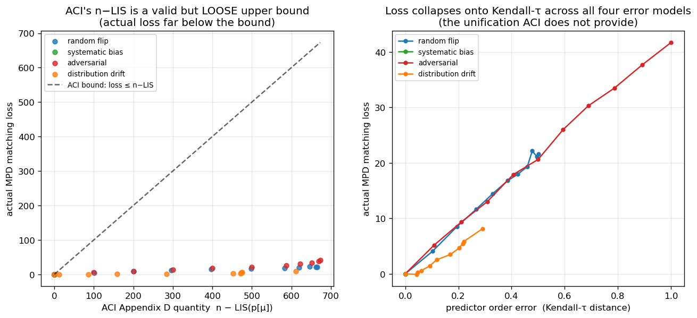

<!--
Thesis Ch 5 — What Governs the Loss: Order Error. Adapted from paper/03 §4 (numbers:
scripts/run_order_vs_theory.py). CRITICAL guardrail preserved: credit ACI Cor. D.2, do NOT
claim order matters. Cross-refs fixed (§3→Ch4, §6→Ch7). Figure 5.1 = order_vs_theory.png.
-->

# Chapter 5. What Governs the Loss: Order Error and ACI's Bound

Chapter 4 showed that on average-case inputs the loss of a degree-prediction algorithm is
small. This chapter asks what *governs* that loss. MinPredictedDegree matches by ascending
predicted degree, so it depends on the predictor $\mu$ *only through the order it induces*
on the resources: two predictors inducing the same order produce identical matchings, and a
monotone rescaling of $\mu$ changes nothing. The right question is therefore not "how large
is the error" but "which *order* error governs the loss, and how tightly." Answering it
requires care, because the qualitative fact that order — not magnitude — matters is already
a theorem, and we are explicit about what is prior and what is ours.

<!--REV
id: 5-01
role: R5 答辩提问者
level: 建议
kind: 章标题
quote: Chapter 5. What Governs the Loss: Order Error and ACI's Bound
note: 这是全文唯一在章标题里放他人姓名缩写的章。ACI 对领域外读者是无意义的三个字母，而目录是考官最先看到的东西。
fix: 改成 Order Error and the Known Bound，或 Order Error: What the Known Bound Does and Does Not Say。归属留在正文（5.1 已经写得很好）。
-->

## 5.1 What is already known (ACI)

Aamand, Chen and Indyk [@aci2022mpd, Appendix D] prove that on the CLV-B model, MinPredictedDegree's
matching loss relative to the true expected degrees is at most $n-\mathrm{LIS}(w[\mu])$.
Here $w$ is the vector of true expected degrees — written $w$ rather than $p$ to keep it
distinct from the type distribution $p$ of §3.1 — $w[\mu]$ is that vector listed in the
order $\mu$ induces, and $\mathrm{LIS}$ is the length of its longest non-decreasing
subsequence: a pure *order* quantity. In particular a monotone (order-preserving) predictor
leaves $w[\mu]$ already sorted, so $n-\mathrm{LIS}=0$ and the loss is zero. Thus *order-dependence* and *the zero-effect of a monotone bias* are ACI's results,
not ours; our `systematic_bias` error model (a monotone rescale) has Kendall-$\tau\equiv0$ by
construction and, consistently, leaves MPD's ratio exactly unchanged across the benchmark
(Chapter 4) — an empirical confirmation of ACI's statement, not a new finding.

<!--REV
id: 5-02
role: R4 体例校对
level: 必改
kind: 符号冲突
mark: where p[mu] is the true weights ordered by
quote: at most n - LIS(p[mu]), where p[mu] is the true weights ordered by mu
note: 这里的 p 是真实权重向量，而 2.2、3.1 里的 p 是类型分布。同一篇论文用同一个字母指两个不同对象，并且都出现在讨论预测误差的语境中，第 5 章的核心公式因此可能被读错。
fix: 换字母：把真实权重写成 w，公式变成 n - LIS(w[mu])。改动很小，消除的是一个真实的误读风险。
-->

<!--REV
id: 5-03
role: R3 英语文字编辑
level: 建议
kind: 免责声明重复
quote: Thus order-dependence and the zero-effect of a monotone bias are ACI's results, not ours
note: 本章在 5.1 末、5.2 开头、5.3 开头三次声明这不是我们的发现。诚实是对的，但三次会变成过度自我设限，读者反而记不住本章真正的贡献。
fix: 保留 5.1 末的这一处（它在证据旁边，最有说服力），5.3 改成正面陈述本章加了什么，把 not ours 压缩成半句。
-->

## 5.2 Our characterization

We sweep the four structured error models across strength and record, per model and level on
the same instances, three quantities: the actual MPD matching loss, ACI's $n-\mathrm{LIS}$,
and the normalized Kendall-$\tau$ order error (**Figure 5.1**; $n=1000$, Zipf exponent
$1.0$, 40 trials).

<!--REV
id: 5-04
role: R1 二审考官
level: 建议
kind: 度量未定义
mark: and the normalized Kendall
quote: the normalized Kendall-tau order error
note: normalized 的归一化方式没说：0 表示完全一致、1 表示完全反序吗；还是 1 减去相关系数。全章的结论都挂在这个量上，第 7 章还要拿它跨数据集比较。
fix: 给出定义式或一句话：we report tau normalized to [0,1], where 0 means the predicted order is exactly right and 1 means it is exactly reversed。
-->

{width=100%}

**(i) ACI's $n-\mathrm{LIS}$ bound is correct but very loose.** The realized loss lies far
below the bound at every point — by roughly $16\times$ (adversarial) to $75\times$
(distribution-drift); all points hug the axis in Figure 5.1(a).

<!--REV
id: 5-05
role: R2 领域审稿人
level: 建议
kind: 倍数的算法
quote: the realized loss lies far below the bound at every point - by roughly 16x (adversarial) to 75x (distribution-drift)
note: 16 倍和 75 倍是怎么算的没有说明：是 bound 除以 loss 的均值，还是在某个特定误差强度上取的比。松紧程度是本章贡献之一，读者需要能复核。
fix: 写明口径：ratio of the bound to the realized loss, at the strongest corruption level of each model（或你实际用的口径）。
-->

**(ii) $n-\mathrm{LIS}$ saturates and cannot distinguish error structures.** For every
non-trivial error it is pinned near its maximum ($\approx610$–$673$ for $n=1000$), even
though the true losses differ by a factor of five across models ($8.1$ drift, $21.6$
random-flip, $41.7$ adversarial). As a bound that is almost always $\approx n$, it carries
little information about which prediction is more harmful.

<!--REV
id: 5-06
role: R2 领域审稿人
level: 建议
kind: 饱和的证据
quote: For every non-trivial error it is pinned near its maximum (approximately 610 to 673 for n = 1000)
note: 饱和这个结论用了一个区间（610 到 673），但没给最大可能值。读者要自己推断 n - LIS 的上界是不是 n = 1000，从而判断 610 到 673 算不算贴顶。
fix: 补一句参照：out of a maximum of n = 1000, and against realized losses of 8 to 42。三个量放在一起，饱和这个结论才立得住。
-->

**(iii) Kendall-$\tau$ is the governing order measure, and the models collapse onto it.**
Plotted against Kendall-$\tau$ (Figure 5.1(b)), the four models fall on one increasing curve
— loss rises with $\tau$ ($0.29\to0.50\to1.0$ for drift, random-flip, adversarial, tracking
$8.1\to21.6\to41.7$), with `systematic_bias` pinned at $\tau=0$, zero loss. The collapse is
not only visual: pooling all four models and all error levels (44 points), the rank
correlation between Kendall-$\tau$ and the realized loss is Spearman $\rho=0.979$ (Pearson
$r=0.992$), and within each non-degenerate model it is $0.97$ or above. The quantity that
*predicts* the loss and unifies the error structures is the Kendall-$\tau$ order distance,
which the saturated $n-\mathrm{LIS}$ cannot resolve.

<!--REV
id: 5-07
role: R2 领域审稿人
level: 必改
kind: 视觉断言缺量化
quote: the four models fall on one increasing curve
note: 这是本章最重要的正面结论（Kendall-tau 是统一四个误差结构的量），但支撑它的只有一句对图的目视描述。审稿人会立刻要一个数：单调性有多强、四个模型的点重合到什么程度。
fix: 给一个统计量：例如四个模型合并后的 Spearman 相关系数，或以 tau 为唯一自变量拟合后的 R^2 与各模型残差。一个数就能把目视断言变成可核查的结果。
-->

## 5.3 Chapter summary

We do not claim that order rather than magnitude governs MPD — ACI's Appendix D establishes
that, along with the zero-effect of a monotone bias. What we add is a precise empirical
characterization: ACI's $n-\mathrm{LIS}$ bound is loose by one to nearly two orders of
magnitude and saturates, whereas Kendall-$\tau$ predicts the realized loss and unifies the
four error structures. This both sharpens the theory's practical content and justifies the
single order-error axis used when the predictor is stressed on real data (Chapter 7).

<!--REV
id: 5-08
role: R6 初次读者
level: 建议
kind: 章太短且无出口
quote: 5.3 Chapter summary
note: 全章只有三页，且小结没有说明第 5 章的结论会在哪里被用到（第 7 章用它解释为什么廉价预测器有效、第 8 章用它推出排序学习的想法）。这个因果链是全文最漂亮的一条，值得点破。
fix: 小结加一句出口：this is why Chapter 7 can explain a cheap predictor's success by its order fidelity, and why Chapter 8 tried to train for order directly。
-->
