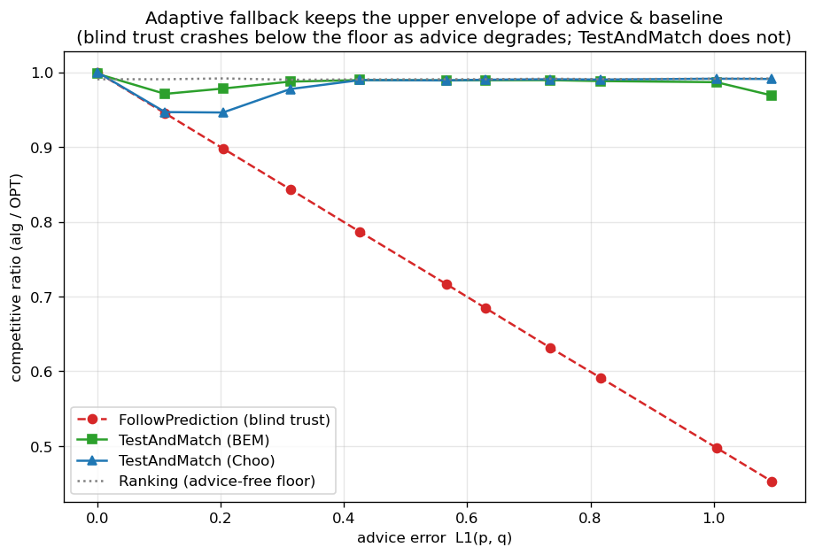
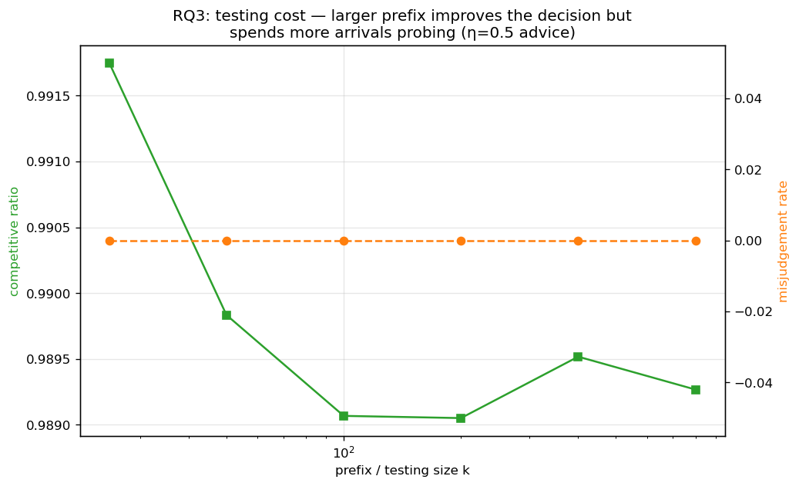
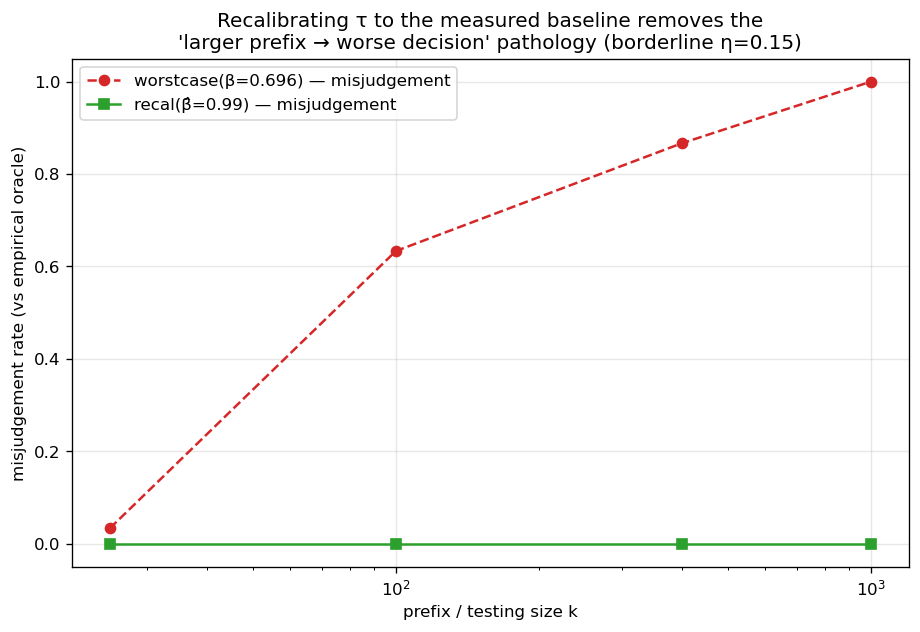

<!--
Thesis Ch 6 — Test-and-Fallback in Depth. Adapted from paper/04 §5 (numbers: run_choo_bem.py,
run_recalibration.py, test_combiner_small.py). §6.3 is the empirical bridge to the outlook
in §10.2 (Ch 9 was cut 2026-07-27; theory lives in the companion paper). Figures 6.1 =
envelope, 6.2 = prefix sweep, 6.3 = recalibration, 6.4 = testing-wall frontier.
-->

# Chapter 6. Test-and-Fallback in Depth

The test-and-fallback algorithms are the adaptive robustness mechanism of Chapter 4. This
chapter gives their first empirical study: the robustness envelope they achieve (§6.1), a
counter-intuitive failure of the acceptance threshold (§6.2), its recalibration and the
resolution limit that recalibration exposes (§6.3) — a limit that persists across the whole
difficulty range and anchors the theoretical outlook of §10.2 — and a benchmark of the
dynamic combiner that explains the *commit-once* structure (§6.4). Two naming conventions
apply throughout. **FollowPrediction** is the unguarded follower, which mimics the advice
matching without testing it; **TestAndMatch** is the test-and-fallback scheme in general, of
which **Choo** and **BEM** are the two published instantiations — they share the
test-then-commit structure and differ in how the acceptance threshold is set. The $\ell_1$
test is the empirical surrogate the original authors also fall back to (Chapter 3).

<!--REV
id: 6-01
role: R1 二审考官
level: 必改
kind: 名称未消歧
mark: TestAndMatch instead stays on the
quote: FollowPrediction / TestAndMatch / BEM / Choo
note: 本章有四个名字在流通：FollowPrediction、TestAndMatch、Choo、BEM。前两个是策略名，后两个是作者缩写，但正文从未说明 Choo 和 BEM 是同一个 TestAndMatch 的两种变体、还是两个不同算法。6.1 直接写 BEM 0.998 到 0.969；Choo 1.000 到 0.991，读者到这里必须自己反推。
fix: 在本章导语加一句名称表：we write TestAndMatch for the test-and-fallback scheme in general, and Choo and BEM for its two published instantiations, which differ only in the acceptance threshold。四个名字一次说清，全章受益。
-->

<!--REV
id: 6-02
role: R3 英语文字编辑
level: 建议
kind: 导语长句
quote: This chapter gives their first empirical study: the robustness envelope they achieve (6.1), a counter-intuitive failure of the acceptance threshold (6.2), its recalibration and the resolution limit that recalibration exposes (6.3) - a limit that persists across the whole difficulty range and anchors the theoretical outlook of 10.2 - and a benchmark of the dynamic combiner that explains the commit-once structure (6.4).
note: 一句 70 词，四项并列，中间还插了一个破折号从句。章导语是读者决定怎么读这一章的地方，恰恰最不该长。
fix: 拆成两句：一句列四项（各一个短语），一句单独说 6.3 的分辨率极限是本章通往 10.2 的接口。
-->

## 6.1 The robustness envelope

Sweeping advice error $\ell_1(p,q)$ on few-types instances ($n=2000$, $r=8$, prefix $k=200$,
40 trials; **Figure 6.1**), FollowPrediction degrades *linearly* from $1.000$ at perfect
advice to $0.453$ at $\ell_1\!\approx\!1.1$ — well *below* the advice-free floor
($\approx0.99$). TestAndMatch instead stays on the **upper envelope**: it captures the
benefit when advice is good and, when advice is bad, its prefix test rejects it and it falls
back to Ranking, never crashing (BEM $0.998\to0.969$; Choo $1.000\to0.991$). This is the
adaptive counterpart of the structural robustness of Chapter 4.

<!--REV
id: 6-03
role: R1 二审考官
level: 建议
kind: 符号未复述
mark: Sweeping advice error
quote: few-types instances (n=2000, r=8, prefix k=200, 40 trials)
note: 四个符号在第 3 章定义，但读者到这里已经隔了十五页，尤其 r 和 k 很容易记混（r 是类型数还是资源数？k 是前缀长度还是折数？）。
fix: 括号里就地补词：(n=2000 arrivals, r=8 request types, a prefix of k=200 arrivals, 40 trials)。多几个词，读者不用回翻。
-->

<!--REV
id: 6-04
role: R2 领域审稿人
level: 建议
kind: 全称断言
quote: its prefix test rejects it and it falls back to Ranking, never crashing
note: never 是全称量词，而证据是一条误差 sweep、一个图族、40 次重复。审稿人会盯这类词。
fix: 限定到证据范围：it does not fall below the advice free floor at any point of this sweep。真正的全称结论留给 6.3 的机制解释去承担。
-->

{width=50%}

## 6.2 A threshold that is too lenient on average-case inputs

Sweeping the prefix (testing) size $k$ at *borderline* advice ($\eta=0.15$, true
$\ell_1\!\approx\!0.16$) — where the test works hardest (**Figure 6.2**) — a larger, more
accurate test makes the *worse* decision: as $k$ grows $25\to800$, the ratio falls
$0.992\to0.956$ and the misjudgement rate rises $0.00\to0.60$.

The mechanism has two halves. First, the acceptance threshold $\tau$ is calibrated to
$\beta$, the competitive ratio the advice-free baseline is *proved* to achieve — here
$\beta\approx0.696$, Ranking's worst-case ratio under random arrival order, the value Choo
et al. instantiate their threshold with [@choo2024imperfect]. On these instances the
realized baseline is instead $\approx0.99$ (F3), so the empirical break-even sits at
$\ell_1\approx0$, far below $\tau$. Second, the prefix interacts with that gap in opposite
directions at the two ends of the sweep. A small, noisy prefix over-estimates $\ell_1$ and
rejects the borderline advice, landing safely on the floor — it is right for the wrong
reason, rejecting because it is noisy rather than because the advice is bad. A large,
accurate prefix measures $\ell_1\approx0.16<\tau$ correctly and therefore accepts the
mildly-bad advice that the worst-case threshold deems acceptable, underperforming the
baseline. On strong-baseline inputs the worst-case threshold is too lenient, and a more
accurate test only follows it more faithfully.

<!--REV
id: 6-05
role: R1 二审考官
level: 必改
kind: 数字来源缺失
mark: is calibrated to the worst-case baseline
quote: the Choo/BEM threshold tau is calibrated to the worst-case baseline beta approximately 0.696
note: 0.696 凭空出现。读者（尤其二审）会立刻想：这个数是哪来的、为什么不是 1-1/e。这是本节机制解释的支点，支点没有来源，整个 pathology 的论证就悬空了。
fix: 补半句出处：beta is the worst case competitive ratio the advice free baseline is proved to achieve in this model (see 2.x / the original paper)。若是你自己算的，写明算法与实例族。
-->

<!--REV
id: 6-06
role: R3 英语文字编辑
level: 必改
kind: 信息密度
quote: as k grows 25 to 800, the ratio falls 0.992 to 0.956 and the misjudgement rate rises 0.00 to 0.60. The mechanism: ... A small noisy prefix over-estimates ell_1 and accidentally rejects the borderline advice (landing safely on the floor); a large accurate prefix correctly measures ell_1 approximately 0.16 < tau and accepts the mildly-bad advice ...
note: 一段里有六组数字加一条两步机制解释，其中一句 45 词。这是全章最反直觉的发现，却是最难读的一段，第一次读需要读三遍。
fix: 改成三段式：第一句只讲现象（更大的测试反而做出更差的决定，给两个数）。第二句讲原因的一半（阈值是按最坏情况基线校准的，而这些实例的基线是 0.99）。第三句讲另一半（小前缀因为噪声误拒而侥幸安全，大前缀准确测量后照章接受了坏建议）。数字各归各句。
-->

<!--REV
id: 6-07
role: R3 英语文字编辑
level: 建议
kind: 强调过密
mark: -
quote: worse / falls / rises / accidentally rejects / accepts / below
note: 这一段有八处斜体强调。强调密度一高，强调就失效，读者反而抓不到哪个才是重点。
fix: 每段最多留一到两处。本段真正需要强调的只有一个词组：more accurate 却 worse decision。
-->

<!--REV
id: 6-08
role: R6 初次读者
level: 建议
kind: 题眼被藏起来
quote: (landing safely on the floor)
note: 错误的原因导致了正确的结果，这是本节最有意思、也最能体现你观察力的一点，现在被塞在括号里一带而过。
fix: 把它提成独立一句并点名：the small test is right for the wrong reason - it rejects because it is noisy, not because the advice is bad。这句话会成为读者记住这一节的抓手。
-->

{width=50%}

## 6.3 Recalibration, and the resolution limit it exposes

By the **resolution** of a test we mean the smallest difference in $\ell_1$ that its
empirical estimator can distinguish from its own sampling noise at prefix length $k$; this
section is about that quantity and the limit it imposes.
Recalibrating $\tau$ to the *measured* baseline $\hat\beta$ eliminates the pathology
(**Figure 6.3**): at borderline advice the worst-case threshold's misjudgement climbs
$0.03\to1.00$ as the prefix grows and its ratio drops to $0.920$, while the recalibrated
threshold holds misjudgement $0.00$ at every prefix and ratio $\approx0.986$. But
recalibration exposes a deeper limit.
At perfect advice the worst-case threshold scores $1.000$ while the recalibrated one scores
only $0.987$: the recalibrated $\tau\approx2(1-\hat\beta)\approx0.028$ is *smaller than the
empirical-$\ell_1$ estimator's noise floor* ($\approx0.05$–$0.13$), so it can never
confidently *accept* — it rejects everything, including perfect advice, and always plays the
baseline. In short:

> On strong-baseline instances, no practical empirical-$\ell_1$ threshold can both capture
> the consistency upside and stay safe: the upside is tiny and sits *below the estimator's
> resolution*. The worst-case threshold over-accepts; the recalibrated one over-rejects; a
> better tester only follows whichever threshold more faithfully.

<!--REV
id: 6-09
role: R1 二审考官
level: 必改
kind: 先用后释
quote: 6.3 Recalibration, and the resolution limit it exposes
note: resolution limit 出现在节标题里，正文到第六行才隐含解释（阈值小于估计量噪声底）。读者带着一个没定义的词读了半页。
fix: 节的第一句就下定义：by resolution we mean the smallest difference in ell_1 the empirical estimator can distinguish from noise at prefix length k。后面的论证才有依托。
-->

<!--REV
id: 6-10
role: R2 领域审稿人
level: 建议
kind: 断言范围
quote: On strong-baseline instances, no practical empirical-ell_1 threshold can both capture the consistency upside and stay safe
note: no ... can 是不可能性断言，而证据是两个具体阈值加一次噪声底估计。practical 和 empirical-ell_1 这两个限定词已经做得很好，但审稿人仍会问：所有阈值都试过了吗。
fix: 把量词落到证据上：among thresholds of this form, and at the prefix lengths we can afford, none both captures ... 真正的任意规则版本是 10.2 的事，两处的强度要分开。
-->

<!--REV
id: 6-11
role: R3 英语文字编辑
level: 建议
kind: 重复
quote: a better tester only follows whichever threshold more faithfully
note: 与 6.2 末句 a more accurate test only follows it more faithfully 几乎同形同义，隔了半页再说一遍，第二次读起来像作者忘了自己写过。
fix: 6.2 那句改成机制描述，把这句金句留给 6.3 的小结独享。
-->

<!--REV
id: 6-12
role: R2 领域审稿人
level: 建议
kind: 估计量缺说明
mark: estimator's noise floor
quote: smaller than the empirical-ell_1 estimator's noise floor (approximately 0.05 to 0.13)
note: 噪声底给了区间但没说这个区间是怎么来的、随什么变化（k？r？重复次数？）。这是本节论证的关键量，也是整篇论文通往 10.2 的桥。
fix: 补一句：the range spans k from 25 to 800 (noise falls as k grows); it is the standard deviation of the plug in estimate across trials at zero true error。一句话就把这个数从断言变成可复核的量。
-->

{width=50%}

**Figure 6.4** widens this finding from one threshold to the whole difficulty range.
Sweeping the number of types — the knob that sets the baseline strength — the *potential*
upside of perfect advice grows as the baseline weakens, but the upside a sublinear-prefix
test can *safely capture* stays pinned near zero: the empirical test's resolution (its
noise floor) sits far above the break-even margin wherever an upside exists. The wall of
this chapter is therefore not one badly calibrated threshold. The upside and the testing
resolution move together — and the concluding outlook (§10.2) gives this coupling a
quantitative form: the prefix needed to decide scales as the inverse square of the stakes.

{width=100%}

<!--REV
id: 6-13
role: R1 二审考官
level: 建议
kind: 图注不自足
quote: as the baseline weakens (left)
note: 这是全章最重要的一张图，图注却没说横轴是什么。as the baseline weakens (left) 只是暗示了方向，读者要回正文才知道扫的是类型数 r。图应当能脱离正文被看懂。
fix: 图注首句直接交代坐标：horizontal axis: number of request types r (fewer types = weaker advice free baseline, shown left); vertical axis: ratio gain over the baseline。然后再讲结论。
-->

## 6.4 The dynamic combiner is dominated, and shows why matching needs test-then-commit

We benchmark the Chłędowski-style dynamic combiner to contextualize the commit-once structure
of test-and-fallback. In its robust tuning the combiner sits exactly on the floor of the
few-types family of §6.1 ($0.990$ across all advice quality): it never crashes but captures
none of the consistency upside, strictly dominated by TestAndMatch. More instructively, an
*eager* combiner that switches mid-stream reveals a penalty specific to irrevocable
problems. On a smaller instance used as a mechanism check — $n=600$, $r=6$, a single seed
with no averaging, one of the hand-verifiable scripts of Appendix A.3 — eager switching
under perfect advice scores $0.927$, below both the pure follower ($1.000$) and Ranking on
that same instance ($0.958$), because switching from Ranking to advice-following mid-run
lands the committed matching in an *incompatible hybrid*. Being one instance, this figure
illustrates the mechanism rather than measuring its size; note also that its $0.958$ is
Ranking on *that* instance, not the $0.990$ floor of the family above. In an irrevocable problem the
follow/fallback decision must be made *before* the bulk of the commitments, which is why
Choo/BEM test a prefix and then *commit* rather than switching dynamically. The dynamic
combiner that is cheap insurance for caching does not port cleanly to matching.

<!--REV
id: 6-14
role: R5 答辩提问者
level: 必改
kind: 数据来源可疑
mark: eager switching scores
quote: eager switching scores 0.927 - below both the pure follower (1.000) and the pure baseline (0.958; tests/test_combiner_small.py)
note: 论文正文的数字引用了一个单元测试文件。答辩时这一定会被问：这是正式实验还是小规模自测、n 多大、重复多少次、有没有置信区间。全章其他数字都有实验设置，只有这一处没有。
fix: 要么把它升级为一次正式实验并给出与 6.1 同格式的设置与置信区间，要么在正文明说它的地位：a small scale sanity experiment (n=..., ... trials), reported to illustrate the mechanism rather than to measure it。脚本路径移到附录 A 的映射表里。
-->

<!--REV
id: 6-15
role: R4 体例校对
level: 必改
kind: 同名不同值
mark: In its robust tuning the combiner sits exactly on the floor
quote: the pure baseline (0.958) / the advice-free floor (approximately 0.99) / the combiner sits exactly on the floor (0.990)
note: 本章出现了三个都叫基线或 floor 的数：0.99、0.990、0.958。它们大概来自不同实例族与不同规模，但正文没有区分，读者只会认为哪里算错了。这是最容易被考官当场指出的不一致。
fix: 两条都做：给每个数标注它所在的实例设置（一个括号即可），并在本章第一次出现时统一命名（advice free floor 只指 6.1 那个族的数）。若三者本可统一，那就统一。
-->

<!--REV
id: 6-16
role: R4 体例校对
level: 建议
kind: 代码名进正文
quote: switching from Ranking to advice-following (mimic) mid-run
note: mimic 是代码里的策略名，在正文这是它第一次也是唯一一次出现，读者不知道它和 advice following 是不是两回事。
fix: 删掉 mimic，或写成 (called mimic in the implementation)。正文只用一个名字。
-->

## 6.5 Chapter summary

Test-and-fallback delivers the adaptive robustness envelope of §6.1, but its accept/reject
decision is fundamentally limited on strong-baseline inputs: no empirical-$\ell_1$ threshold
both captures the upside and stays safe (§6.3), and dynamic switching is dominated by
test-then-commit (§6.4). The resolution limit of §6.3 — and its persistence across the
whole difficulty range (Figure 6.4) — is the empirical anchor of the theoretical outlook
in §10.2.

<!--REV
id: 6-17
role: R6 初次读者
level: 可选
kind: 小结无出口
quote: The resolution limit of 6.3 ... is the empirical anchor of the theoretical outlook in 10.2.
note: 本章小结只回顾结论，没有告诉读者接下来该带着什么问题读第 7 章。全书各章小结的结构如果一致（回顾 + 出口），阅读节奏会好很多。
fix: 末尾补一句出口：the next chapter asks whether this picture survives outside synthetic instances。并检查其他各章小结是否都有这样一句。
-->
