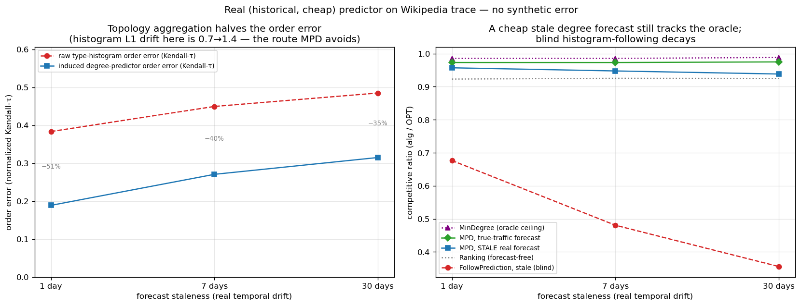
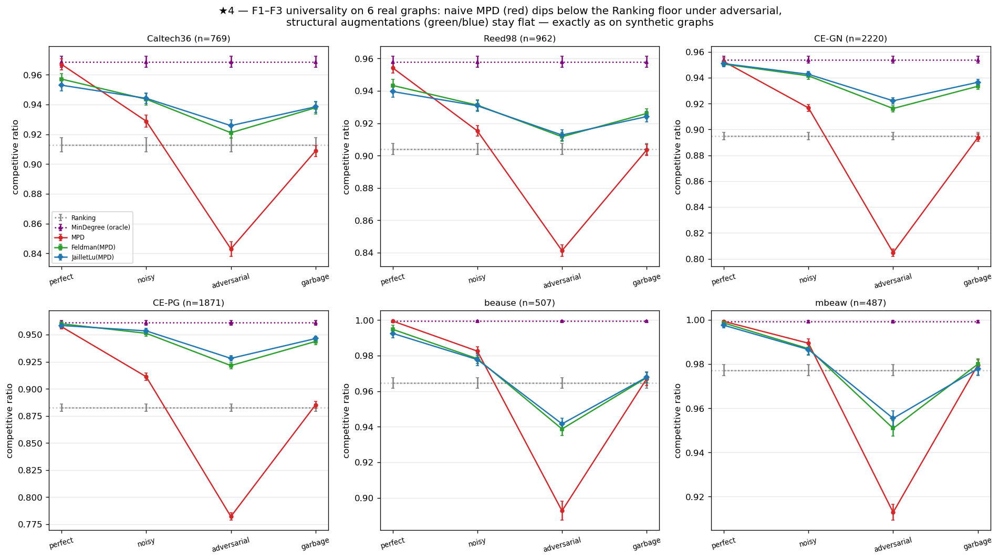

<!--
Thesis Ch 7 — External Validity. Adapted from paper/05 §6 (numbers: run_real_predictor.py,
run_realworld_robustness.py, RANK_LEARNING_M0_M3.md). Cross-refs fixed (§4→Ch5, §7→Ch9).
Guardrails: F2 "qualitatively 6/6, strictly 4/6"; §7.3 learning result is an honest negative
(the fuller Direction-A journey is Ch 8). Figures 7.1 = real_predictor, 7.2 = realworld_robustness.
-->

# Chapter 7. External Validity

Chapters 4–6 use synthetic graphs and a synthetic error knob. Is the picture real? We stress
it three ways: a genuine, cheap predictor on a real request trace (§7.1); the six real-world
graphs (§7.2); and whether *learning* the predictor changes anything (§7.3).

## 7.1 A real, cheap predictor

We replace the synthetic knob with the cheapest realistic predictor: last-window historical
statistics. Real Wikipedia daily pageviews give a live day (the truth) and earlier days (a
1-, 7-, or 30-day-stale forecast), so the error is genuine temporal drift; we map the trace
onto a fixed serving topology and consume the forecast through the degree route (MPD)
(**Figure 7.1**). Three facts emerge. First, **the cost premise does not bite**: the
predictor is a linear-time count ($0.108$ ms — about $2\%$ of computing $\mathrm{OPT}$ once),
not an ML inference. Second, **the benefit is real, partial, and never harmful**: a stale
forecast captures $27\%$–$68\%$ of the oracle gap (falling with staleness) and always stays
above the baseline ($0.938$–$0.957$ vs $0.923$–$0.925$, even at 30 days). Third, and why:
**topology aggregation makes the cheap predictor order-faithful** — the induced degree
predictor's order error is only Kendall-$\tau\approx0.19$–$0.32$, roughly *half* the raw
histogram's ($0.38$–$0.49$) — and since MPD depends only on order (Chapter 5), the aggregated
route survives real drift. Consuming the *same* forecast through the raw histogram is
catastrophic: blind FollowPrediction collapses to $0.68\to0.36$, far below the $\approx0.92$
baseline — exactly what the robust algorithms of Chapters 4 and 6 are for.

{width=100%}

## 7.2 Six real-world graphs

We re-run the degree-prediction roster of Chapter 4 on the six Network-Repository graphs (two
Facebook social, two C. elegans biological, two economic input-output), across the same
quality columns, with 95% CIs (**Figure 7.2**). The two load-bearing findings are universal.
**F1 holds on all six**: naive MPD fed an adversarial predictor falls below the Ranking floor
everywhere — by $0.07$ (Caltech36) to $0.11$ (CE-PG). **F3 is universal and confirms its own
logic**: the consistency upside is small everywhere (mean $+0.049$; range $+0.022$–$+0.077$)
and smallest exactly where the baseline is strongest — the two dense economic graphs, with
Ranking already $0.965$/$0.977$, give the tiniest upsides.

The structural-robustness finding **F2 holds qualitatively on all six** (the augmentations
are always less sensitive to prediction quality than naive MPD) and *strictly* on the four
social/bio graphs (spread $0.22$–$0.29\times$ MPD's); on the two dense economic graphs the
protection is only *partial* — the augmentation cushions the adversarial drop ($0.939$ vs
naive MPD's $0.893$) but cannot clear the unusually high $0.965$ floor, dipping $\approx0.03$
below it. This econ boundary is instructive rather than a failure: those graphs are so dense
that matching is nearly trivial (Ranking $\approx0.97$, MinDegree $=1.00$), so there is
neither upside to capture (F3) nor much downside to protect. Finally, F4 is *dramatic*: the
worst-case-designed Feldman/Jaillet–Lu are the weakest advice-free entries on the econ graphs
($0.73$–$0.77$) and the augmentation lifts them to $0.99$ — a $+0.26$ rescue.

{width=100%}

## 7.3 Does learning the predictor help?

Because MPD consumes the predictor only through order (Chapter 5), one might train it with a
rank loss rather than regression. We tested this and report an honest negative. With
*deliberately divergent* synthetic features rank-training beats regression sharply ($0.989\approx$
oracle vs $0.974$, with worse regression error but better order); but the advantage is gated
by feature divergence and by graph difficulty (peaking at $+1.3\%$), and, decisively, on real
temporal features it *disappears* — rank- and regression-trained predictors produce identical
order (Kendall-$\tau$ $0.126$ vs $0.126$) and identical ratio. The dissociation that powers
order-aware training is a property of engineered features, not realistic ones. (The fuller
account of this exploration is Chapter 8.) The lesson reinforces the thesis: once a predictor
is order-faithful — which a cheap historical count already is (§7.1) — neither a better
algorithm nor a better-trained predictor buys much on average-case matching.

## 7.4 Chapter summary

On real predictors, real graphs, and a learned predictor, the same wall stands: the
advice-free baseline is near-optimal, unguarded following is unsafe, and predictions buy
downside protection rather than performance. Having established the wall empirically across
every setting we could reach, the thesis next proves it is necessary (Chapter 9).
