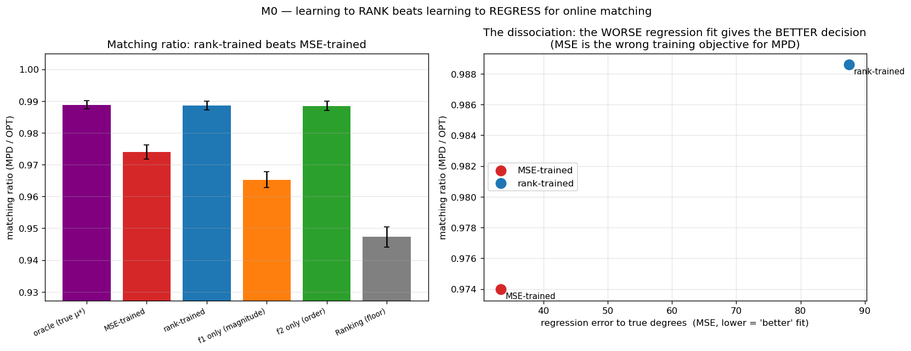
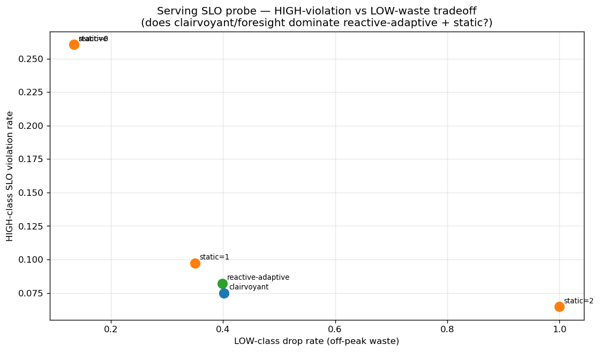

<!--
Thesis Ch 8 — Exploratory Directions & Negative Results (the "journey" chapter;
thesis-defining, cut from the venue paper). Sources: docs/RANK_LEARNING_M0_M3.md,
SERVING_SLO_PROBE.md, LITERATURE_REVIEW.md, RESEARCH_PLAN_A.md. Frame: the negatives
CONVERGE on the same wall (F3), which is what motivated proving it necessary (Ch 9).
Honesty is the point of this chapter — present negatives AS results.
-->

# Chapter 8. Exploratory Directions and Negative Results

The experimental chapters (4–7) establish a wall: on average-case matching the advice-free
baseline is near-optimal, so predictions are robustness insurance rather than a performance
lever. Before proving this wall is necessary (Chapter 9), we pursued three directions that
each *tried to get past it* — learning the predictor to squeeze out more performance
(§8.1), finding a serving regime where predictions genuinely help (§8.2), and letting a
systematic literature review point us to the highest-value contribution (§8.3). All three
returned the same answer, and their convergence is what motivated the theorem. This chapter
reports them honestly, including the negatives, because they are part of the evidence and
because ruling out ambitious alternatives is itself a result.

## 8.1 Learning to rank the predictor (a negative result)

Chapter 5 shows that MPD consumes its predictor only through the *order* it induces. This
suggests a concrete way to do better: rather than training a predictor to minimize its
*regression* error to the true degrees (the standard "predict-then-optimize" objective),
train it with an *order-aware* loss — a pairwise rank loss — so it optimizes the quantity
the algorithm actually uses. We investigated this in three steps.

**M0 — the mechanism exists.** With deliberately *divergent* synthetic features (one feature
carrying magnitude, another carrying order), a rank-trained linear predictor sharply beats a
regression-trained one on the decision metric: matching ratio $0.989$ (essentially the
oracle) versus $0.974$, while the rank-trained predictor has *worse* regression error to the
truth (MSE $87.6$ vs $33.4$) but better order (Kendall-$\tau$ $0.058$ vs $0.255$). The
dissociation is real: the worse *fit* gives the better *decision*, confirming that
regression is the wrong training objective when it matters.

{width=100%}

**M1 — but the advantage is doubly gated, and small.** Sweeping the feature divergence and
the graph difficulty, the rank-advantage is zero when features do not induce an
order/magnitude conflict, and zero on easy instances where the baseline is already optimal
(the wall, again). It peaks at only $+1.3\%$ of the ratio on synthetic graphs; a more
favorable framing is *gap-capture*, where rank-training recovers essentially the full oracle
gap while regression leaves about $30\%$ of it unrealized — but the gap itself is small.

**M3 — and it disappears on real features.** The decisive test uses genuine temporal
features from real serving traces (per-resource reference counts over the previous windows)
to predict the next window. Here the rank- and regression-trained predictors produce
*identical* order (Kendall-$\tau$ $0.126$ vs $0.126$) and identical matching ratio, across
every topology and lag configuration tried. The order/magnitude divergence that powers
rank-training is a property of *engineered* features; realistic lagged-count features are
co-linear noisy estimates of the same popularity, so regression already recovers the order
as well as ranking does.

{width=100%}

**Verdict.** Learning the predictor with a decision-aligned loss does not elevate to a
standalone contribution: the win requires a feature divergence that does not arise in
practice, and even where it does the payoff is bounded by the (small) baseline-to-oracle
gap. The result is folded into the thesis as a negative that *reinforces* the central
finding — once a predictor is order-faithful, which a cheap historical count already is
(Chapter 7), neither a better algorithm nor a better-trained predictor buys much on
average-case matching.

## 8.2 Rescuing the serving application with a with-predictions result (a negative probe)

The serving case study (Chapter 10) recovers established systems results and is therefore
presented as a case study rather than a novelty claim. We asked whether a *new* actionable
with-predictions result could rescue it. The obstacle is again the wall: every serving
variant we tried optimizes *throughput* (goodput), and throughput is forgiving — under
overload a reactive router fills capacity just as the optimum does, so predictions add
nothing. The escape, if one exists, must be a different *objective* on which the reactive
baseline is genuinely far from optimal.

We probed the most promising candidate: an **SLO / tail objective** — protecting a tight-SLO
class of requests from being dropped — under bursty, non-stationary load, exactly the regime
where a reactive policy, lacking foresight, might fail. Using an event-driven simulator we
compared non-predictive policies (static capacity reservation; a reactive-adaptive policy
that reserves based on *observed* recent load) against a **clairvoyant oracle** that reserves
based on the *actual future* burst. Across every regime swept — overload level, uniform vs
bursty tight-SLO demand — the best non-predictive policy matches the clairvoyant oracle to
within $\le 3\%$; in the moderate regime a trivial static reservation of one slot drives
tight-SLO violations to near zero and *beats* the clairvoyant oracle outright. Two reasons,
both robust to the sweep: protecting a tight-SLO minority needs only a small static
headroom, no forecast; and bursts are persistent enough that reacting to observed load is
almost as good as forecasting it.

{width=75%}

**Verdict.** The tail objective is forgiving too — a third face of the wall, after
throughput (Chapters 4–7) and predictor-learning (§8.1). We found no natural regime where
foresight helps, so serving remains a case study. A regime that would break the wall (a
non-stationary or adversarial objective where the baseline is far from optimal) is exactly
the kind of setting the thesis brackets as future work.

## 8.3 A literature review that redirected the work

Deciding *which* of our findings were genuinely novel — and worth developing — required a
systematic prior-art review rather than intuition. We conducted a large multi-source,
adversarially-verified literature search (documented in `docs/LITERATURE_REVIEW.md`) that
returned honest, sometimes deflating, verdicts. It confirmed that the unified experimental
benchmark and the empirical study of test-and-fallback are unoccupied and worth leading
with; that the order-error finding is *partially* pre-empted by ACI's Appendix D and must be
reframed as a tightness/measure characterization rather than a discovery (Chapter 5); and
that the serving results are largely re-derivations of established systems facts, warranting
their demotion to a case study (§8.2, Chapter 10). A second, focused prior-art pass on the
theory confirmed that the impossibility of Chapter 9 is unoccupied, while flagging the one
risk to defend against (Choo et al.'s constructive baseline-coupling), which shaped the
information-theoretic framing of the proof.

This review is itself part of the research process reported here: it turned an
undifferentiated pile of findings into a prioritized contribution, redirected effort away
from low-value elaborations (weighted-value variants, more baseline comparisons) and toward
the theorem, and enforced the honesty guardrails carried throughout the thesis.

## 8.4 Synthesis: the negatives motivate the theorem

The three explorations point the same way. A better-trained predictor does not help on real
features (§8.1); a with-predictions lens does not rescue serving even on a tail objective
(§8.2); and the literature review confirmed there was no easy performance win to be had
(§8.3). Together with the throughput wall of Chapters 4–7, they show the phenomenon is not
confined to one objective, one algorithm, or one dataset — it recurs everywhere we pushed.
That robustness of the empirical finding is precisely what suggested it might be *forced*,
and it is what motivated the impossibility theorem of Chapter 9: having failed to get past
the wall from several directions, we set out to prove that no algorithm of the relevant
class can.
