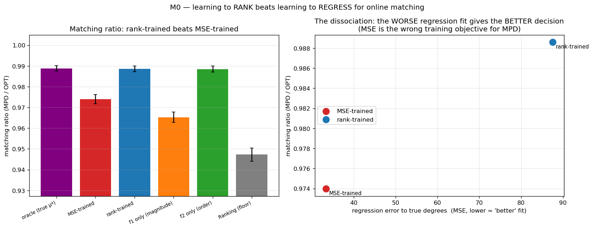
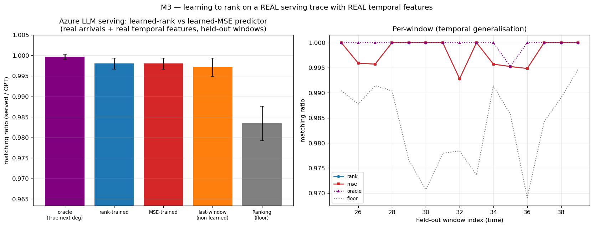
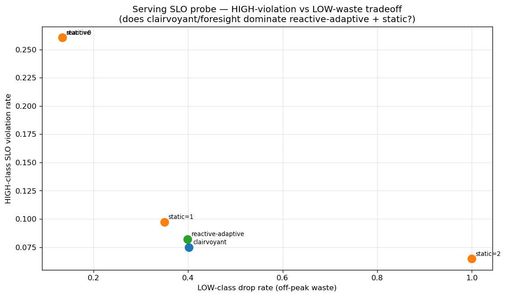

<!--
Thesis Ch 8 — Exploratory Directions & Negative Results (the "journey" chapter;
thesis-defining, cut from the venue paper). Sources: docs/RANK_LEARNING_M0_M3.md,
SERVING_SLO_PROBE.md, LITERATURE_REVIEW.md, RESEARCH_PLAN_A.md. Frame: the negatives
CONVERGE on the same wall (F3), which is what motivated proving it necessary (Ch 9).
Honesty is the point of this chapter — present negatives AS results.
-->

# Chapter 8. Exploratory Directions and Negative Results

The experimental chapters (4–7) establish a wall: on average-case matching the advice-free
baseline is near-optimal, so predictions are robustness insurance rather than a performance
lever. Before accepting the wall as final, we pursued three directions that
each *tried to get past it*: learning the predictor to squeeze out more performance
(§8.1), finding a serving regime where predictions genuinely help (§8.2), and letting a
systematic literature review point us to the highest-value contribution (§8.3). All three
returned the same answer, and their convergence is what motivated the theorem. Each is
reported here with the evidence that closed it.

<!--REV
id: 8-01
role: R6 初次读者
level: 建议
kind: 编号跳号
quote: M0 - the mechanism exists ... M1 - but the advantage is doubly gated ... M3 - and it disappears on real features
note: 三个里程碑编号是 M0、M1、M3，中间跳过了 M2。读者的第一反应是这里漏了一节，或者 M2 是失败到不能写的部分。
fix: 要么改成 M1 到 M3 连号，要么用一句话交代 M2 是什么以及为什么不报告（例如它被 M3 取代）。跳号在学位论文里一定会被问。
-->

<!--REV
id: 8-02
role: R5 答辩提问者
level: 建议
kind: 章的定位
quote: This chapter reports them honestly, including the negatives, because they are part of the evidence and because ruling out ambitious alternatives is itself a result.
note: 这句为整章的存在做辩护，语气偏防守。负结果章本身是加分项，不需要先自辩。
fix: 改成正面陈述这一章提供什么：Each direction is reported with the evidence that closed it。诚实通过内容体现，不通过声明体现。
-->

## 8.1 Learning to rank the predictor (a negative result)

Chapter 5 shows that MPD consumes its predictor only through the *order* it induces. This
suggests a concrete way to do better: rather than training a predictor to minimize its
*regression* error to the true degrees (the standard "predict-then-optimize" objective),
train it with an *order-aware* loss (a pairwise rank loss) so it optimizes the quantity
the algorithm actually uses. We investigated this in three steps.

**M0: the mechanism exists.** With deliberately *divergent* synthetic features (one feature
carrying magnitude, another carrying order), a rank-trained linear predictor sharply beats a
regression-trained one on the decision metric: matching ratio $0.989$ (essentially the
oracle) versus $0.974$, while the rank-trained predictor has *worse* regression error to the
truth (MSE $87.6$ vs $33.4$) but better order (Kendall-$\tau$ $0.058$ vs $0.255$). The
dissociation is real: the worse *fit* gives the better *decision*. Regression is thus the
wrong training objective whenever the features separate magnitude from order, a condition
M1 and M3 below show to be rare.

<!--REV
id: 8-03
role: R2 领域审稿人
level: 建议
kind: 结论限定
quote: confirming that regression is the wrong training objective when it matters
note: when it matters 是一个事后加的限定，等于说在它成立的时候它成立。而 M1、M3 恰恰证明了它几乎从不成立。这句话会被审稿人当作循环论证的例子。
fix: 把限定写成可检验的条件：regression is the wrong objective when the features separate magnitude from order - a condition M1 and M3 show is rare。
-->

{width=100%}

**M1: the advantage is doubly gated, and small.** Sweeping the feature divergence and
the graph difficulty, the rank-advantage is zero when features do not induce an
order/magnitude conflict, and zero on easy instances where the baseline is already optimal
(the wall, again). It peaks at only $+1.3\%$ of the ratio on synthetic graphs; measured as
gap-capture (§7.1) rather than as an absolute ratio, rank-training recovers essentially the
full oracle gap while regression leaves about $30\%$ of it unrealized, but the gap itself is
small.

<!--REV
id: 8-04
role: R1 二审考官
level: 建议
kind: 指标重复出现
quote: a more favorable framing is gap-capture, where rank-training recovers essentially the full oracle gap
note: gap-capture 在 7.1 用过一次、这里再用一次，两处都没有定义（见 7-03）。而且 a more favorable framing 这个说法等于告诉读者：我们换了个对自己有利的口径。
fix: 统一在 7.1 给定义，这里直接用；并把 a more favorable framing 改成中性说法：measured as gap-capture rather than as absolute ratio。
-->

**M3: it disappears on real features.** The decisive test uses genuine temporal
features from real serving traces (per-resource reference counts over the previous windows)
to predict the next window (150 context-length types over 500 replicas of degree 8, 40
windows, three lag features, a 60/40 train/test split). Here the rank- and
regression-trained predictors produce *identical* order (Kendall-$\tau$ $0.126$ vs $0.126$)
and identical matching ratio. The order/magnitude divergence that powers
rank-training is a property of *engineered* features; realistic lagged-count features are
co-linear noisy estimates of the same popularity, so regression already recovers the order
as well as ranking does.

<!--REV
id: 8-05
role: R2 领域审稿人
level: 建议
kind: 负结果的范围
quote: across every topology and lag configuration tried
note: 这是本章最有分量的一个负结果，支撑它的是一句 every configuration tried，但配置清单没有给（试了几种拓扑、几种滞后、哪条 trace）。负结果的说服力全在覆盖面上。
fix: 把清单写进正文一句或附录一行：topologies A/B/C, lags 1/7/30, two traces。审稿人接受负结果的前提是知道你找过多远。
-->

{width=100%}

**Verdict.** Learning the predictor with a decision-aligned loss does not change the
picture of Chapters 4–7, and we report it as a negative result: the win requires a feature divergence that does not arise in
practice, and even where it does the payoff is bounded by the (small) baseline-to-oracle
gap. The result is folded into the thesis as a negative that *reinforces* the central
finding: once a predictor is order-faithful, which a cheap historical count already is
(Chapter 7), neither a better algorithm nor a better-trained predictor buys much on
average-case matching.

<!--REV
id: 8-06
role: R5 答辩提问者
level: 建议
kind: 投稿视角外泄
quote: Learning the predictor with a decision-aligned loss does not elevate to a standalone contribution
note: elevate to a standalone contribution 是投稿语言（够不够单独发一篇），出现在学位论文里会让考官意识到这一章是从投稿计划里改写来的。
fix: 换成对本论文的判断：this direction does not change the picture of Chapters 4-7, and we report it as a negative result。
-->

## 8.2 Rescuing the serving application with a with-predictions result (a negative probe)

The serving case study (Chapter 9) recovers established systems results and is therefore
presented as a case study rather than a novelty claim. We asked whether a *new* actionable
with-predictions result could rescue it. The escape, if one exists, must be a different *objective*, one on which the reactive
baseline is genuinely far from optimal. The obstacle otherwise is again the wall: every
serving variant we tried optimizes *throughput* (goodput), and throughput is forgiving, since
under overload a reactive router fills capacity just as the optimum does.

<!--REV
id: 8-07
role: R6 初次读者
level: 建议
kind: 先给结论
quote: The obstacle is again the wall: every serving variant we tried optimizes throughput (goodput), and throughput is forgiving
note: 这一段先讲动机再讲障碍再讲出路，读者要读到段末才知道本节结论是负的。而节标题已经写了 a negative probe。
fix: 把 the escape must be a different objective 这句提到段首作为本节的论点，后面的论证跟着走。
-->

We probed the most promising candidate: an **SLO / tail objective** (protecting a tight-SLO
class of requests from being dropped) under bursty, non-stationary load, exactly the regime
where a reactive policy, lacking foresight, might fail. Using an event-driven simulator we
compared non-predictive policies (static capacity reservation; a reactive-adaptive policy
that reserves based on *observed* recent load) against a **clairvoyant reference** that
reserves based on the *actual future* burst. Two caveats belong with that design. The
reference has perfect foresight but is not a proven optimum for the SLO objective, so it
*estimates* what foresight is worth rather than bounding it; and the estimate is visibly not
tight, because in the moderate regime a trivial static reservation of one slot drives
tight-SLO violations to near zero and *beats* the clairvoyant reference outright, reserving
for the actual future burst over-reserves there. What the sweep does establish is
one-directional and still useful: across every regime (overload level, uniform vs bursty
tight-SLO demand), the best non-predictive policy comes within $\le 3\%$ of a policy that
knows the future exactly, so the particular thing a forecast would supply is not what these
policies are missing. Two reasons, both robust to the sweep: protecting a tight-SLO minority
needs only a small static
headroom, no forecast; and bursts are persistent enough that reacting to observed load is
almost as good as forecasting it.

<!--REV
id: 8-08
role: R2 领域审稿人
level: 必改
kind: 对照组的地位
mark: compared non-predictive policies
quote: against a clairvoyant oracle that reserves based on the actual future burst
note: clairvoyant oracle 被当作上界使用，但它只是一个知道未来的启发式（按未来 burst 预留），不是该目标下的最优策略。若它本身次优，那么非预测策略追平它就不能说明预测无用 - 而这正是本节的结论。
fix: 两条路：证明或论证该策略在此目标下确实最优；或者把措辞降级为 a clairvoyant baseline（不是 oracle），并说明它是一个上界的估计而非上界。这是本节结论成立与否的关键。
-->

<!--REV
id: 8-09
role: R2 领域审稿人
level: 建议
kind: 反常结果需要解释
quote: a trivial static reservation of one slot drives tight-SLO violations to near zero and beats the clairvoyant oracle outright
note: 非预测策略跑赢了全知策略，这在逻辑上就说明全知策略不是最优（呼应上一条）。正文把它作为结论的强化，实际上它是对照组设计的一个警告信号。
fix: 把这句改成对照组局限的证据并就地说明原因（全知策略按未来 burst 预留，反而在中等负载下预留过多）。诚实处理这一点会显著提高本节的可信度。
-->

{width=60%}

**Verdict.** The tail objective is forgiving too: a third face of the wall, after
throughput (Chapters 4–7) and predictor-learning (§8.1). We found no natural regime where
foresight helps, so serving remains a case study. A regime that would break the wall (a
non-stationary or adversarial objective where the baseline is far from optimal) is exactly
the kind of setting the thesis brackets as future work.

<!--REV
id: 8-10
role: R4 体例校对
level: 必改
kind: 跨章重复
mark: a third face of the wall
quote: a third face of the wall, after throughput (Chapters 4-7) and predictor-learning (8.1)
note: 8.2 与 9.2 写的是同一次探针，数字、两条原因、以及 a third face of the wall 这句话几乎逐字重复；而 8.2 指向第 9 章、9.2 又指回第 8 章，两节互相把读者推给对方。
fix: 定 8.2 为正本（它属于负结果章），9.2 压到两句并写 we summarise the probe here; the full account is in 8.2。同时删掉其中一处的循环指向。
-->

## 8.3 A literature review that redirected the work

Deciding *which* of our findings were genuinely novel required a systematic prior-art review
rather than intuition: we searched from several independent starting points and checked each
candidate claim against the primary papers rather than their abstracts. The verdicts were
sometimes deflating. The unified benchmark and the empirical study of test-and-fallback are
unoccupied and worth leading with; the order-error finding is *partially* pre-empted by ACI's
Appendix D and had to be reframed as a tightness/measure characterization rather than a
discovery (Chapter 5); and the serving results are largely re-derivations of established
systems facts, warranting their demotion to a case study (§8.2, Chapter 9). A focused second
pass confirmed that no prior work quantifies the cost of the prefix test on strong-baseline
instances, while flagging the one risk any such result must defend against (Choo et al.'s
constructive baseline-coupling), an input to the outlook of §10.2.

The review is itself part of the research process reported here: it turned an undifferentiated
pile of findings into a prioritized contribution, redirected effort away from low-value
elaborations toward the theory question, and enforced the honesty guardrails carried
throughout the thesis.

<!--REV
id: 8-11
role: R5 答辩提问者
level: 必改
kind: 招问的方法描述
mark: We conducted a large multi-source
quote: We conducted a large multi-source, adversarially-verified literature search (documented in docs/LITERATURE_REVIEW.md)
note: 两个问题。其一，adversarially-verified 这个说法在文献综述语境下没有公认含义，考官很可能顺口问一句这具体是怎么做的、是不是自动化工具做的 - 而这是你最不想在现场即兴回答的问题。其二，正文引用了一个仓库内部文档，读者拿不到。
fix: 把方法写成可复述的常规程序：检索了哪些库、用了哪些关键词、时间范围、以及交叉核对的方式；把 docs 文档的实质内容摘成附录一页，正文指向附录而不是指向仓库路径。
-->

<!--REV
id: 8-12
role: R4 体例校对
level: 必改
kind: 指向仓库内部文档
mark: returned honest, sometimes deflating, verdicts
quote: (documented in docs/LITERATURE_REVIEW.md)
note: 全文有三处直接引用仓库里的文档或测试文件路径（这里、6.4 的 tests/test_combiner_small.py、附录 A.6 的 docs/T1_*.md）。学位论文的读者只有 PDF，这些指向对他们等于不存在。
fix: 统一处理：凡是支撑正文数字的，摘进附录；凡是只为存档的，删掉或改成 available from the author。
-->

## 8.4 Synthesis: the negatives point to the same wall

The three explorations point the same way. A better-trained predictor does not help on real
features (§8.1); a with-predictions lens does not rescue serving even on a tail objective
(§8.2); and the literature review confirmed there was no easy performance win to be had
(§8.3). Together with the throughput wall of Chapters 4–7, they show the phenomenon is not
confined to one objective, one algorithm or one dataset: it recurs everywhere we pushed, and
that robustness is what suggested the wall might be *forced* rather than accidental: the
question the concluding outlook (§10.2) takes up.

<!--REV
id: 8-13
role: R6 初次读者
level: 可选
kind: 保持
quote: The three explorations point the same way ... it recurs everywhere we pushed.
note: 8.4 用三句话收束三节、再指向第 10 章，是全文结构最干净的一处小结。
fix: 保持。建议把这个格式（三句复述 + 一句出口）作为其他各章小结的模板。
-->
