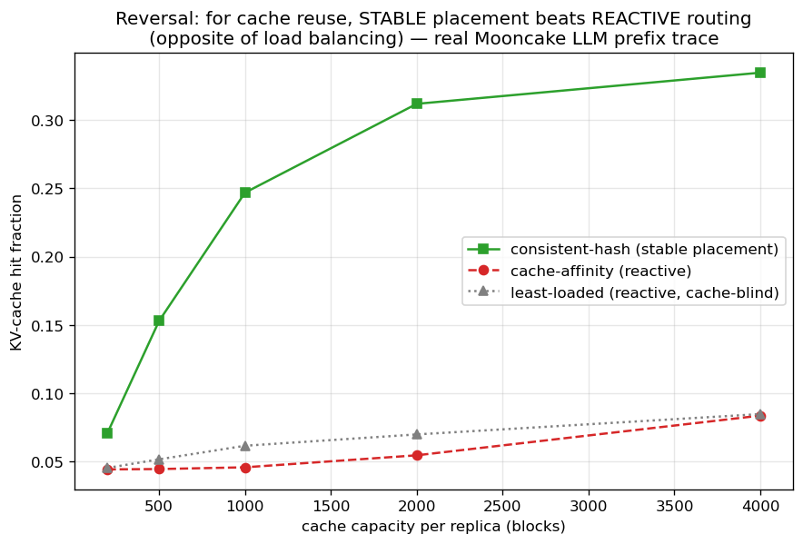

<!--
Thesis Ch 9 (was Ch 10 before the theory chapter was cut, 2026-07-27) — AI-Inference
Serving Case Study. Adapted from paper/07 §8 + PHASE4_SERVING_REPORT.md. Guardrail: case
study, NOT a novelty claim; the SLO-probe negative is in Ch 8, referenced here.
-->

# Chapter 9. Application Case Study: AI-Inference Serving

The thesis's abstraction is not confined to classical matching markets; it instantiates a
contemporary systems problem. This chapter casts request routing in an AI-inference serving
system as online matching. It does two things. First, it tests whether the abstraction is
rich enough to carry a live systems problem; recovering established results provides
evidence that the mapping is faithful. Second, it supplies the setting in which Chapter 8
probed, and did not identify, a regime where
predictions genuinely help. Because the systems facts recovered below are already known, the
chapter is a **case study rather than a novelty claim**; that decision follows the prior-art
review of Chapter 8.

<!--REV
id: 9-01
role: R5 答辩提问者
level: 必改
kind: 过度自我贬低
mark: presented, deliberately, as a
quote: It is presented, deliberately, as a case study, not a novelty claim - the systems facts below are known, and the with-predictions vocabulary is a re-labeling of them
note: 本章在开头、9.2 末、9.3 末三次声明自己不是贡献，其中一次还说本章的语言只是对已知事实的重新贴标签。考官读完会直接问：那这一章为什么留在论文里。诚实是对的，但需要同时给出这一章的正面价值。
fix: 保留 case study 的定位，但把价值写出来：它验证了本文的抽象能容纳一个真实系统问题，并且是第 8 章负结果的实验场。三次声明减到一次。
-->

## 9.1 The serving instantiation

We map serving to online **capacitated matching**: each offline resource is a model replica
or cache shard that can serve up to $c$ concurrent requests, so we match with capacity $c$
rather than $1$ (this is $b$-matching with every $b$ equal to $c$; we write $c$ throughout,
including in the figures). Arrivals are requests drawn from a non-uniform, bursty traffic
distribution over request types, and an edge is a capability or cache affinity. Two
quantities must be kept apart. Raw **goodput** is the fraction of arriving requests that are
served; the **competitive ratio** is the number served divided by the capacitated optimum on
the same realized instance. They coincide only when the optimum can serve every arrival,
which under overload it cannot, so we report the competitive ratio throughout. Figures 9.1
and 9.2 both plot it; Figure 9.3 measures a different objective entirely (the KV-cache hit
fraction) and is labelled accordingly.

For the dynamic experiment of Figure 9.2 that optimum is not a matching but a scheduling
problem: admit a subset of the requests, each held on one compatible replica for its whole
service time, at most $c$ concurrent per replica. It is NP-hard in general, so we divide by a
computable upper bound on it, obtained by relaxing the per-replica capacity to a per-type
capacity $c\cdot\deg(\ell)$; the relaxed problem decomposes by type into interval scheduling
and is then solved exactly. The reported ratios are therefore lower bounds on the true
competitive ratio, and the bound is tight, since a feasible offline assignment brackets the
optimum to within $1.1\%$ of the arrival count at $c=3$, $0.4\%$ at $c=6$, and exactly at
$c=12$. We exercise the instantiation on a synthetic serving topology (Figure 9.1, where the
prediction quality can be swept directly) and on two real traces: an Azure LLM inference
trace (Figure 9.2) and the Mooncake prefix-cache trace [@mooncake2024] (Figure 9.3). A third
real trace, Wikipedia pageviews, drives the predictor study of §7.1.

<!--REV
id: 9-02
role: R2 领域审稿人
level: 必改
kind: 指标定义不一致
mark: the fraction of requests served
quote: goodput - the fraction of requests served - is the competitive ratio against the b-matching optimum
note: 这句把两个不同的量当成同一个：被服务请求的比例，与相对 b-matching 最优的比值。二者只有在最优能服务全部请求时才相等，而本章讨论的正是过载场景。
fix: 分开定义并选一个作为报告指标：goodput = served/arrived; the competitive ratio = served/OPT。然后检查本章每个数字用的是哪一个。这一处不改，第 9 章所有比值的含义都是含混的。
-->

<!--REV
id: 9-03
role: R4 体例校对
level: 必改
kind: 符号冲突
mark: the offline resources are model replicas or cache shards
quote: online b-matching: the offline resources are ... each with a capacity c
note: 同一句里 b-matching 的 b 与容量 c 指的是同一件事，却用了两个字母；后文图注又写 c = 8。读者会以为 b 和 c 是两个不同的参数。
fix: 统一用 c，并写明 b-matching with all capacities equal to c；或者反过来全用 b。图注同步。
-->

{width=70%}

**Capacity as robustness** (**Figure 9.1**). Increasing the capacity $c$ smooths the
  effect of a bad prediction: a capacity-aware baseline stays safe, while blindly trusting
  a traffic forecast degrades further as capacity grows. Over the capacity range we swept, added capacity buys the same protection that the
  adaptive test does: the systems analogue of the robustness-insurance thesis, and a
  reminder that the cheaper of the two is a provisioning decision, not an algorithmic one.

<!--REV
id: 9-04
role: R1 二审考官
level: 建议
kind: 图注缺设置
quote: Capacity as robustness: blindly following the forecast crashes goodput - deeper at ample capacity (c=8) - while the adaptive test stays flat.
note: 本章三张图的图注都没有说明用的是哪条 trace、多大规模、多少次重复。第 9 章是最可能被系统方向的读者单独翻阅的一章，图必须能独立看懂。
fix: 每张图注补一个括号：(Wikipedia trace, n = ..., ... trials)。三张图统一格式。
-->

<!--REV
id: 9-05
role: R2 领域审稿人
level: 建议
kind: 机制断言
quote: Capacity is thus a substitute for algorithmic robustness
note: substitute 是一个强的机制断言（容量可以替代算法鲁棒性），但证据是一条曲线随 c 变化的形状。二者在什么范围内可互换、代价各是多少，都没有讨论。
fix: 降为观察加条件：over the capacity range we swept, added capacity buys the same protection that the adaptive test does。或者补一句代价对比（多买一份容量 vs 跑一次前缀测试）。
-->

{width=100%}

**Forecasts vs live load** (**Figure 9.2**). Under dynamic service times (requests hold a
  slot for a real duration, released event-by-event), a live-load signal beats a stale
  traffic forecast. Against the offline optimum the gap is stark: the forecast-free
  least-loaded balancer reaches $0.98$–$1.00$ of the optimum at every capacity, while
  blindly following the forecast reaches only $0.58$–$0.91$, and the prefix test recovers
  most of the loss ($0.93$–$0.99$) at the cost of the prefix it spends. The reactive policy
  is not merely better than the forecast-following one; it is within $2\%$ of what perfect
  hindsight could have achieved.

{width=50%}

**Cache-affinity routing** (**Figure 9.3**). For prefix-cache-aware routing, a *stable*
  affinity router beats a reactive one, the reverse of the traffic-forecast case, because
  cache locality rewards persistence [@preble2024].

Each of these recovers an established systems result cleanly, demonstrating that the
framework instantiates the problem faithfully. They also line up into one observation: the
first two say *react rather than forecast*, the third says the opposite, and the difference
is the objective: cache locality rewards persistence where load balancing rewards
responsiveness.

<!--REV
id: 9-06
role: R6 初次读者
level: 建议
kind: 三段并列缺主线
quote: Each of these recovers an established systems result cleanly
note: 三个 serving concern 是三段并列，读者读完不知道它们之间是什么关系（前两个说预测不如反应，第三个说反应不如稳定 - 其实是一个漂亮的反转）。9.1 末尾这句只是把它们打包收尾。
fix: 点破这条主线：the first two say react rather than forecast; the third says the opposite, because cache locality rewards persistence - the objective decides which。这一章最有意思的地方现在是隐藏的。
-->

## 9.2 A probe for a genuinely new result, and its negative

We also asked whether the with-predictions lens yields a new actionable serving result on a
tail rather than a throughput objective. In this probe it did not: on an SLO objective (protecting a
tight-SLO class of requests under bursty load), a non-predictive policy comes within
$\le 3\%$ of one with perfect foresight across every regime swept. The experiment, its
caveats and its two explanations are in §8.2. The consequence for this chapter is that we
did not identify a benefit from foresight in the regimes examined, so serving remains a case
study.

<!--REV
id: 9-07
role: R4 体例校对
level: 必改
kind: 与 8.2 重复且循环引用
mark: matches a clairvoyant oracle to within
quote: the full account is in Chapter 8
note: 本节与 8.2 内容几乎逐句重复（同样的 3% 、同样的一格静态预留、同样的两条原因、同样的 a third face of the wall），而且 8.2 写 the serving case study (Chapter 9)、这里写 the full account is in Chapter 8，两节互相指向对方。
fix: 本节压到两句（结论加指向），正本留在 8.2；删掉其中一处的相互指向，只保留单向。
-->

## 9.3 Chapter summary

The abstraction reaches a live systems problem and recovers its established results, and
the tail-objective probe did not identify a genuine with-predictions win. What remains is to ask
whether the wall these chapters keep meeting is an accident of our inputs or something
forced: the question the conclusion takes up.

<!--REV
id: 9-08
role: R3 英语文字编辑
level: 建议
kind: 小结重复
quote: The serving instantiation shows the framework reaches a live systems problem and recovers its established results - capacity as a robustness substitute, live load over stale forecasts, stability for cache locality
note: 小结把 9.1 的三个小标题原样复述一遍，再加上第三次 not an independent contribution 的声明。
fix: 小结只留一句：本章证明抽象能落到真实系统上，且连尾延迟目标也没有给预测留出空间。三个小标题读者刚看过。
-->
