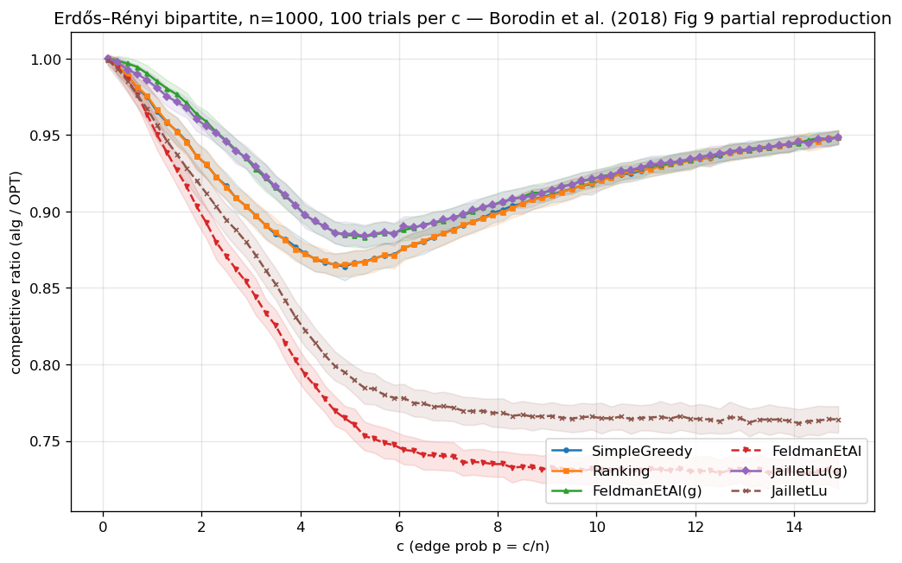
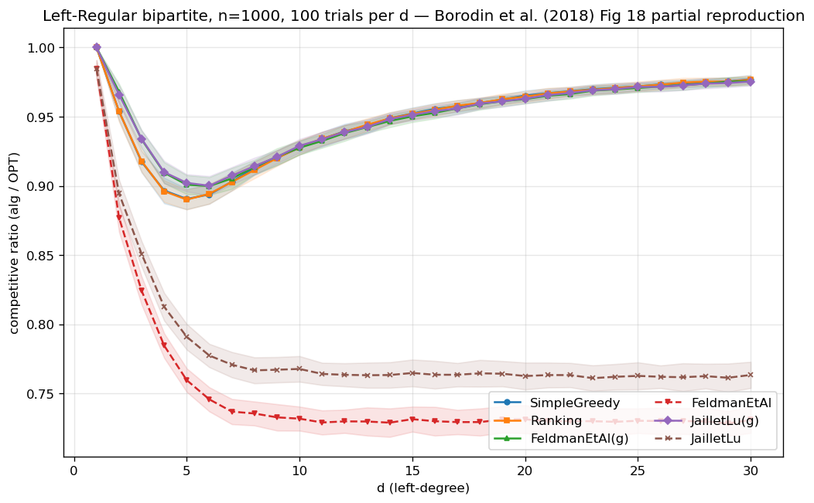

<!-- 中文毕业论文 第3章 模型、算法与方法 + Phase-2 复现（对应 ../03_model_methodology.md）。 -->

# 模型、算法与方法

第2章将问题置于其领域中。本章固定全文所用的精确模型与记号（3.1 节），详述我们所实现的算法（3.2 节）、
预测对象与结构化误差模型（3.3 节）、一致性/鲁棒性度量（3.4 节），以及实验框架（3.5 节）。最后，在
任何贡献建立于其上之前，通过复现 Borodin 等人已发表的图来验证该框架（3.6 节）。

## 精确的 known-i.i.d. 模型

存在一个包含 $n$ 个离线**资源**的集合 $R$，以及一个含 $r$ 个在线**类型**的**类型图**；类型 $\ell$ 的
邻域为 $N(\ell)\subseteq R$。一个实例由从类型分布 $p$ 上独立同分布地抽取 $m$ 个到达生成；第 $i$ 个
到达揭示其类型（从而其邻域），必须立即、不可撤销地被匹配到其邻域中一个当前未匹配的资源，或不予
匹配。类型图与 $p$ 对算法已知，实现的到达序列未知。遵循标准的**整型类型**约定，默认取 $m=n$ 且 $p$
均匀，使每个类型的期望计数为整数；经典设定为 $r=n$（每个离线顶点一个独立类型），而用于直方图建议
实验的**少类型**设定取 $r\ll n$。

性能度量为**竞争比** $\rho(\mathrm{ALG}) = \mathbb E[|\mathrm{ALG}|]/\mathbb E[|\mathrm{OPT}|]$，
其中 $\mathrm{OPT}$ 是**实现实例**的最大匹配，由 Hopcroft–Karp 精确计算。全文的免预测基线是 KVV
Ranking，其比值记为 $\rho_{\mathrm{base}}$（**基线强度**）。

## 算法

所有贪心型算法都是一个原语的实例：给定资源上的一个全序（**rank**），**GreedyWithPermutation** 将
每个到达匹配到其 rank 最小的可用邻居。这使整个算法族成为一条由 rank 参数化的代码路径，这对公平比较
与理论都很重要。

- **免预测基线。** SimpleGreedy（恒等 rank）；**Ranking**（均匀随机 rank；基线）；以及随机匹配算法
  Feldman 与 Jaillet–Lu，它们通过最大流预计算一个建议匹配——Feldman 经由容量 $\{2,1,2\}$ 的流网络
  及单位流子图的蓝/红分解，Jaillet–Lu 经由容量 $\{3,2,3\}$ 的网络得到分数解 $f^\star\in\{0,\tfrac13,\tfrac23\}$
  及逐类型的列表分布。每个都有一个**非贪婪**变体（仅跟随建议）与一个**贪婪**变体（回退到任意可用邻居）。

- **度数预测。** MinPredictedDegree（MPD）是按预测度数 $\mu\in\mathbb R^R$ 升序排名的
  GreedyWithPermutation。常数 $\mu$ 给出 Ranking；真实的实现度数给出一致性天花板（MinDegree）。
  **增强**版 Feldman(MPD) 与 JailletLu(MPD) 仅将 MPD 的 rank 用作贪婪回退的平局打破，因此由最坏
  情况最优的基匹配承担主要负载。

- **类型直方图建议与测试-回退。** 由类型上的计数向量 $\hat c$ 我们构造一个建议匹配 $\hat M$（$\hat c$
  份拷贝的最大匹配）并记录其逐类型伙伴。**FollowPrediction** 对每个到达按 $\hat M$ 模仿；**TestAndMatch**
  （Choo 与 BEM 变体）在长度 $k$ 的前缀上模仿，检验前缀类型频率与 $q=\hat c/\lVert\hat c\rVert_1$ 的
  经验 $\ell_1$ 距离是否不超过阈值 $\tau$，据此继续或回退到 Ranking。我们还移植了 Chłędowski 式动态
  **组合器**作为基准评测对象（非贡献）。

## 预测对象与结构化误差模型

各族消费不同的预测对象——度数向量 $\mu$ 与类型直方图 $\hat c$——因此各以自己的旋钮扰动并在并列的
面板中报告。对 $\mu$ 我们使用四种结构化误差模型，各返回一个 $\ell_1$ **幅度**与一个归一化的
**Kendall-$\tau$ 顺序误差**：随机翻转、系统性偏置（单调重缩放——保序，故 Kendall-$\tau\equiv0$ 是
构造性的）、对抗（反射一部分分量）、以及分布漂移（朝一个独立抽取的同族图的度数混合）。对 $\hat c$
我们以比例 $\eta\in[0,1]$ 将实现计数朝一个集中随机目标混合，报告诱导的 $\ell_1(p,q)$。由于 MPD 仅
经诱导顺序依赖于 $\mu$，顺序/幅度之别正是第5章的主题。

## 一致性与鲁棒性

对一个消费预测的算法，**一致性**是其在完美建议下的比值，**鲁棒性**是其在对抗建议下的最坏比值。一个
有用的算法应既一致、又从不（大幅）低于 $\rho_{\mathrm{base}}$；二者之间的张力是第6章与第9章的主题。

## 实验框架

框架是一个小型、依赖轻量的 Python 代码库（NumPy、SciPy、NetworkX）。所有随机性都来自 NumPy 的
spawn 机制得到的独立、可复现的流——默认四条流（图、实例、Ranking、Jaillet–Lu），并为预测生成与扰动
派生额外的流，因此新增一个算法从不扰动既有结果。我们使用**配对试验**：在一次比较中，每个算法与误差
水平复用同一图、到达序列、$\mathrm{OPT}$ 与平局种子，因此差异可归因于预测本身。所报告的比值为试验
上的均值及 95% 正态近似置信区间。全文每张图与表都由单个脚本从固定种子重生成（附录 A）。

## 地基验证：复现 Borodin 等人

在框架上构建基于预测的算法之前，我们对照 Borodin、Karavasilis 与 Pankratov [@borodin2018experimental] 已发表的实验
研究验证了它。这是一次**保真度检验，而非贡献**：其目的是确认生成器、i.i.d. 采样器、Hopcroft–Karp
最优解与算法实现能复现该文的定性发现，从而使日后的差异可归因于算法而非基础设施。我们的技术栈
（Python/NetworkX）不同于该文（C++/Edmonds–Karp），故我们以**定性**一致为目标，接受小的绝对差异
（$\le 0.02$）。

我们在两个随机图族上复现了核心四算法（六个贪婪/非贪婪变体），$n=1000$、$m=n$、每参数值 100 次试验
（与该文设定一致），单一主种子。

**Erdős–Rényi（边概率 $c/n$；该文图 9，部分）。** 扫描 $c$ 复现了特征性的 U 形及其困难情形：
SimpleGreedy 在 $c\approx4.9$ 取最小值 $0.864$，复杂算法的贪婪变体在 $c\approx5.3$ 取其最小值
$\approx0.884$。Ranking 与 SimpleGreedy 无法区分（全部 75 个值上最大差为 $0.0017$——该文正因此省略
Ranking 的曲线），非贪婪变体随 $c$ 增大单调退化（Feldman $0.987\to0.729$，Jaillet–Lu $0.985\to0.764$）。
我们核对的该文五条文字论断全部成立。

{width=85%}

**随机左正则（左度数 $d$；该文图 18，部分）。** 图景在困难情形 $d=5$（SimpleGreedy 最小值 $0.890$）
重复出现，Ranking $\approx$ SimpleGreedy（最大差 $0.005$），非贪婪随 $d$ 增大退化，贪婪复杂变体渐近
$\approx$ SimpleGreedy。

{width=85%}

**一个跨族观察。** 合并两次扫描浮现出一个不平凡的事实：非贪婪的 Feldman 与 Jaillet–Lu 在**两个**族中
收敛到**同一**渐近比值——分别为 $0.729$ 与 $0.764$，跨族相差在 $0.002$ 内——且都**高于**其最坏情况
理论界（$0.670$ 与 $0.729$）$+0.06$ 与 $+0.03$。这暗示存在一个不同于最坏情况保证的、普适的"平均情况
渐近常数"——是本文反复出现的主题（平均情况远比最坏情况温和）的一个早期具体实例，后续各章的预测误差
扫描将认真探究它。

**结论。** 框架在两个族上复现了已发表的定性发现，包括困难情形的位置以及 Greedy 与 Ranking 的近乎
恒等。地基可信；第4–9章的贡献建立于其上。（完整的复现表与论断核对清单见附录 A。）
