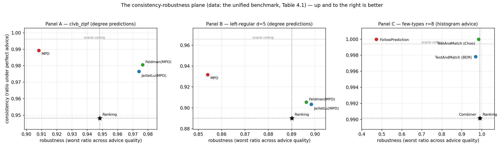

<!-- 中文毕业论文 第4章 统一基准（对应 ../04_unified_benchmark.md）。表头/标签译中文，数字保留。 -->

# 统一基准

在验证框架（第3章）之后，我们将三个算法族置于其上，确立本文的组织性发现。本章以竞争比（均值 $\pm$
95% 置信区间）作为预测质量的函数，在三个面板中报告，各面板对应各族被设计的体制；它所提炼的四个发现
（4.2 节）贯穿全文其余部分。

## 设计

各族消费不同的预测对象，故各以自己的扰动旋钮驱动并在并列面板中呈现（第3章）；共享的框架——图、
$\mathrm{OPT}$、置信区间方法、以及免预测地板——正是使各面板可比的东西。

- **面板 A —— clvb_zipf**（$n=1000$，Zipf 指数 $1.0$，60 次试验）：重尾离线度数，度数预测带有信号
  的体制。
- **面板 B —— 左正则 $d{=}5$**（$n=1000$，60 次试验）：近均匀度数——第3章的困难情形——预测几乎
  无信号可携带。
- **面板 C —— 少类型 $r{=}8$**（$n=2000$，50 次试验，检验前缀 $k=200$）：近乎完美可匹配，类型
  直方图测试-回退算法的校准体制。

**共享设置。** 每个面板都运行在第3章的框架上，每实例 $m=n$ 个独立同分布到达，并采用**配对试验**：
面板内每个算法与质量水平复用同一批图、到达序列、实现最优解（Hopcroft–Karp）与平局种子，故列间
差异可完全归因于预测本身。所有随机性来自每面板一个主种子派生的四条独立流（图、实例、算法平局、
预测扰动）。表项为试验均值及 95% 正态近似置信区间，全程很紧（$\pm 0.001$–$0.003$）。质量列实例化
3.3 节的误差模型——度数面板：**完美**（真实实现度数）、**含噪**（强度 $\tfrac12$ 的随机翻转）、
**对抗**（逆序反射）、**垃圾**（独立随机 $\mu$，$\equiv$ Ranking）；建议面板：真实直方图以
$\eta\in\{0,0.3,0.6,1.0\}$ 朝一个集中随机目标混合（**完美/轻度/严重/垃圾**）。**表 4.1** 将各面板的
比值与其柱状图并排呈现；发现见 4.2 节。

```{=latex}
\begin{table}[t]
\footnotesize
\setlength{\tabcolsep}{4pt}
\noindent
\begin{minipage}[c]{0.60\linewidth}
\begin{tabular}{@{}lrrrr@{}}
\toprule
\emph{面板 A——clvb\_zipf} & 完美 & 含噪 & 对抗 & 垃圾 \\
\midrule
Ranking（地板） & 0.948 & --- & --- & --- \\
MinDegree（预言机） & 0.996 & --- & --- & --- \\
MPD & 0.989 & 0.956 & \textbf{0.908} & 0.946 \\
Feldman(MPD) & 0.981 & 0.979 & 0.976 & 0.978 \\
JailletLu(MPD) & 0.977 & 0.976 & 0.974 & 0.975 \\
Feldman（基础版） & 0.887 & --- & --- & --- \\
JailletLu（基础版） & 0.901 & --- & --- & --- \\
\bottomrule
\end{tabular}
\end{minipage}\hfill
\begin{minipage}[c]{0.38\linewidth}
\includegraphics[width=\linewidth]{../../results/unified_benchmark_panelA.png}
\end{minipage}

\medskip
\noindent
\begin{minipage}[c]{0.60\linewidth}
\begin{tabular}{@{}lrrrr@{}}
\toprule
\emph{面板 B——左正则 $d{=}5$} & 完美 & 含噪 & 对抗 & 垃圾 \\
\midrule
Greedy $=$ Ranking（地板） & 0.890 & --- & --- & --- \\
MinDegree（预言机） & 0.966 & --- & --- & --- \\
MPD & 0.932 & 0.906 & \textbf{0.854} & 0.888 \\
Feldman(MPD) & 0.906 & 0.903 & 0.896 & 0.900 \\
JailletLu(MPD) & 0.903 & 0.902 & 0.898 & 0.901 \\
Feldman（基础版） & 0.758 & --- & --- & --- \\
JailletLu（基础版） & 0.789 & --- & --- & --- \\
\bottomrule
\end{tabular}
\end{minipage}\hfill
\begin{minipage}[c]{0.38\linewidth}
\includegraphics[width=\linewidth]{../../results/unified_benchmark_panelB.png}
\end{minipage}

\medskip
\noindent
\begin{minipage}[c]{0.60\linewidth}
\begin{tabular}{@{}lrrrr@{}}
\toprule
\emph{面板 C——少类型 $r{=}8$} & 完美 & 轻度 & 严重 & 垃圾 \\
\midrule
Ranking（地板） & 0.990 & --- & --- & --- \\
MinDegree（预言机） & 0.999 & --- & --- & --- \\
FollowPrediction & 1.000 & 0.832 & 0.679 & \textbf{0.472} \\
TestAndMatch (Choo) & 1.000 & 0.984 & 0.989 & 0.990 \\
TestAndMatch (BEM) & 0.998 & 0.988 & 0.988 & 0.968 \\
Combiner\emph{（基准）} & 0.990 & 0.990 & 0.990 & 0.990 \\
\bottomrule
\end{tabular}
\end{minipage}\hfill
\begin{minipage}[c]{0.38\linewidth}
\includegraphics[width=\linewidth]{../../results/unified_benchmark_panelC.png}
\end{minipage}
\caption{统一基准。各面板的竞争比（配对试验均值；所有 95\% 置信区间 $\le 0.003$）与其柱状图并排
（误差棒：95\% CI；虚线：免预测地板；点线：预言机天花板）。加粗为跌破地板的项。}
\end{table}
```

## 四个发现

**（F1）鲁棒性是工程出来的，而非免费的：裸跟随者跌破地板。** 两个无防护的预测跟随者一旦预测为对抗或
垃圾，都会跌到免预测 Ranking 地板之下：MPD 落到 $0.908<0.948$（面板 A）与 $0.854<0.890$（面板 B），
FollowPrediction 崩到 $0.472\ll0.990$（面板 C）。无防护地使用二者中的任何一个，都严格劣于不用预测。
表中每个鲁棒算法——增强版、TestAndMatch、组合器——都在构造上避免了这一点。

**（F2）两种不同的鲁棒机制，形状不同。** *结构式*鲁棒（Feldman(MPD)、JailletLu(MPD)）：最坏情况最优
的基匹配承担负载，预测仅打破平局，故性能几乎**平坦**——Feldman(MPD) 从完美到对抗仅移动 $0.981\!\to\!0.976$
（面板 A）。它不会崩，但也封顶了上升空间（永远够不到 $0.996$ 的预言机）。*自适应*鲁棒（TestAndMatch）：
在亚线性前缀上检验，再提交——建议好时抓住上升空间（Choo $1.000$），建议坏时守住地板（$0.990$）。在
面板 C 上，它是唯一在两端都处于上包络的算法。两种机制以相反的方式用一致性换鲁棒性；**图 4.1** 把
每个算法画在一致性–鲁棒性平面上，两种机制相反的取舍——以及 TestAndMatch 之外通向理想右上角的空白
区域——一目了然。

{width=100%}

**（F3）平均情况输入上一致性上升空间很小；差异全在坏建议一侧。** 在少类型上，免预测 Ranking 已达
$0.990$，用真实度数的 MPD 达 $0.999$——好建议侧任何添益都不足 $0.01$。面板 C 中每个宽大的裂口都是
**下行**裂口。这是本文论点的一图缩影；第9章证明它是**必然的**。

**（F4）增强救活了结构性薄弱的基算法。** Feldman 与 Jaillet–Lu 为最坏情况比值而调，在这些平均情况
输入上是**最弱**的免预测项（面板 B：$0.758$ / $0.789$，低于 Greedy 的 $0.890$）；MPD 增强将它们抬到
$\approx0.90$。预测对为最坏情况设计的算法所做的，**多于**对贪婪所做的——这一配对只有在统一表下才可见。

## 本章小结

综合来看，F1–F4 表明：在平均情况匹配上，免预测基线本已近乎最优，无防护地跟随预测是不安全的，而成熟
算法的价值是由两种机制之一提供的下行保护。第5–7章锐化各部分——什么支配那（微小的）损失、自适应检验
的代价几何、以及该图景在真实数据上是否成立——第9章则证明这堵墙是定理而非产物。
