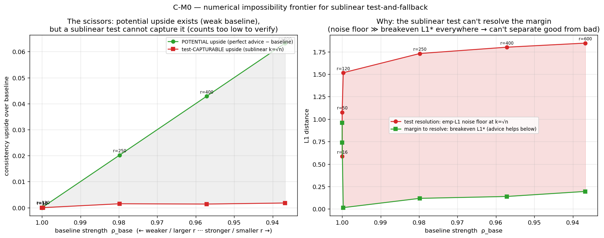

<!-- 中文毕业论文 第6章 深入研究测试-回退（对应 ../06_test_and_fallback.md）。6.3 是通向结论章展望（10.2 节）的经验桥梁；原第9章已砍（2026-07-27），理论在配套论文中。图 6.4 = 检验之墙边界图。 -->

# 深入研究测试-回退

测试-回退算法是第4章的自适应鲁棒机制。本章给出对它们的首个实证研究：它们所达到的鲁棒性包络
（6.1 节）、接受阈值的一个反直觉失效（6.2 节）、其重校准以及重校准所暴露的分辨率极限（6.3 节）——
该极限在整个难度范围上持续成立，并为 10.2 节的理论展望提供经验锚点——以及对动态组合器的基准评测
（6.4 节），后者解释了**先测试再一次性提交**的结构。全程中，$\ell_1$ 检验是原作者自己也退回使用的
经验代理（第3章）。

## 鲁棒性包络

在少类型实例上扫描建议误差 $\ell_1(p,q)$（$n=2000$，$r=8$，前缀 $k=200$，40 次试验；**图 6.1**），
FollowPrediction 从完美建议的 $1.000$ **线性**退化到 $\ell_1\!\approx\!1.1$ 处的 $0.453$——远**低于**
免预测地板（$\approx0.99$）。TestAndMatch 则稳在**上包络**：建议好时抓住收益，建议坏时其前缀检验拒绝
它并回退到 Ranking，从不崩溃（BEM $0.998\to0.969$；Choo $1.000\to0.991$）。这是第4章结构式鲁棒的
自适应对应物。

{width=60%}

## 一个在平均情况输入上过于宽松的阈值

在**边界**建议（$\eta=0.15$，真实 $\ell_1\!\approx\!0.16$）——检验最吃力之处（**图 6.2**）——处扫描
前缀（检验）规模 $k$，一个更大、更准确的检验反而做出**更差**的决策：随 $k$ 从 $25$ 增到 $800$，比值
**下降** $0.992\to0.956$，误判率**上升** $0.00\to0.60$。机制在于：Choo/BEM 阈值 $\tau$ 是按最坏情况
基线 $\beta\approx0.696$ 校准的，但在这些实例上基线为 $\approx0.99$（F3），故经验盈亏平衡点位于
$\ell_1\approx0$，远低于 $\tau$。一个小而含噪的前缀高估 $\ell_1$ 并**意外拒绝**边界建议（安全落在
地板上）；一个大而准确的前缀正确测得 $\ell_1\approx0.16<\tau$，从而**接受**了最坏情况阈值判定为可接受
的轻度坏建议——表现低于基线。在强基线输入上最坏情况阈值过于宽松，而更准确的检验只是更忠实地跟随它。

{width=60%}

## 重校准，及其暴露的分辨率极限

将 $\tau$ 重校准到**测得**的基线 $\hat\beta$ 可消除该病理（**图 6.3**）：在边界建议处，最坏情况阈值的
误判随前缀增长从 $0.03$ 攀到 $1.00$、比值降到 $0.920$，而重校准阈值在每个前缀规模上都保持误判 $0.00$、
比值 $\approx0.986$。
但重校准暴露出一个更深的极限。在完美建议下，最坏情况阈值得 $1.000$，而重校准的仅得 $0.987$：重校准
的 $\tau\approx2(1-\hat\beta)\approx0.028$ **小于经验 $\ell_1$ 估计器自身的噪声底**（$\approx0.05$–$0.13$），
故它永远无法自信地**接受**——它拒绝一切（包括完美建议），总是回退到基线。一言以蔽之：

> 在强基线实例上，没有任何实用的经验 $\ell_1$ 阈值能既抓住一致性上升空间又保持安全：上升空间很小、且
> 位于估计器的分辨率**之下**。最坏情况阈值过度接受；重校准阈值过度拒绝；更好的检验只是更忠实地跟随
> 其中之一。

{width=60%}

**图 6.4** 把这一发现从单个阈值推广到整个难度范围。扫描类型数——设定基线强度的旋钮——随着基线变弱，
完美建议的**潜在**上升空间增大；但一个亚线性前缀检验能**安全捕获**的上升空间始终钉在零附近：凡上升
空间存在之处，经验检验的分辨率（噪声底）都远高于盈亏平衡边际。因此本章的墙并非一个校准不当的阈值。
上升空间与检验分辨率同进退——结论章的展望（10.2 节）将给这一耦合一个定量形式：做出决策所需的前缀
规模按赌注的平方反比增长。

{width=100%}

## 动态组合器被支配，并揭示为何匹配需要先测试再提交

最后我们对 Chłędowski 式动态组合器做基准评测，以映衬测试-回退的**一次性提交**结构。在其稳健调参下，
组合器恰好落在地板上（少类型上所有建议质量下均为 $0.990$）：它从不崩溃，但一点一致性上升空间也抓不到，
严格被 TestAndMatch 支配。更有启发的是，一个**急切**、中途切换专家的组合器揭示了一个不可逆问题特有的
惩罚：在完美建议下，急切切换得 $0.927$——**低于**纯跟随者（$1.000$）**和**纯基线（$0.958$；见
`tests/test_combiner_small.py`）**二者**——因为中途从 Ranking 切到模仿（mimic）模式会使已提交的匹配落入一个
**不兼容的混合态**。在不可逆问题中，跟随/回退的决策必须在大批承诺**之前**做出，这正是 Choo/BEM 在
前缀上检验、然后**提交**、而非像缓存式组合器那样动态切换的原因。对缓存而言是廉价保险的动态组合器，
无法干净地移植到匹配上。

## 本章小结

测试-回退提供了 6.1 节的自适应鲁棒包络，但其接受/拒绝决策在强基线输入上有根本限制：没有经验 $\ell_1$
阈值能既抓上升又保安全（6.3 节），且动态切换被"先测试再提交"支配（6.4 节）。6.3 节的分辨率极限——
及其在整个难度范围上的持续成立（图 6.4）——是 10.2 节理论展望的经验锚点。
