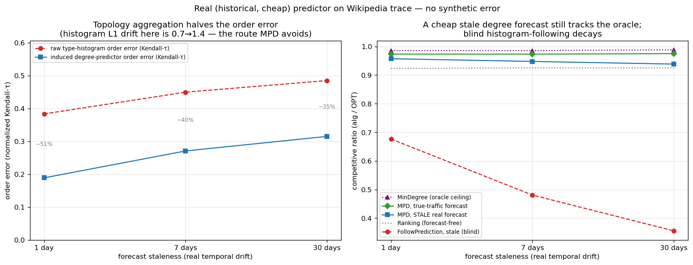
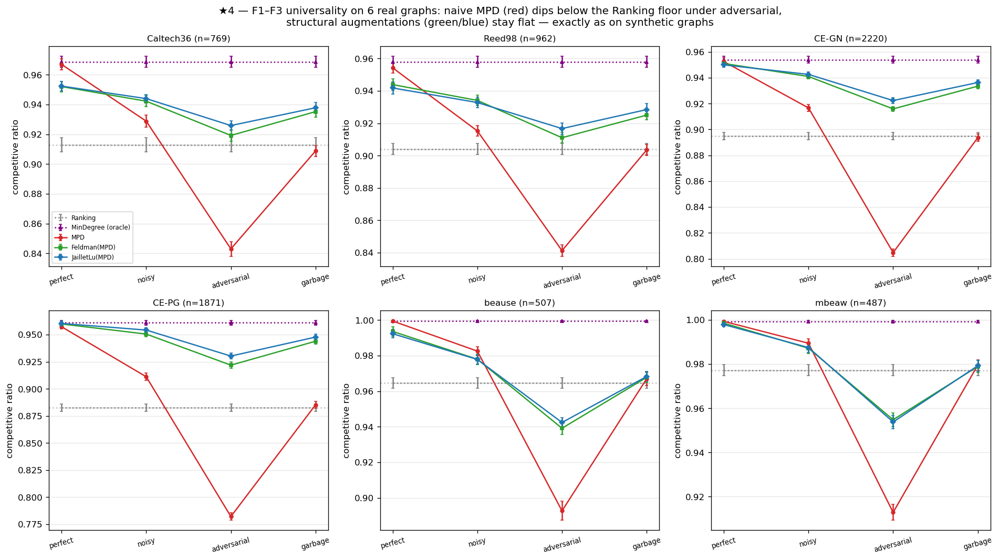

<!-- 中文毕业论文 第7章 外部效度（对应 ../07_external_validity.md）。F2 诚实：定性 6/6、严格 4/6。 -->

# 外部效度

第4–6章使用合成图与一个合成误差旋钮。这一图景是真实的吗？我们从三个方面施压，每一处用真实对应物替换
掉一种合成成分：7.1 节把合成误差换成真实 trace 上的时间漂移，7.2 节把合成图换成六个真实图，7.3 节把
手工构造的预测器换成一个学习得到的预测器。

## 一个真实、廉价的预测器

我们用最廉价的现实预测器替换合成旋钮：上一窗口的历史统计。真实的 Wikipedia 每日页面浏览给出一个直播
日（真值）与若干更早的日（1、7 或 30 天陈旧的预测），故误差是真实的时间漂移；我们将该 trace 映射到一个
固定的服务拓扑，并通过度数路线（MPD）消费该预测（**图 7.1**）。本章全程用**缺口捕获率**衡量一个预测器
实现了多少可得收益：$(\rho_{\mathrm{ALG}}-\rho_{\mathrm{base}})/(\rho_{\mathrm{oracle}}-\rho_{\mathrm{base}})$，
即它填平了"基线到预言机"这段缺口的多大比例。三个事实浮现。

第一，**这个预测器很廉价**。带预测的文献通常设想一个昂贵的学习模型；这里它只是一次线性时间的计数——
每个实例约 $0.11$ 毫秒，而计算一次 $\mathrm{OPT}$ 约 $4.4$ 毫秒，占比只有百分之几。这是全文仅有的两个
墙钟数字，因而依赖机器；其余一切都是比值。

第二，**收益真实、部分、且从不有害**：一个陈旧预测达到 $27\%$–$68\%$ 的缺口捕获率（随陈旧度下降），
且**始终**高于免预测基线（$0.938$–$0.957$ vs $0.923$–$0.925$，即便在 30 天时）。

第三，原因在于：**拓扑聚合使廉价预测器保序**。诱导度数预测器的顺序误差仅为
Kendall-$\tau\approx0.19$–$0.32$，约为原始直方图（$0.38$–$0.49$）的**一半**；而由于 MPD 仅依赖顺序
（第5章），聚合后的度数路线在真实漂移下存活下来。将**同一**预测通过原始直方图消费则是灾难性的：盲从的 FollowPrediction 崩到 $0.68\to0.36$，
远低于 $\approx0.92$ 的基线——这正是第4章与第6章的鲁棒算法的用武之地。

{width=80%}

## 六个真实世界图

我们在六个 Network Repository 图（两个 Facebook 社交、两个 C. elegans 生物、两个经济投入产出）上，跨
相同的质量列、带 95% 置信区间，重跑第4章的度数预测算法阵容（**图 7.2**）。两个承重发现是普适的。
**F1 在全部六个图上成立**：喂给对抗预测器的裸 MPD 在每个图上都跌破 Ranking 地板——差 $0.06$（Reed98）
到 $0.10$（CE-PG）。**F3 在全部六个图上成立，并印证其自身逻辑**：一致性上升空间处处很小（均值 $+0.049$；范围
$+0.022$–$+0.077$），且恰恰在基线最强处最小——两个稠密经济图，其 Ranking 已达 $0.965$/$0.977$，给出
最小的上升空间。

结构式鲁棒发现 **F2 在全部六个图上定性成立**——增强版跨质量列的谱宽在每个图上都小于裸 MPD——并按
"谱宽不超过 MPD 一半"这个更强的判据在四个社交/生物图上**严格**成立（谱宽为 MPD 的
$0.22$–$0.29\times$）；在两个稠密经济图上保护只是**部分的**——增强
缓冲了对抗下的跌落（$0.939$ vs 裸 MPD 的 $0.893$），但清不掉异常高的 $0.965$ 地板，落到其下 $\approx0.03$。
那两个图太稠密，匹配近乎平凡（Ranking $\approx0.97$，MinDegree $=1.00$），故既无上升空间可抓（F3）、
也无多少下行需保护：这个边界正是 F3 自身机制在起作用，而不是它的例外。最后，F4 在此**极为显著**：为最坏情况设计的 Feldman/Jaillet–Lu
在经济图上是最弱的免预测项（$0.73$–$0.77$），而增强将它们抬到 $0.99$——一次 $+0.26$ 的救援。

{width=100%}

## 学习预测器是否有帮助？

由于 MPD 仅经顺序消费预测器（第5章），人们或许会想用顺序损失（rank loss）而非回归来训练它。我们对此
做了检验，报告一个诚实的负结果：这一优势在刻意构造的特征上确实存在，但在真实时序特征上**消失**——
rank 训练与回归训练的预测器诱导出相同的顺序、达到相同的比值。实验、数字以及背后的三步论证见 8.1 节；
对外部效度而言，重要的只是它的推论。一旦预测器保序——而廉价的历史计数本已如此
（7.1 节）——在平均情况匹配上，无论更好的算法还是更好训练的预测器都买不到多少。

## 本章小结

在真实预测器、真实图与一个学习预测器上，同一堵墙依然矗立：免预测基线近乎最优、无防护跟随不安全、
预测买到的是下行保护而非性能——只有一个具启发性的边界，即 7.2 节那两个稠密经济图，增强在那里清不掉
异常高的地板。在我们所能触及的每一种设置上都从经验上确立了这堵墙之后，第8章报告
试图越过它的方向，结论章的展望（10.2 节）解释它为何是被迫的。
