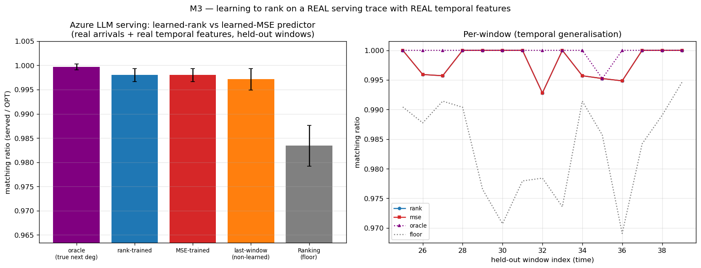

<!-- 中文毕业论文 第8章 探索方向与负结果（对应 ../08_exploratory_negatives.md）。负结果收敛于同一堵墙，动机了第9章。 -->

# 探索方向与负结果

实验各章（第4–7章）确立了一堵墙：在平均情况匹配上，免预测基线近乎最优，故预测是鲁棒性保险而非性能
杠杆。在证明这堵墙是必然的（第9章）之前，我们追求了三个各自**试图越过它**的方向——学习预测器以榨取
更多性能（8.1 节）、寻找一个预测真正有帮助的服务场景（8.2 节）、以及让一次系统的文献综述为我们指出
最高价值的贡献（8.3 节）。三者都返回了同一个答案，它们的收敛正是动机该定理的原因。本章诚实地报告
它们，包括负结果，因为它们是证据的一部分，且排除有雄心的替代方案本身就是一个结果。

## 学习为预测器排序（一个负结果）

第5章表明 MPD 仅通过其诱导的**顺序**消费预测器。这提示了一个具体的改进途径：不再训练预测器最小化其
对真实度数的**回归**误差（标准的"先预测再优化"目标），而是用一个**顺序感知**损失——成对 rank 损失——
训练它，使其优化算法实际使用的量。我们分三步考察。

**M0——机制存在。** 用刻意**发散**的合成特征（一个特征承载幅度、另一个承载顺序），一个 rank 训练的
线性预测器在决策度量上锐利地击败回归训练者：匹配比值 $0.989$（基本上是预言机）对 $0.974$，而 rank
训练的预测器对真值的回归误差**更差**（MSE $87.6$ vs $33.4$），顺序却更好（Kendall-$\tau$ $0.058$ vs
$0.255$）。这一解离是真实的：**更差的拟合给出更好的决策**，印证了当决策重要时回归是错误的训练目标。

{width=100%}

**M1——但优势被双重门控，且很小。** 扫描特征发散度与图难度，rank 优势在特征不诱导顺序/幅度冲突时为零，
在基线本已最优的容易实例上也为零（又是那堵墙）。它在合成图上峰值仅 $+1.3\%$；一个更有利的表述是
**gap-capture**：rank 训练基本上恢复整个预言机缺口，而回归留下约 $30\%$ 未实现——但缺口本身很小。

**M3——且在真实特征上消失。** 决定性的检验使用来自真实服务 trace 的真实时序特征（各资源在此前若干窗口
的引用计数）来预测下一窗口。此处 rank 训练与回归训练的预测器产生**相同**的顺序（Kendall-$\tau$ $0.126$
vs $0.126$）与相同的匹配比值，在所试的每一种拓扑与滞后配置下皆然。驱动 rank 训练的顺序/幅度发散是
**人为**特征的属性；现实的滞后计数特征是同一流行度的共线含噪估计，故回归本已把顺序学得和排序一样好。

{width=100%}

**裁决。** 用决策对齐损失学习预测器不构成一个独立贡献：其取胜需要一个现实中不出现的特征发散，且即便
出现，收益也受制于那（微小的）基线到预言机缺口。该结果作为一个**强化**核心发现的负结果被并入本文——
一旦预测器保序（廉价历史计数本已如此，第7章），在平均情况匹配上无论更好的算法还是更好训练的预测器
都买不到多少。

## 用一个带预测的结果救援服务应用（一个负探针）

服务案例研究（第10章）复现了已确立的系统结论，因此被呈现为案例研究而非新意声明。我们追问是否有一个
**新的**、可行动的带预测结果能救援它。障碍又是那堵墙：我们所试的每个服务变体都优化**吞吐**（goodput），
而吞吐是宽容的——过载下反应式路由填满容量的方式与最优相同，故预测毫无添益。若存在出路，必是一个反应式
基线在其上确实远离最优的不同**目标**。

我们探测了最有希望的候选：一个 **SLO/尾部目标**——在突发、非平稳负载下保护一类紧 SLO 请求不被丢弃——
恰恰是反应式策略因缺乏前瞻可能失败的体制。用一个事件驱动模拟器，我们将非预测策略（静态容量预留；一个
基于**观测**近期负载做预留的反应式自适应策略）与一个基于**实际未来**突发做预留的**clairvoyant 预言机**
对比。在所扫的每个体制——过载水平、均匀 vs 突发紧 SLO 需求——最佳非预测策略都在 $\le 3\%$ 内匹配
clairvoyant 预言机；在中度体制下，一个仅预留一个槽位的平凡静态预留甚至直接反超预言机。两个原因，都对
扫描稳健：保护一个紧 SLO 少数只需一点静态余量、无需预测；且突发足够持续，使得对观测负载做反应几乎和
预测它一样好。

{width=75%}

**裁决。** 尾部目标也是宽容的——继吞吐（第4–7章）与预测器学习（8.1 节）之后，这是墙的第三张脸。我们
没有找到前瞻有帮助的自然体制，故服务仍是案例研究。一个能打破这堵墙的体制（一个基线远离最优的非平稳
或对抗目标）正是本文作为未来工作所框定的那类设置。

## 一次重定向了工作的文献综述

判定我们的哪些发现真正新颖——并值得发展——需要一次系统的 prior-art 综述而非直觉。我们进行了一次大规模、
多源、对抗验证的文献检索（记录于 `docs/LITERATURE_REVIEW.md`），它返回了诚实、有时令人沮丧的裁决。它
确认统一实验基准与对测试-回退的实证研究无人占据、值得领衔；顺序误差发现被 ACI 的附录 D **部分**预占，
须重构为紧度/度量刻画而非发现（第5章）；服务结论大多是已确立系统事实的重新推导，故应降格为案例研究
（8.2 节、第10章）。第二次针对理论的聚焦 prior-art 检查确认第9章的不可能性无人占据，同时标出唯一需要
防范的风险（Choo 等人构造性的基线耦合），这塑造了证明的信息论框架。

这次综述本身是此处所报告研究过程的一部分：它把一堆无差别的发现变成了有优先级的贡献，将精力从低价值的
细化（带权价值变体、更多基线比较）重定向到那个定理，并贯彻了全文的诚实护栏。

## 综合：负结果动机了定理

三次探索指向同一方向。更好训练的预测器在真实特征上无帮助（8.1 节）；带预测的视角即便在尾部目标上也
无法救援服务（8.2 节）；文献综述确认没有唾手可得的性能胜利（8.3 节）。连同第4–7章的吞吐墙，它们表明
该现象不限于单一目标、单一算法或单一数据集——在我们所推的每个方向上都反复出现。这种经验发现的稳健性
正是暗示它可能是**被迫**的东西，也正是动机第9章不可能性定理的原因：在从几个方向都未能越过这堵墙之后，
我们着手证明相关类别的任何算法都不能。
