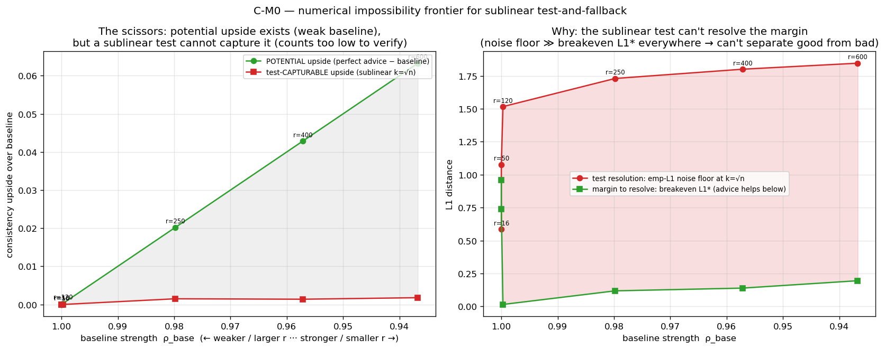

<!-- 中文毕业论文 第9章 不可能性定理（对应 ../09_theory.md，精简版）。直觉优先，完整证明留附录，诚实标状态。 -->

# 不可能性定理：为何这堵墙是必然的

每个实验章都撞上了同一堵墙：在平均情况匹配上，免预测基线近乎最优，预测买到的是鲁棒性保险而非性能，
而对测试-回退算法而言，没有任何接受阈值能既抓住那微小的上升空间又保持安全（第6章）。本章论证这堵墙
并非某个特定阈值、图或算法的产物，而是一个**定理**。为使论述聚焦，我们在此给出直觉与证明的架构，将
完整的形式化推演留到附录 B。

## 命题

非正式地：

> 在强基线实例上，任何仅在**亚线性**到达前缀上做检验的测试-回退算法，都无法同时兼具一致性与鲁棒性。

一个**测试-回退**算法（第3章）观察前 $k$ 个到达，**以任意规则**决定是跟随建议还是回退到 Ranking，
然后提交。命题是：当预算 $k$ 亚线性（$k=o(n)$）且基线强时，可达的（一致性，鲁棒性）区域塌缩到唯一
一点"就打基线"：你可以安全，或抓住上升空间，但不能兼得。

**图 9.1** 是这一点的经验面。随基线变弱（从右向左），**潜在**上升空间——完美建议超出基线多少——增长；
但亚线性检验能**安全捕获**的上升空间却钉在零附近。两条曲线之间的裂口就是不可能性。

{width=100%}

## 直觉：可测性与基线强度是同一个旋钮

论证的核心是一个易于陈述、一旦看见便难以忘却的耦合。为了安全地判定是否信任建议，算法必须从其短前缀
中区分**好**建议（够近能帮）与**坏**建议（够远会伤）。这是对请求类型分布的一个统计检验。这样的检验
只在**少类型、每类型多次到达**时可行——否则前缀太稀疏，什么都估不出来。但少数高计数类型恰恰是匹配
近乎完美、免预测基线本已近乎最优的体制，故没什么值得检验。而在基线足够弱、建议真能帮的地方，类型
繁多、每类型只被看到寥寥几次，没有任何亚线性前缀能完成该检验。

一言以蔽之：**使检验可行的结构，就是使基线近乎最优的结构——故能检验建议的地方，就不需要它。** 本章
其余部分把这一直觉变成证明。

## 证明的架构

证明立于三根支柱；我们用文字陈述每根，并给出其一个关键公式，将形式化细节留到附录 B。

**支柱 1——一个权衡不等式（严格）。** 若两个要求**相反**决策（跟随 vs 回退）的实例在前缀上看起来
统计相同——即其前缀分布的全变差距离 $\gamma_k$ 很小——则前缀上的任何规则都无法同时服务二者。形式上，
记 $\eta_c$ 为算法放弃的上升空间比例、$\eta_r$ 为其鲁棒性损失，可证
$$(1-\eta_c)\;\le\;\eta_r+\gamma_k+o(1).$$
当前缀无信息（$\gamma_k\to0$）时，算法无法既一致（$\eta_c\to0$）又鲁棒（$\eta_r\to0$）。此引理简短
自洽，是结论的双边核心。

**支柱 2——归约到分布检验（任意规则）。** 前缀**恰是**来自类型分布的一批独立同分布样本。我们构造一个
实例族，其中跟随建议恰在建议与真值 $\ell_1$ 接近时有帮助、恰在 $\ell_1$ 遥远时有害；在其上，一个既
一致又鲁棒的算法实际上要**从样本中区分接近与遥远**——一个**容差**分布检验问题。由于算法的决策是样本
的任意函数，下述下界排除了**每一种**规则，而非仅是实践中使用的经验距离阈值——这正是我们的结果区别于
Choo 等人算法中已有的构造性基线耦合之处。

**支柱 3——容差检验几乎和学习分布一样难。** 最后一味来自分布检验的一个已知且起初令人惊讶的事实。
**验证**一个分布等于一个已知分布只需 $\Theta(\sqrt r)$ 个样本——关于类型数 $r$ 亚线性。但**容差**检验
——区分"稍近"与"稍远"，即安全使用建议所需——需要 $\tilde\Theta(r/\log r)$ 个样本，关于 $r$ 近乎**线性**
[@canonne2022tolerance; @valiant2011unseen]。我们的构造有 $r=\Theta(n)$ 个类型，故检验需要 $\tilde\Theta(n/\log n)$ 个样本——多于
任何亚线性前缀所能提供。好建议一侧确实是真值周围的一个**球**（而非单点），这正是使问题落入困难的容差
体制、而非容易的 $\sqrt r$ 体制的原因。构造的一个副产品是：从建议误差到匹配损失的映射是一个**精确的
线性律**（经数值验证），它干净地钉住了常数。

三者串联：在该族上，任何 $(1-o(1))$-一致、鲁棒、亚线性检验的算法都要解一个它可证无法解的容差检验，
故不存在这样的算法。

## 定理

> **定理（非正式）。** 对每个亚线性检验预算 $k=o(n/\log n)$，存在一个含 $\Theta(n)$ 个类型、强基线的
> known-i.i.d. 匹配族，在其上没有任何测试-回退算法——以前缀上的任意规则，而不仅是经验 $\ell_1$ 阈值——
> 能同时 $(1-o(1))$-一致且鲁棒。可达的（鲁棒性，一致性）区域塌缩到基线点。

连同容易的强基线一侧（少类型 $\Rightarrow$ 基线近乎最优 $\Rightarrow$ 无上升空间可抓），这正是图 9.1
的剪刀，现在有了证明：上升空间只存在于容差检验不可行之处。

## 范围、状态与诚实

**范围。** 强形式针对含 $\Theta(n)$ 个类型的体制陈述——那是唯一有上升空间可争的体制，因而是自然的；
一个在常数 $r$ 下也生效的版本尚待解决。归约沿用了它所界定算法所用检验的经验 $\ell_1$ 建模（第3章）。

**与相关工作的关系。** Choo 等人与 BEM 给出算法（上界）且在此模型中无下界；Choo 等人的阈值已与基线
比值耦合，但是**构造性地**。我们的贡献是双边、**规则无关**的不可能性，以及将可测性与基线强度等同起来；
据我们所知，从分布检验样本复杂度到在线算法中建议价值的归约是新的。

**状态（如实陈述）。** 权衡不等式（支柱 1）已证；构造的常数与线性转换律已推导并数值验证；容差检验
壁垒（支柱 3）是一个已引用的、位于容差/非容差分界"保定理"一侧的精确结果。构造的一个常规步骤——给出
检验下界所保证的两个不可区分见证分布——以及一次最终审阅，尚待完成，之后完整证明即告完成。本文以明确
标注此状态的方式呈现该定理，符合进行中理论工作的惯例；图 9.1 的经验剪刀是该陈述为真的独立证据。
