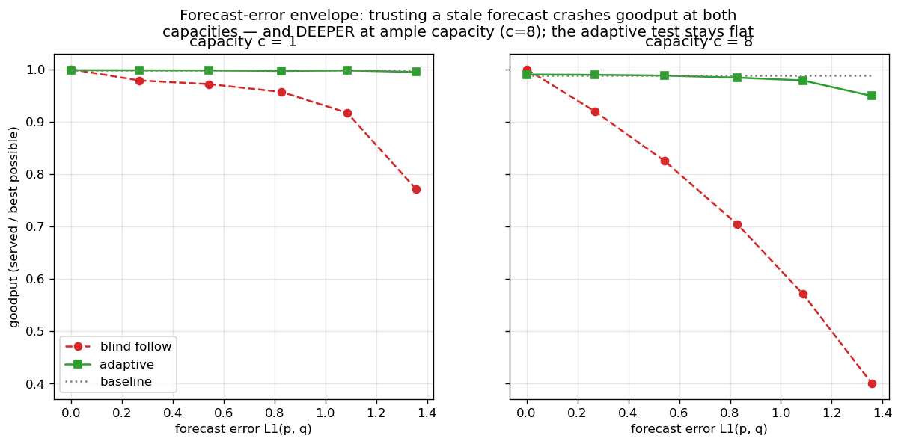
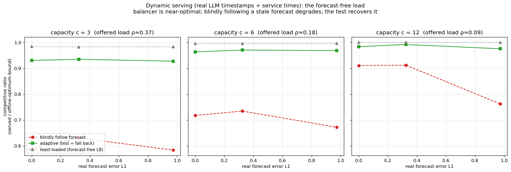

<!-- 中文毕业论文 第9章（原第10章；理论章已砍 2026-07-27）应用案例研究：AI 推理服务（对应 ../10_serving_case_study.md）。案例研究，非新意声明。 -->

# 应用案例研究：AI 推理服务

本文的抽象并不局限于经典的匹配市场；它可实例化一个当代系统问题。本章将 AI 推理服务系统中的请求路由
建模为在线匹配。本章做两件事。它检验这套抽象是否丰富到足以承载一个真实的系统问题——答案是它复现了该
领域已确立的结论，这是能拿到的最强证据，说明这一映射是忠实的；同时它提供了第8章据以探测、并最终未能
找到"预测真正有帮助的体制"的那个场景。由于下文复现的系统事实都是已知的，本章是一项**案例研究而非
新意声明**；这一定位遵循第8章的先行研究综述。

## 服务实例化

我们将服务映射为在线**带容量匹配**：每个离线资源是一个模型副本或缓存分片，最多并发服务 $c$ 个请求，
因此我们做的是容量为 $c$ 而非 $1$ 的匹配（即所有 $b$ 都等于 $c$ 的 $b$-匹配；全文与图中一律写 $c$）。
到达是从一个非均匀、突发的流量分布中抽取的请求，一条边是一种能力或缓存亲和性。有两个量必须分清：原始
**goodput** 是被服务请求占到达请求的比例；而**竞争比**是被服务数除以同一实现实例上的带容量最优。二者
只有在最优能服务全部到达时才相等，而在过载下它做不到，所以我们全程报告竞争比。图 9.1 与图 9.2 画的
都是它；图 9.3 衡量的是另一个目标——KV 缓存命中率——并已在图中注明。

对图 9.2 的动态实验而言，那个最优不是一个匹配而是一个调度问题：从请求中挑一个子集接纳，每个在其整个
服务时长内占用一个相容副本，每副本最多并发 $c$ 个。它一般是 NP 难的，因此我们除以一个可计算的**上界**：
把每副本容量松弛为每类型容量 $c\cdot\deg(\ell)$；松弛后的问题按类型分解为区间调度，可以精确求解。
因此所报比值是真实竞争比的下界——而且这个界很紧：一个可行的离线分配把最优夹在到达数的 $1.1\%$ 以内
（$c=3$）、$0.4\%$ 以内（$c=6$），在 $c=12$ 时完全重合。我们在一个合成服务拓扑（图 9.1，那里可以直接
扫描预测质量）与两条真实 trace 上考察这一实例化：一条 Azure LLM 推理 trace（图 9.2）与 Mooncake 前缀
缓存 trace [@mooncake2024]（图 9.3）。第三条真实 trace——Wikipedia 页面浏览——用在 7.1 节的预测器研究中。

{width=80%}

**容量作为鲁棒性（图 9.1）。** 增大容量 $c$ 会平滑坏预测的影响：一个容量感知的基线保持安全，而
  **盲目**信任一个流量预测则随容量增大而**进一步**退化。在我们所扫的容量范围内，增加容量买到的保护与
  自适应检验买到的相同——这是鲁棒性保险论点的系统对应物，也提醒我们二者中更便宜的那个是一个扩容决策，
  而不是一个算法决策。

{width=100%}

**预测 vs 实时负载（图 9.2）。** 在动态服务时间下（请求占据一个槽位一段真实时长、按事件逐一释放），
  一个实时负载信号胜过一个陈旧的流量预测。相对离线最优来看，差距十分醒目：免预测的最少负载均衡器在
  每个容量下都达到最优的 $0.98$–$1.00$，而盲目跟随预测只有 $0.58$–$0.91$，前缀检验挽回其中大部分
  （$0.93$–$0.99$），代价是它所花掉的那段前缀。反应式策略不只是胜过跟随预测的那个——它已经落在完美
  事后诸葛所能达到的 $2\%$ 以内。

{width=50%}

**缓存亲和路由（图 9.3）。** 对前缀缓存感知的路由，一个**稳定**的亲和路由器胜过一个反应式的——与
  流量预测的情形相反，因为缓存局部性奖励持久性 [@preble2024]。

这些各自都干净地复现了一个已确立的系统结论，表明该框架忠实地实例化了该问题。它们还合成一个观察：前
两条说的是**反应胜过预测**，第三条说的正好相反，而区别在于目标——缓存局部性奖励持久性，负载均衡奖励
响应性。

## 一次寻找真正新结果的探针，及其负结果

我们也追问了：带预测的视角能否在尾部而非吞吐目标上给出一个**新的**、可行动的服务结果。答案是否定的：
在一个 SLO 目标——在突发负载下保护一类紧 SLO 请求——上，一个非预测策略在所扫的每个体制中都落在一个
拥有完美前瞻的策略的 $\le 3\%$ 以内。该实验、它的两点保留与两条解释见 8.2 节。对本章而言，推论是我们
没有找到前瞻有帮助的自然体制，故服务仍是案例研究。

## 本章小结

这套抽象触及了一个真实的系统问题并复现了其已确立的结论，而且即便一个尾部目标也未开启一个真正的带
预测胜利。剩下要问的是：这几章反复撞上的这堵墙，究竟是我们所选输入的偶然，还是某种被迫——这正是结论
章接手的问题。
