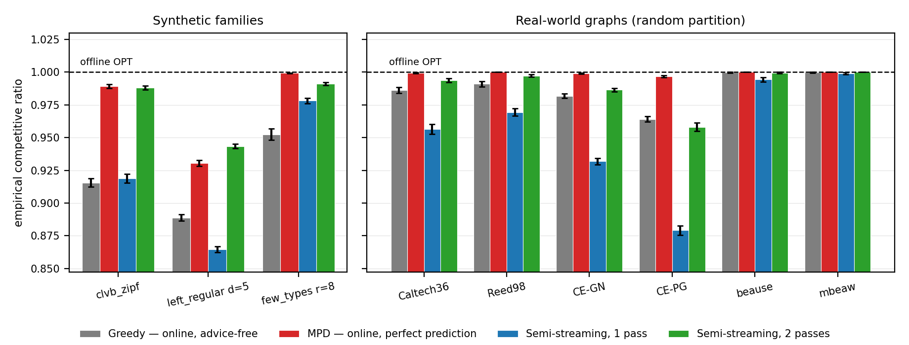

<!-- 中文毕业论文 附录A 复现指南（对应 ../A_reproduction.md）。代码/脚本名/路径/数字保留，表头与说明译中文。 -->

# 复现指南

本文中每个定量结果都由单个脚本从固定种子重生成。这些脚本须分为两类。多数是**自足的**：它们自行生成
合成实例，在一份干净的代码检出上开箱即跑。其余的（第7、8、9章的真实图与真实 trace 结果）需要先把外部
数据放到 `data/` 下；这些数据不随代码分发，A.5 节记录了每个数据集是什么、从哪里来。下面的映射表中以
匕首号（$\dagger$）标出第二类脚本。

本附录将每张图与表映射到其脚本，给出命令与运行时间，列出第3章推迟至此的完整 Phase-2 复现表，并记录
数据来源。

## 环境与原则

- **技术栈：** Python 3.12；NumPy 1.26+、SciPy 1.13、NetworkX 3.3、Matplotlib（仅绘图）。
- **确定性：** 所有随机性都经 NumPy 的 `default_rng(seed).spawn(k)` 从单一主种子（默认 `0`）派生，得到
  独立、可复现的流（图、实例、算法随机性、预测扰动）。结果在 NumPy 1.25 起的小版本间按位稳定
  （基于 BitGenerator 的 spawn）。
- **配对试验：** 在一次比较中，每个算法与误差水平复用同一图、到达序列、`OPT` 与平局种子，故差异可
  归因于预测本身。
- **置信区间：** 试验上的 95% 正态近似半宽。
- **流分解。** 有三处预处理（Feldman、Jaillet–Lu 与服务端的建议 $b$-匹配）取一个最大流并消费它的
  **分解**；与流的值不同，分解并不唯一。它们的网络用整数而非字符串标注节点，使 NetworkX 返回的分解在
  多次运行间稳定；用字符串标注时，它会随 Python 每进程的字符串哈希而变，由此派生的每个数字都会在同一
  个脚本的两次运行之间发生变化。
- 每个脚本写出 `results/<name>.json`（原始均值/置信区间）与 `results/<name>.png`（图），并打印逐步进度。

## 图/表 → 脚本映射

| 论文对象 | 脚本 | 输出 | 约运行时间 |
|---|---|---|---|
| 图 3.1（ER U 曲线） | `scripts/run_er_full.py` | `results/er_full.{json,png}` | ~20 分钟 |
| 图 3.2（左正则） | `scripts/run_left_regular.py` | `results/left_regular.{json,png}` | ~10 分钟 |
| 3.1 / 3.5 节方法学核对 | `scripts/run_metric_check.py` | `results/metric_check.json` | ~90 秒 |
| **表 4.1**（统一基准） | `scripts/run_unified_benchmark.py`，再 `plot_unified_panels.py` | `results/unified_benchmark.{json,png}`、`unified_benchmark_panel{A,B,C}.png`、`unified_benchmark_tables.md` | ~100 秒 |
| 图 4.1（一致性–鲁棒性平面） | `scripts/run_consistency_robustness.py` | `results/consistency_robustness.{json,png}` | ~1 秒 |
| 图 5.1（顺序误差 vs ACI） | `scripts/run_order_vs_theory.py` | `results/order_vs_theory.{json,png}` | ~30 秒 |
| 图 6.1（包络）、图 6.2（前缀扫描） | `scripts/run_choo_bem.py` | `results/choo_bem_{envelope,prefix}.png` | ~20 分钟 |
| 图 6.3、重校准（6.3 节） | `scripts/run_recalibration.py` | `results/recalibration_*.png` | ~1.5 分钟 |
| 图 6.4（检验之墙边界） | `scripts/run_impossibility_frontier.py` | `results/impossibility_frontier.{json,png}` | ~6 秒 |
| 图 7.1（真实预测器）$\dagger$ | `scripts/run_real_predictor.py` | `results/real_predictor.{json,png}` | ~15 秒 |
| 图 7.2（六个真实图）$\dagger$ | `scripts/run_realworld_robustness.py` | `results/realworld_robustness.{json,png}` | ~65 秒 |
| 图 8.1（M0 rank vs MSE） | `scripts/run_rank_vs_mse_mve.py` | `results/rank_vs_mse_mve.{json,png}` | ~10 秒 |
| M1 扫描（8.1 节，无图） | `scripts/run_rank_when_it_matters.py` | `results/rank_when_it_matters.{json,png}` | ~20 秒 |
| 图 8.2（M3 真实 trace 学习）$\dagger$ | `scripts/run_rank_real_trace.py` | `results/rank_real_trace.{json,png}` | ~10 秒 |
| 图 8.3（服务 SLO 探针） | `scripts/run_serving_slo_probe.py` | `results/serving_slo_probe.{json,png}` | ~1 秒 |
| 图 9.1–9.3、服务（第9章）$\dagger$ | `scripts/run_serving*.py`、`run_prefix_cache.py` | `results/serving_*.png`、`prefix_cache_*.png` 等 | 不一 |
| 松弛阶梯、流式（A.7 节） | `scripts/run_streaming_ladder.py`，再 `plot_streaming_ladder.py` | `results/streaming_ladder.{json,png}`、`streaming_ladder_tables.md` | ~40 秒 |
| 10.2 节展望核对（A.6 节） | `scripts/verify_witness_gap.py` | 控制台输出 | 数秒 |
| 真实图 Borodin 表 3/4（验证）$\dagger$ | `scripts/run_realworld.py` | `results/realworld.json` | ~数分钟 |

运行时间为单机墙钟（Apple M4 Pro，12 核）；除 NumPy 自身的向量化外脚本为单线程，因此随单核速度伸缩。

**区间口径（自 3.5 节移来）。** `run_metric_check.py` 还把本文报告的按算法区间与同一批试验上的配对差
区间做了对比。逐实例比值正相关处，配对区间窄 $1.7$–$2.6$ 倍（相关系数 $0.67$ 与 $0.85$）；不正相关
处（垃圾建议下的盲目跟随对 Ranking，相关系数 $-0.15$），配对并不占便宜，按算法各自报告的区间才是
诚实的那个。本文余量最小的一处，Feldman(MPD) 的 $+0.0044$ 对 $\pm0.0023$，配对后收紧到 $\pm0.0009$。

## 复现命令

```bash
# 从项目根目录（matching-experiments/）
# 正确性锚点：8 个可手工验证的测试文件，全部通过：
for t in tests/test_*.py; do python3 "$t"; done

# 重生成主要结果（快脚本）：
python3 scripts/run_unified_benchmark.py        # 表 4.1（数据）
python3 scripts/plot_unified_panels.py          # 表 4.1（面板小图；需先跑上一行）
python3 scripts/run_consistency_robustness.py   # 图 4.1（需先跑 run_unified_benchmark）
python3 scripts/run_metric_check.py             # 3.1 与 3.5 节的方法学核对
python3 scripts/run_streaming_ladder.py         # A.7 节阶梯（数据）
python3 scripts/plot_streaming_ladder.py        # A.7 节图（需先跑上一行）
python3 scripts/run_order_vs_theory.py          # 图 5.1
python3 scripts/run_real_predictor.py           # 图 7.1
python3 scripts/run_realworld_robustness.py     # 图 7.2
python3 scripts/run_rank_real_trace.py          # 图 8.2
python3 scripts/run_serving_slo_probe.py        # 图 8.3
python3 scripts/run_impossibility_frontier.py   # 图 6.4

# 较长（受最大流 / Hopcroft–Karp 限制）的扫描：
python3 scripts/run_er_full.py                  # 图 3.1  (~20 分钟)
python3 scripts/run_left_regular.py             # 图 3.2  (~10 分钟)
python3 scripts/run_choo_bem.py                 # 图 6.1、6.2 (~20 分钟)
```

除特别说明外所有脚本硬编码种子 `0`；重跑即复现所报告的数字。

## 完整 Phase-2 复现表（自 3.6 节推迟）

设定：$n=1000$、$m=n$、每参数值 100 次试验、种子 0。目标是与 Borodin 等人**定性**一致（Python/NetworkX
对该文 C++/Edmonds–Karp；接受绝对差 $\le 0.02$，故比值一律给到三位小数）。

**Erdős–Rényi，选定 $c$ 处的竞争比**（SG=SimpleGreedy，Rk=Ranking，F/J=Feldman/Jaillet–Lu，
-NG/-G=非贪婪/贪婪）：

| $c$ | SG | Rk | F-NG | F-G | J-NG | J-G |
|---:|---:|---:|---:|---:|---:|---:|
| 0.10 | 1.000 | 0.999 | 1.000 | 1.000 | 0.999 | 1.000 |
| 1.90 | 0.936 | 0.936 | 0.904 | 0.964 | 0.920 | 0.961 |
| **4.90** | **0.864** | 0.866 | 0.764 | **0.884** | 0.795 | **0.886** |
| 8.90 | 0.909 | 0.909 | 0.730 | 0.912 | 0.765 | 0.913 |
| 14.90 | 0.949 | 0.949 | 0.730 | 0.949 | 0.760 | 0.948 |

各算法最小值（ER）：SG 0.864 @ $c$=4.9；Rk 0.865 @ 4.7；F-NG 0.728 @ 14.5；F-G 0.884 @ 5.3；
J-NG 0.759 @ 13.9；J-G 0.884 @ 5.3。

**随机左正则，选定 $d$ 处的竞争比：**

| $d$ | SG | Rk | F-NG | F-G | J-NG | J-G |
|---:|---:|---:|---:|---:|---:|---:|
| 1 | 1.000 | 1.000 | 0.985 | 1.000 | 0.985 | 1.000 |
| 2 | 0.954 | 0.954 | 0.877 | 0.968 | 0.895 | 0.966 |
| **5** | **0.890** | 0.890 | 0.758 | 0.900 | 0.788 | 0.901 |
| 10 | 0.928 | 0.928 | 0.733 | 0.928 | 0.766 | 0.928 |
| 30 | 0.977 | 0.977 | 0.730 | 0.976 | 0.760 | 0.976 |

**论断核对清单（全部验证 $\checkmark$）：** 贪婪最小值在 $c\approx4.9$ / $d=5$ 附近；Ranking $\approx$
SimpleGreedy（ER 最大差 0.0017、LR 0.0013，该文正因此省略 Ranking 曲线）；非贪婪变体随 $c,d$ 增大
单调退化；贪婪复杂变体渐近 $\approx$ SimpleGreedy；$c$=14.9 处非贪婪的排序（J-NG 0.760 > F-NG 0.730）
与该文最坏情况界的排序一致。跨族来看，非贪婪算法收敛到相同的渐近常数（Feldman 0.730、Jaillet–Lu
0.760，相差在 0.001 内），高于其最坏情况界 +0.06 / +0.03；3.6 节给出对这一观察的解读。

## 数据来源

真实数据本地存放于 `data/` 下（体量大；不纳入版本控制）。

- **真实图（第7章、3.6 节验证）：** 六个取自 Network Repository（`networkrepository.com`）的图：`socfb-Caltech36`、`socfb-Reed98`、
  `bio-CE-GN`、`bio-CE-PG`、`econ-beause`、`econ-mbeaflw`，为 MatrixMarket `.mtx` / 空白分隔 `.edges`，
  化简为简单无向图，并经随机平衡划分（Borodin 表 3）或复制双重覆盖（表 4）转为二部图。
- **Trace（第7、8、9章）：** 四天的 Wikipedia "每日热门文章"，取自 Wikimedia REST 页面浏览 API
  （`data/trace/wiki/`，用作直播日 vs 1/7/30 天陈旧的预测）；取自微软公开 Azure 数据集发布的 Azure LLM
  推理 trace（`data/trace/azure_llm/`，带时间戳的上下文/生成 token 计数）；以及随 [@mooncake2024] 发布
  的 Mooncake 会话 trace（`data/trace/mooncake/`，每请求的前缀缓存块 `hash_ids`）。Wikipedia trace 是
  一个活数据源的快照而非静态基准，因此精确复现需要同一份快照，而不仅仅是同一个 API。

## 展望验证片段（10.2 节）

10.2 节展望中引用的每一个量，在被使用之前都经过数值核对。共有三项核对，每项都是对稀缺资源构造的一次
简短模拟。

1. **单 cell 常数。** 每 cell 的最优、每 cell 的基线，以及优势与 $\ell_1$ 的闭式表达，与模拟吻合到三位
   小数。例如在争用率 $\theta=0.6$、建议偏置 $0.3$ 时，模拟得每 cell 优势为 $\pm0.119$，而预测值为
   $\pm\theta\cdot0.3=\pm0.12$。
2. **转换律。** 跟随建议时的期望比值与 $\rho_{\mathrm{perfect}} - \tfrac12\ell_1(p,q)$ 吻合（其中
   $\rho_{\mathrm{perfect}}$ 是完美建议下的比值），即它随建议的 $\ell_1$ 误差线性下降，同样精确到
   三位小数。用 10.2 节的语言说，正是这一点使**赌注** $\delta$ 成为建议误差的线性函数。
3. **预算–赌注的两个成分。** 方向性统计量在固定前缀长度下的准确率不随 $n$ 增大而退化；而插入式
   $\ell_1$ 估计在 $k \ll r$ 时变得失明，即无法区分好建议与坏建议。二者都由
   `scripts/verify_witness_gap.py` 产生（A.2 节）。

这些核对使 10.2 节的**解读**成立，但它们不是对它的证明。形式化发展是本文之外的独立工作。

## 松弛阶梯：流式与离线算法（10.3 节）

原始选题要求建议用**流式或离线算法**来扩展复现工作。10.3 节记录了我改用学习增强这一族作为替换。
本节以缩减的规模补做选题建议的那一支，并且不把它摆成一组并列基准，而是让它对本文自己的问题说话：
把流式算法放在同一批实例的一条**松弛阶梯**上，从而衡量在线模型的两条约束中，究竟哪一条是承重的。

**两个模型。** 正文工作在在线点到达模型下：一个在线点到达，暴露其全部邻居，必须立即且不可撤销地
被匹配。内存不受限，但不允许修改。半流式模型 [@feigenbaum2005semistreaming] 把两者反过来：图以
**边**流的形式按任意顺序到达，工作内存为 $O(n\,\mathrm{polylog}\,n)$，即够放下一个匹配而放不下整
张图，且算法可以扫 $p$ 遍，因此当 $p>1$ 时先前的决策可以被修改。按其允许的能力排列：

| 模型 | 内存 | 可修改？ | 能看到整个边集？ |
|---|---|---|---|
| 离线最优 | 不受限 | 是 | 是 |
| 流式，$p$ 遍 | $O(n)$ | 每多一遍可改一次 | 是，每次一遍 |
| 流式，1 遍 | $O(n)$ | 否 | 是，仅一次 |
| 在线点到达 | 不受限 | 否 | 否 |

**两个算法。** 第一遍是贪心：只要一条边的两端都还空闲就取下它。结果是一个极大匹配，因而至少为
$\mathrm{OPT}/2$ [@feigenbaum2005semistreaming]。之后每一遍都是标准的长度为 3 的增广遍
[@mcgregor2005matchings]，在二部情形下特化为：扫描过程中为每个已匹配的离线点记住一个空闲在线邻居、
为每个已匹配的在线点记住一个空闲离线邻居（合计 $O(n)$ 个字），扫完后再提交它们所编码的一组点不相交
的增广。离线那一级不需要新代码：Hopcroft–Karp 最优本来就是本文每一个比值的分母。选题里的**离线**
建议也不需要单列一项：均匀随机边序下的一遍，恰好就是在随机置换的边表上跑离线贪心。

**设置。** 与表 4.1 相同的三个合成图族、与 7.2 节相同的六个真实图（随机划分转换），相同的实例、相同的
Hopcroft–Karp 最优、相同的 $95\%$ 区间约定。为验证这条阶梯与正文站在同一基础上，它的在线各行在区间内
复现了表 4.1：`clvb_zipf` 上 Greedy 为 $0.916$ 对 $0.917$，`left_regular` 上为 $0.889$ 对 $0.890$；
完美预测下的 MPD 为 $0.989$ 对 $0.989$、$0.930$ 对 $0.932$；Ranking 在三个面板上三位小数完全一致。
完整表格由脚本生成于 `results/streaming_ladder_tables.md`；下图绘出其中四行。

{width=100%}

**读法一：一遍并不是免费的午餐。** 在放宽内存但仍只扫一遍的情况下，结果在九个图中的七个上**劣于**
在线模型：CE-PG 上是 $0.879$ 对 Greedy 的 $0.964$，CE-GN 上是 $0.932$ 对 $0.982$，`left_regular`
上是 $0.865$ 对 $0.889$。两者产出的都是极大匹配，都在 $\mathrm{OPT}/2$ 之上；差别在于**哪一个**极大
匹配。点到达把一个点的边聚在一起，因此该点只要在到达时还有空闲邻居就会被匹配；随机边序把它们打散，
于是一个离线点可能被一个本来还有其他选择的在线点占走。例外是 `few_types`，那里一遍达到 $0.978$ 而
Greedy 只有 $0.952$，原因与 Ranking 在那里也胜过 Greedy（$0.990$）相同：Greedy 固定的字典序打破
平局把到达集中到低下标的离线点上，而随机边序等于把这个平局随机化了。

**读法二：第二遍才是杠杆。** 一次增广遍把每个图都抬升到距离线最优 $0.6\%$–$4.2\%$ 之内。对等的比较
是边际比较：每个模型都有一个既不预测也不修改的条目（在线的 Greedy、流式的一遍），于是可以问在它之上
加一项能力各买到多少。下表第一列是在线模型相对 Greedy 的增益，另两列是流式模型相对它自己那一遍的增益。

| 图 | $+$ 完美预测 | $+$ 1 次修改遍 | $+$ 2 次修改遍 |
|---|---:|---:|---:|
| `clvb_zipf` | $+0.074$ | $+0.069$ | $+0.072$ |
| `left_regular` | $+0.042$ | $+0.079$ | $+0.087$ |
| `few_types` | $+0.047$ | $+0.013$ | $+0.017$ |
| Caltech36 | $+0.013$ | $+0.037$ | $+0.041$ |
| Reed98 | $+0.009$ | $+0.028$ | $+0.029$ |
| CE-GN | $+0.017$ | $+0.055$ | $+0.063$ |
| CE-PG | $+0.033$ | $+0.079$ | $+0.099$ |
| beause | $+0.000$ | $+0.005$ | $+0.006$ |
| mbeaw | $+0.000$ | $+0.001$ | $+0.001$ |

在九个图中的七个上（包括全部六个真实图），一次修改遍的价值高于一个**完美**的度数预测。两个例外是
`clvb_zipf`（两者相差在 $0.005$ 以内）与 `few_types`，后者正是被刻意构造成近乎完美可匹配、且类型
计数成块的那个图族，也就是建议类算法本就为之设计的那一个场景。

**读法三：这对本文的主结论说明了什么。** 正文的发现是，预测是鲁棒性保险而非性能杠杆，因为免预测基线
本就已接近最优。这条阶梯把残余差距定了位：它不是一个更好的预测器能填上的信息缺口，而是第6章直接量化
过其代价的不可撤销性约束。对同一批数据多看一眼——没有预测器、没有训练集、没有建议，而且内存比在线
算法被允许的还少——所收回的差距，比完美的度数信息还多，唯一的例外是那个为度数信息而生的图族。

**范围，以及这不是什么。** 第二遍并不是在线算法。它要求到达仍然可取、决策尚未被执行，而这恰恰是本文所面向的那些应用所禁止的：已派出的司机、已投放的广告位收不回来。在那种场合，两条路线中只有预测这一条
可用，本节的阶梯并不构成对它的反驳。阶梯衡量的是两条路线各自上行空间的**大小**，而不是它们的适用性；
其结论是，带预测文献在这一区间所追逐的上行空间，并不比一次修改所买到的更大。这同样是选题建议的一个
缩减版本：只有一个流式算法族、最多三遍，没有内存核算，没有与更强的 $(1-\varepsilon)$ 近似流式算法
比较，边序也是均匀随机而非对抗性的。10.5 节说明了完整的一支还需要什么。
